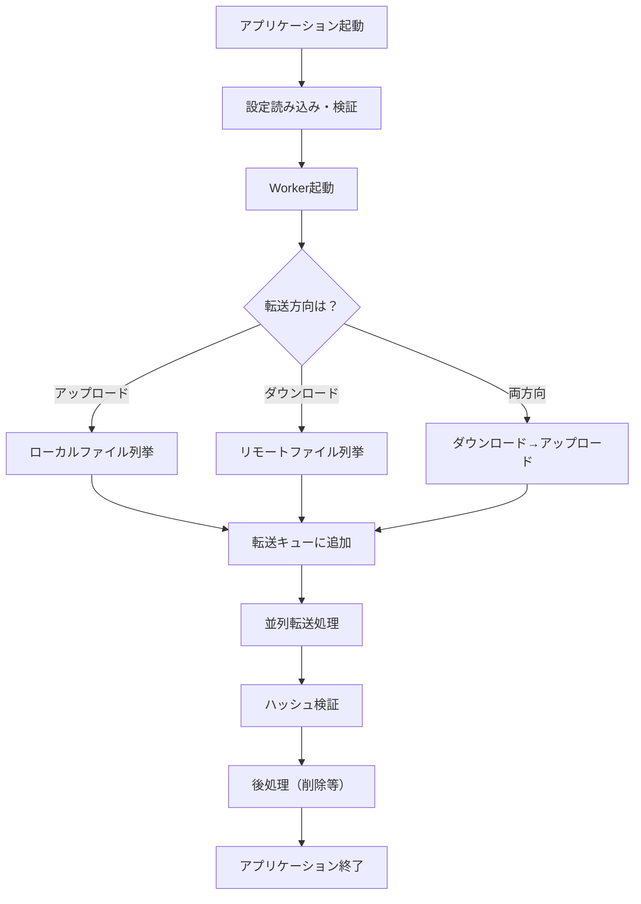

# FtpTransferAgent 完全学習ガイド

## 目次
1. [プロジェクト概要](#1-プロジェクト概要)
2. [プロジェクト構造の理解](#2-プロジェクト構造の理解)
3. [基本的な動作フロー](#3-基本的な動作フロー)
4. [重要な技術・パターンの解説](#4-重要な技術パターンの解説)
5. [各コンポーネントの詳細解説](#5-各コンポーネントの詳細解説)
6. [高度な機能の解説](#6-高度な機能の解説)
7. [テストの理解](#7-テストの理解)
8. [実践的な使い方](#8-実践的な使い方)

---

## 1. プロジェクト概要

### FtpTransferAgentとは？
- **目的**: ローカルとリモートサーバー間でファイルを自動転送するツール
- **対応プロトコル**: FTP（File Transfer Protocol）とSFTP（SSH File Transfer Protocol）
- **動作方式**: バッチ処理（起動→ファイル転送→終了）
- **特徴**: 
  - ハッシュ値による整合性チェック
  - 並列転送対応
  - リトライ機能
  - ENDファイル検証機能

### なぜWorker Serviceなのか？
```csharp
// 従来のProgram.csだけのコンソールアプリ
Console.WriteLine("Hello World!");

// Worker Serviceを使った場合
Host.CreateDefaultBuilder(args)
    .ConfigureServices(services =>
    {
        services.AddHostedService<Worker>();
    })
    .Build()
    .Run();
```

**Worker Serviceの利点**:
- 依存性注入（DI）の標準サポート
- 設定管理の統一化
- ロギングの標準化
- バックグラウンドタスクの管理

---

## 2. プロジェクト構造の理解

### ソリューション構造
```
FtpTransferAgent.sln
├── FtpTransferAgent/          # メインプロジェクト
│   ├── Configuration/         # 設定関連クラス
│   ├── Logging/              # ロギング関連
│   ├── Services/             # ビジネスロジック
│   ├── Program.cs            # エントリーポイント
│   ├── Worker.cs             # メイン処理
│   └── appsettings.json      # 設定ファイル
└── FtpTransferAgent.Tests/    # テストプロジェクト
```

### 主要なファイルの役割

#### Program.cs - アプリケーションのエントリーポイント
```csharp
// ホストビルダーを生成
var builder = Host.CreateApplicationBuilder(args);

// 設定クラスをDIコンテナに登録
builder.Services.AddOptions<WatchOptions>()
    .BindConfiguration("Watch")      // appsettings.jsonの"Watch"セクションをバインド
    .ValidateDataAnnotations()       // データアノテーションで検証
    .ValidateOnStart();             // 起動時に検証実行
```

**ポイント**:
- `Host.CreateApplicationBuilder`: .NET のホスティング機能を初期化
- `AddOptions<T>`: 設定クラスをDIコンテナに登録
- `BindConfiguration`: JSONファイルの特定セクションを設定クラスにマッピング

#### Worker.cs - メインのビジネスロジック
```csharp
public class Worker : BackgroundService
{
    protected override async Task ExecuteAsync(CancellationToken stoppingToken)
    {
        // ここにメイン処理を実装
    }
}
```

**BackgroundServiceとは**:
- 長時間実行されるサービスの基底クラス
- `ExecuteAsync`メソッドをオーバーライドして処理を実装
- アプリケーション終了時に自動的にキャンセルされる

---

## 3. 基本的な動作フロー

### 全体の処理フロー


### 詳細な処理ステップ

#### 1. 設定の読み込みと検証
```csharp
// appsettings.json
{
  "Watch": {
    "Path": "./watch",
    "IncludeSubfolders": false,
    "AllowedExtensions": [ ".txt" ]
  }
}

// 設定クラス
public class WatchOptions
{
    [Required]  // 必須項目
    public string Path { get; set; } = string.Empty;
    public bool IncludeSubfolders { get; set; }
    public string[] AllowedExtensions { get; set; } = Array.Empty<string>();
}
```

#### 2. ファイル転送クライアントの作成
```csharp
protected virtual IFileTransferClient CreateClient()
{
    return _transfer.Mode.ToLowerInvariant() switch
    {
        "sftp" => ActivatorUtilities.CreateInstance<SftpClientWrapper>(_services, _transfer),
        "ftp" => ActivatorUtilities.CreateInstance<AsyncFtpClientWrapper>(_services, _transfer),
        _ => throw new ArgumentException($"Unsupported transfer mode: {_transfer.Mode}")
    };
}
```

**ファクトリパターンの使用**:
- 設定に応じて適切なクライアントを生成
- `ActivatorUtilities.CreateInstance`: DIコンテナを使ってインスタンス生成

#### 3. ファイルの列挙と転送キューへの追加
```csharp
// ローカルファイルの列挙（アップロード時）
var files = Directory.EnumerateFiles(_watch.Path, "*", option)
    .OrderBy(f => Path.GetFileName(f), StringComparer.OrdinalIgnoreCase)
    .ToList();

// 転送キューに追加
foreach (var file in files)
{
    _channel.Writer.TryWrite(new TransferItem(file, TransferAction.Upload));
}
```

#### 4. 並列転送処理
```csharp
// TransferQueue.cs
public Task StartAsync(Func<TransferItem, CancellationToken, Task> handler, CancellationToken ct)
{
    var tasks = new Task[_concurrency];
    for (int i = 0; i < _concurrency; i++)
    {
        int workerId = i;
        tasks[i] = Task.Run(async () => await Worker(workerId, ct).ConfigureAwait(false), ct);
    }
    return Task.WhenAll(tasks);
}
```

---

## 4. 重要な技術・パターンの解説

### 4.1 依存性注入（Dependency Injection, DI）

#### DIとは？
クラスが必要とする依存関係を外部から注入する設計パターン

```csharp
// DIを使わない場合（密結合）
public class Worker
{
    private readonly Logger _logger = new Logger();  // 直接生成
    private readonly Config _config = new Config();  // 直接生成
}

// DIを使う場合（疎結合）
public class Worker
{
    private readonly ILogger<Worker> _logger;
    private readonly IOptions<WatchOptions> _watch;
    
    // コンストラクタで注入
    public Worker(ILogger<Worker> logger, IOptions<WatchOptions> watch)
    {
        _logger = logger;
        _watch = watch;
    }
}
```

**メリット**:
- テストしやすい（モックを注入できる）
- 実装の変更が容易
- 依存関係が明確

### 4.2 オプションパターン（Options Pattern）

#### 設定管理の標準的な方法
```csharp
// 設定クラス
public class TransferOptions
{
    [Required]
    [RegularExpression("^(ftp|sftp)$")]
    public string Mode { get; set; } = "ftp";
    
    [Range(1, 16)]
    public int Concurrency { get; set; } = 1;
}

// 使用方法
public Worker(IOptions<TransferOptions> options)
{
    var transferOptions = options.Value;
    var mode = transferOptions.Mode;
}
```

### 4.3 Channel（チャンネル）による生産者-消費者パターン

#### Channelとは？
スレッドセーフなキューの実装

```csharp
// チャンネルの作成
private readonly Channel<TransferItem> _channel = 
    Channel.CreateBounded<TransferItem>(new BoundedChannelOptions(1000)
    {
        FullMode = BoundedChannelFullMode.Wait,    // キューが満杯時は待機
        SingleReader = false,                       // 複数の読み取り側
        SingleWriter = false                        // 複数の書き込み側
    });

// 書き込み（生産者）
_channel.Writer.TryWrite(new TransferItem(file, TransferAction.Upload));

// 読み取り（消費者）
while (await _channel.Reader.WaitToReadAsync(token))
{
    if (_channel.Reader.TryRead(out var item))
    {
        // 処理実行
    }
}
```

### 4.4 非同期プログラミング（async/await）

#### 基本的な使い方
```csharp
// 同期メソッド
public void DownloadFile(string path)
{
    var data = client.Download(path);  // ブロッキング
    File.WriteAllBytes(localPath, data);
}

// 非同期メソッド
public async Task DownloadFileAsync(string path)
{
    var data = await client.DownloadAsync(path);  // 非ブロッキング
    await File.WriteAllBytesAsync(localPath, data);
}
```

**ConfigureAwait(false)の使用**:
```csharp
await client.UploadAsync(localPath, remotePath, ct).ConfigureAwait(false);
```
- UIコンテキストへの復帰が不要な場合に使用
- パフォーマンスの向上

### 4.5 例外処理とリトライポリシー（Polly）

#### Pollyによるリトライ実装
```csharp
_policy = Policy
    .Handle<Exception>(ex => RetryableExceptionClassifier.IsRetryable(ex))
    .WaitAndRetryAsync(
        retryCount: options.MaxAttempts,
        sleepDurationProvider: attempt => 
            TimeSpan.FromSeconds(options.DelaySeconds * Math.Pow(2, attempt - 1)),
        onRetry: (ex, ts, attempt, ctx) =>
        {
            _logger.LogWarning(ex, "Retry {Attempt}/{MaxAttempts}", 
                attempt, options.MaxAttempts + 1);
        });
```

**指数バックオフ**:
- 1回目: 5秒待機
- 2回目: 10秒待機
- 3回目: 20秒待機

---

## 5. 各コンポーネントの詳細解説

### 5.1 設定クラス（Configuration）

#### WatchOptions - 監視フォルダの設定
```csharp
public class WatchOptions
{
    [Required]
    public string Path { get; set; } = string.Empty;
    
    public bool IncludeSubfolders { get; set; }
    
    public string[] AllowedExtensions { get; set; } = Array.Empty<string>();
    
    // ENDファイル機能
    public bool RequireEndFile { get; set; } = false;
    public string[] EndFileExtensions { get; set; } = new[] { ".END", ".end" };
    public bool TransferEndFiles { get; set; } = false;
}
```

**ENDファイル機能**:
- データファイルの転送完了を示すマーカーファイル
- `data.txt`に対して`data.END`が存在する場合のみ転送

#### TransferOptions - 転送設定
```csharp
[TransferOptionsValidation]  // カスタム検証属性
public class TransferOptions
{
    [Required]
    [RegularExpression("^(ftp|sftp)$")]
    public string Mode { get; set; } = "ftp";
    
    [Required]
    [RegularExpression("^(get|put|both)$")]
    public string Direction { get; set; } = "put";
    
    [Range(1, 16)]
    public int Concurrency { get; set; } = 1;
    
    [Range(1, 3600)]
    public int TimeoutSeconds { get; set; } = 120;
}
```

### 5.2 サービスクラス（Services）

#### IFileTransferClient インターフェース
```csharp
public interface IFileTransferClient : IDisposable
{
    Task UploadAsync(string localPath, string remotePath, CancellationToken ct);
    Task DownloadAsync(string remotePath, string localPath, CancellationToken ct);
    Task<string> GetRemoteHashAsync(string remotePath, string algorithm, CancellationToken ct, bool useServerCommand = false);
    Task<IEnumerable<string>> ListFilesAsync(string remotePath, CancellationToken ct, bool includeSubdirectories = false);
    Task DeleteAsync(string remotePath, CancellationToken ct);
}
```

**インターフェースの利点**:
- 実装の詳細を隠蔽
- テスト時にモックを作成可能
- FTPとSFTPで異なる実装を提供

#### HashUtil - ハッシュ計算ユーティリティ
```csharp
public static async Task<string> ComputeHashAsync(Stream stream, string algorithm, CancellationToken ct)
{
    using HashAlgorithm hasher = algorithm.ToUpper() switch
    {
        "SHA256" => SHA256.Create(),
        "SHA512" => SHA512.Create(),
        "MD5" => MD5.Create(),
        _ => throw new ArgumentException($"Unsupported hash algorithm: {algorithm}")
    };
    
    // バッファサイズの動的調整
    var streamLength = stream.CanSeek ? stream.Length : 0;
    var bufferSize = streamLength switch
    {
        < 1024 * 1024 => 8192,         // 1MB未満: 8KB
        < 10 * 1024 * 1024 => 32768,   // 10MB未満: 32KB
        _ => 81920                      // 10MB以上: 80KB
    };
}
```

**ストリーミング処理**:
- メモリ効率的なハッシュ計算
- 大容量ファイルにも対応

#### TransferQueue - 並列転送管理
```csharp
public class TransferQueue
{
    private readonly ConcurrentDictionary<string, bool> _processedItems = new();
    private readonly ConcurrentDictionary<string, DateTime> _activeItems = new();
    private readonly ConcurrentBag<Exception> _criticalExceptions = new();
}
```

**スレッドセーフなコレクション**:
- `ConcurrentDictionary`: 複数スレッドから安全にアクセス可能
- `ConcurrentBag`: 順序なしのスレッドセーフなコレクション

### 5.3 ロギング（Logging）

#### RollingFileLogger - ローテーション機能付きファイルロガー
```csharp
internal sealed class RollingFileLogger : ILogger, IDisposable
{
    private string GetPath()
    {
        var basePath = _options.RollingFilePath;
        var dir = Path.GetDirectoryName(basePath) ?? string.Empty;
        var name = Path.GetFileNameWithoutExtension(basePath);
        var ext = Path.GetExtension(basePath);
        var suffix = _index > 0 ? $"_{_index}" : string.Empty;
        return Path.Combine(dir, $"{name}{_currentDate:yyyyMMdd}{suffix}{ext}");
    }
}
```

**ログローテーション**:
- 日付でファイル分割: `log20250701.txt`
- サイズでファイル分割: `log20250701_1.txt`

---

## 6. 高度な機能の解説

### 6.1 設定バリデーター

#### ConfigurationValidator - 包括的な設定検証
```csharp
public ConfigurationValidationResult ValidateConfiguration(
    WatchOptions watch,
    TransferOptions transfer,
    RetryOptions retry,
    HashOptions hash,
    CleanupOptions cleanup)
{
    var result = new ConfigurationValidationResult();
    
    // 基本的な設定チェック
    ValidateBasicConfiguration(watch, transfer, result);
    
    // パフォーマンス関連の設定チェック
    ValidatePerformanceConfiguration(transfer, retry, result);
    
    // セキュリティ関連の設定チェック
    ValidateSecurityConfiguration(transfer, cleanup, result);
    
    return result;
}
```

**検証項目の例**:
- ディレクトリの存在確認
- ポート番号の妥当性
- セキュリティ警告（FTPの平文パスワード）
- 設定の組み合わせチェック

### 6.2 例外分類器

#### RetryableExceptionClassifier - リトライ可能な例外の判定
```csharp
public static bool IsRetryable(Exception exception)
{
    return exception switch
    {
        // ネットワーク関連（リトライ可能）
        SocketException => true,
        TimeoutException => true,
        HttpRequestException => true,
        
        // 設定エラー（リトライ不可）
        ArgumentException => false,
        InvalidOperationException => false,
        
        _ => IsRetryableByInnerException(exception)
    };
}
```

### 6.3 アトミックなファイル操作

#### 一時ファイルを使った安全な転送
```csharp
// アップロード時
var tempPath = $"{remotePath}.tmp.{Guid.NewGuid():N}";
await _client.UploadFile(localPath, tempPath);
await _client.MoveFile(tempPath, remotePath);

// ダウンロード時
var temp = $"{localPath}.tmp.{Guid.NewGuid():N}";
await _client.DownloadFile(temp, remotePath);
File.Move(temp, localPath, true);
```

**メリット**:
- 転送途中のファイルを他のプロセスが読まない
- 失敗時に不完全なファイルが残らない

### 6.4 パフォーマンス監視

#### リアルタイム統計情報
```csharp
public class TransferStatistics
{
    public int TotalEnqueued { get; set; }
    public int TotalCompleted { get; set; }
    public int TotalFailed { get; set; }
    public int ActiveItems { get; set; }
    public long MemoryUsageMB { get; set; }
    public double SuccessRate => TotalEnqueued > 0 ? 
        (double)TotalCompleted / TotalEnqueued * 100 : 0;
}
```

---

## 7. テストの理解

### 7.1 単体テスト（Unit Test）

#### モックを使ったテスト
```csharp
[Fact]
public async Task ExecuteAsync_UploadsFileAndDeletesAfterVerification()
{
    // Arrange - テストの準備
    var mock = new Mock<IFileTransferClient>();
    mock.Setup(c => c.UploadAsync(file, remotePath, It.IsAny<CancellationToken>()))
        .Returns(Task.CompletedTask)
        .Verifiable();
    
    // Act - テスト実行
    await worker.RunAsync(CancellationToken.None);
    
    // Assert - 結果検証
    mock.Verify();  // UploadAsyncが呼ばれたことを確認
    Assert.False(File.Exists(file));  // ファイルが削除されたことを確認
}
```

**xUnitの基本**:
- `[Fact]`: パラメータなしのテスト
- `[Theory]`: パラメータありのテスト
- `Assert`: 検証メソッド

### 7.2 統合テスト（Integration Test）

#### 実際のFTPサーバーを使ったテスト
```csharp
private async Task<Process> StartFtpServerAsync(string root, int port)
{
    var python = RuntimeInformation.IsOSPlatform(OSPlatform.Windows) ? "python" : "python3";
    var psi = new ProcessStartInfo(python, $"-m pyftpdlib -p {port} -w -d {root} -u user -P pass");
    var proc = Process.Start(psi)!;
    
    // サーバー起動を待機
    // ...
    
    return proc;
}
```

---

## 8. 実践的な使い方

### 8.1 設定ファイルの例

#### 基本的なアップロード設定
```json
{
  "Watch": {
    "Path": "C:\\Upload",
    "AllowedExtensions": [ ".csv", ".txt" ]
  },
  "Transfer": {
    "Mode": "sftp",
    "Direction": "put",
    "Host": "sftp.example.com",
    "Username": "myuser",
    "Password": "mypassword",
    "RemotePath": "/data/incoming",
    "Concurrency": 4
  },
  "Hash": {
    "Algorithm": "SHA256"
  },
  "Cleanup": {
    "DeleteAfterVerify": true
  }
}
```

#### ENDファイル機能を使った設定
```json
{
  "Watch": {
    "Path": "C:\\DataExport",
    "RequireEndFile": true,
    "EndFileExtensions": [ ".END", ".COMPLETE" ],
    "TransferEndFiles": true
  }
}
```

### 8.2 実行方法

#### コマンドラインから実行
```bash
# 開発環境で実行
dotnet run

# リリースビルドで実行
dotnet run --configuration Release

# 設定ファイルを指定して実行
dotnet run --appsettings=appsettings.Production.json
```

#### Windowsサービスとして実行
```bash
# Windows Serviceとしてインストール
sc create FtpTransferAgent binPath="C:\path\to\FtpTransferAgent.exe"

# タスクスケジューラで定期実行
schtasks /create /tn "FtpTransfer" /tr "C:\path\to\FtpTransferAgent.exe" /sc daily /st 02:00
```

### 8.3 トラブルシューティング

#### ログの確認方法
```csharp
// ログレベルの設定
"Logging": {
  "Level": "Debug",  // Trace, Debug, Information, Warning, Error, Critical
  "RollingFilePath": "logs/ftp-transfer-.log"
}
```

#### よくあるエラーと対処法

1. **接続エラー**
   ```
   Error: Connection timeout
   対処: ファイアウォール設定、ホスト名、ポート番号を確認
   ```

2. **ハッシュ不一致**
   ```
   Error: Hash mismatch for file.txt
   対処: 転送モード（バイナリ/テキスト）、ネットワーク品質を確認
   ```

3. **権限エラー**
   ```
   Error: Access denied
   対処: ファイル/フォルダのアクセス権限、ユーザー権限を確認
   ```

---

## まとめ

このプロジェクトで学べる重要な概念：

1. **アーキテクチャパターン**
   - 依存性注入（DI）
   - オプションパターン
   - ファクトリパターン
   - 生産者-消費者パターン

2. **.NET の高度な機能**
   - Worker Service
   - 非同期プログラミング
   - Channel
   - 設定管理
   - ロギング

3. **実践的なテクニック**
   - エラーハンドリング
   - リトライ処理
   - 並列処理
   - ファイル操作のベストプラクティス

4. **テスト手法**
   - 単体テスト
   - モックの使用
   - 統合テスト

このプロジェクトは、単純なコンソールアプリケーションから一歩進んだ、実務で使えるレベルのアプリケーション開発を学ぶのに最適な教材です。各コンポーネントを理解し、必要に応じて改造していくことで、.NET開発の実践的なスキルを身につけることができます。