# FtpTransferAgent 完全学習ガイド

> このコードベースを「読めば全部わかり、最終的には自分で同じものを書ける」ことを目標にした、**初学者〜中級者向けの徹底解説書**です。
> 単なる API リファレンスではなく、**「なぜこのコードなのか」「何を実現したかったのか」** を一つずつ言葉にしていきます。
> 1 回で読み切る必要はありません。**社内勉強会で数回に分けて進める**ことを想定し、1 回分ずつ独立して読めるよう章立てしています。

---

## この資料の読み方

### 対象読者
- C# / .NET をこれから本格的に触る人（言語の基本構文は知っている前提）
- 「動くコードは書けるが、"なぜそう書くのか" の引き出しを増やしたい」人
- このツールを保守・拡張する担当者、レビュアー

### 前提知識
- プログラミングの一般常識（変数・関数・クラス・例外）
- 「FTP = ファイルをサーバーに送受信する仕組み」程度の理解
- C# の `class` / `interface` / `async` というキーワードを見たことがある程度でOK（意味は本文で説明します）

### この資料の進め方（おすすめの勉強会カリキュラム）

| 回 | テーマ | ねらい | 主に読むコード |
|---|---|---|---|
| **第0回** | オリエンテーション | 何を解決する道具か、全体像 | （概念） |
| **第1回** | 土台：Generic Host と Worker Service | アプリの骨格と「バッチ型」設計 | `Program.cs` / `Worker.cs` |
| **第2回** | 設定システム | Options パターンと二層バリデーション | `Configuration/*` |
| **第3回** | 起動と依存性注入(DI) | `Program.cs` 完全読解 | `Program.cs` |
| **第4回** | 非同期プログラミングの基礎 | `async/await` と I/O バウンド | 全体に共通 |
| **第5回** | 転送の中核 | Strategy パターン・アトミック転送 | `Services/*Client*.cs` |
| **第6回** | 並列処理 | Channel + ワーカー Task の流れ作業 | `TransferQueue.cs` / `ClientPool.cs` |
| **第7回** | リトライと例外分類 | Polly と「待てば直る/直らない」の判定 | `RetryableExceptionClassifier.cs` |
| **第8回** | 整合性（ハッシュ検証） | 「壊れずに送れた」をどう確かめるか | `HashUtil.cs` |
| **第9回** | ファンアウト（複数宛先配信） | 1ファイルを複数宛先へ同時送信 | `FanoutCoordinator.cs` / `Worker.cs` |
| **第10回** | 配信トラッキング | 未送先だけ再送する仕組み | `DeliveryStateStore.cs` |
| **第11回** | 安全機構 | END ファイル・二重起動防止・ホスト鍵検証 | `ProcessLock.cs` / `SftpClientWrapper.cs` |
| **第12回** | 監視と運用 | ログ・メール通知・終了コード | `Logging/*` |
| **第13回** | テストの書き方 | どんなテストをどう書くか | `FtpTransferAgent.Tests/*` |
| **第14回** | 使用パッケージ詳説 | 各ライブラリは何者か | `*.csproj` |
| **第15回** | 総まとめ | 同じものをゼロから書く順序 | （総括） |

> 📌 **アイコンの約束**
> - 💡 = 設計の意図・「なぜ」
> - ⚠️ = ハマりどころ・注意
> - 🧪 = 手を動かす演習
> - 🔍 = もっと深く知りたい人向けの寄り道

### もっと詳しい専門資料（本書の姉妹編）
本書は「全体を順番に学ぶ」ための入口です。ファンアウトと配信トラッキングは特に奥が深いので、**実装機構**と**設計判断**に踏み込んだ専門資料を別に用意しています。第9〜10回はこれらと往復しながら読むと理解が深まります。

- [docs/fanout-and-parallelism.md](docs/fanout-and-parallelism.md) … ファンアウトと並列処理の**実装機構**
- [docs/per-destination-delivery-tracking.md](docs/per-destination-delivery-tracking.md) … 配信トラッキングの**設計判断・対策**
- [ftp-transfer-agent-spec.md](ftp-transfer-agent-spec.md) … 詳細仕様書

---

# 第0回　オリエンテーション：このツールは何を解決するのか

## 0.1 ひとことで言うと

> **指定フォルダのファイルを、決まった相手(FTP/SFTP サーバー)へ、定期的に、確実に送る（または取りに行く）バッチツール。**

「確実に」がこのツールの命です。ただ送るだけなら数十行で書けます。実務で本当に必要なのは、その後ろにある次のような心配ごとへの答えです。

- 送っている途中で相手が**書きかけのファイルを拾ってしまわないか**？
- ネットワークが**一瞬切れた**ときに自動で復帰できるか？
- 送ったファイルが**途中で壊れていない**と、どうやって確かめるか？
- 大量のファイルを**速く**送りたいが、1 件の失敗で全部止まらないか？
- 同じファイルを**複数の連携先へ同時に**送りたい。1 か所だけ落ちていたら？
- 前回の実行がまだ終わっていないのに**次の実行が始まってしまったら**？

このツールのコードのほとんどは、**この「心配ごと」への一つひとつの答え**でできています。本書はその答えを順に解剖していきます。

## 0.2 なぜ作る必要があったのか（背景）

社内にはすでに古い FTP 転送ツール（FileTransFTP）があります。長年動いていますが、

- **FTP（暗号化なし）にしか対応しておらず、SFTP が使えない**
- 技術基盤が古く（.NET Framework 3.5）、改修が難しい
- 並列処理がない

という課題を抱えています。セキュリティ要件の高まりで「FTP を使うには申請が必要」「連携先が SFTP 必須」というケースが増え、**SFTP に対応した後継ツールが必要**になりました。これが FtpTransferAgent の出発点です。

💡 つまりこのプロジェクトの第一の動機は「新機能を作る」ではなく「**レガシーの置き換え**」です。だから「従来と同じ運用モデル（スケジューラから定期起動）」を保ちながら、中身を現代的に作り直す、という方針になっています。

## 0.3 全体像（まず地図を頭に入れる）

細部に入る前に、登場人物の地図を眺めておきましょう。各部品が「何を担当するか」だけ、今はぼんやり掴めれば十分です。

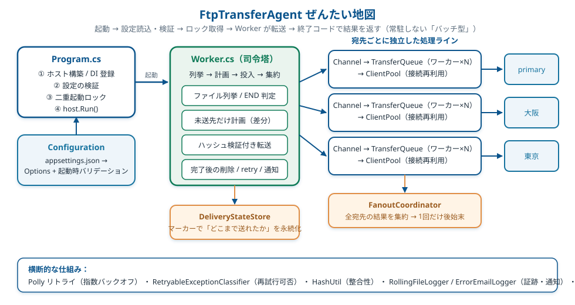

| 部品 | 役割（ひとこと） |
|---|---|
| `Program.cs` | 入口。設定を読んで検証し、二重起動を防ぎ、本体を起動する |
| `Worker.cs` | 司令塔。ファイルを列挙し、計画し、転送を指揮し、後始末する |
| `Configuration/*` | 設定の「型」と検証ルール |
| `IFileTransferClient` + `SftpClientWrapper`/`AsyncFtpClientWrapper` | 実際に送受信する人（FTP 用と SFTP 用） |
| `TransferQueue` | 並列転送のエンジン（流れ作業の待ち行列＋担当） |
| `ClientPool` | 接続を使い回す貯金箱 |
| `FanoutCoordinator` | 「1 ファイルを複数宛先へ送った結果」を集約する |
| `DeliveryStateStore` | 「どのファイルをどの宛先まで送れたか」を記録する |
| `HashUtil` | ファイルの「指紋」を計算して壊れていないか確かめる |
| `RetryableExceptionClassifier` | エラーを「待てば直る/直らない」に仕分ける |
| `ProcessLock` | 二重起動を防ぐ鍵 |
| `Logging/*` | ログ記録とエラーメール通知 |

## 0.4 「バッチ型」という最重要の前提

このツールは**常駐しません**。起動するたびに次を 1 回やって、終わります。

```
起動 → 設定読込・検証 → ロック取得 → ファイルを列挙して転送 → 後始末 → 終了（終了コードを返す）
```

定期的に動かしたいときは、**OS のスケジューラ（Windows タスクスケジューラ / Linux cron）から定期起動**します。サービスとして常駐するのではなく「呼ばれたら 1 回働いて消える」スタイルです。

💡 **なぜ常駐させないのか？**
- 常駐プロセスは「メモリリーク」「いつの間にか止まっていた」「状態が壊れる」といった長期運用特有の事故が起きやすい。
- バッチ型なら、1 回ごとにまっさらな状態で起動するので**状態が積み上がらず、復旧が単純**（失敗してもプロセスごとやり直すだけ）。
- 既存ツールや JP1 などのジョブ管理基盤に**そのまま載る**（運用モデルを変えなくていい）。

⚠️ この「毎回まっさら（ステートレス）」という性質が、後の第10回「配信トラッキング」で大きな設計上の難題を生みます。「前回どこまで送れたか」をプロセス内に覚えておけないからです。覚えておきましょう。

---

# 第1回　土台：Generic Host と Worker Service

> **この回のゴール**：このアプリが「ただの `Main` メソッド」ではなく、`.NET` の **Generic Host** という土台の上に乗っていることを理解する。なぜその土台を使うと嬉しいのかを言葉にできるようになる。

## 1.1 一番素朴なコンソールアプリとの違い

C# で一番素朴なプログラムはこうです。

```csharp
// 究極にシンプルなコンソールアプリ
Console.WriteLine("Hello World!");
```

これでも動きます。では、本物の業務アプリにしようとすると、すぐに次が欲しくなります。

- 設定ファイル（`appsettings.json`）を読みたい
- ログをコンソールにもファイルにも出したい
- いろんなクラス（ロガー、設定、転送クライアント…）を**あちこちで使い回したい**
- 終了処理をきちんとやりたい

これらを毎回自前で書くのは大変です。そこで .NET は **Generic Host（汎用ホスト）** という「アプリの土台一式」を提供しています。FtpTransferAgent はこれを使っています。

```csharp
// Program.cs の冒頭（実物）
var builder = Host.CreateApplicationBuilder(args);
```

この 1 行で、

- 設定の読み込み（`appsettings.json` / 環境変数 / コマンドライン引数）
- ロギングの仕組み
- **DI コンテナ（依存性注入の入れ物。第3回で詳説）**

がまとめて用意されます。`builder` に「何を使うか」を登録していき、最後に `builder.Build()` で完成、`host.Run()` で実行、という流れです。

## 1.2 Worker Service とは

Generic Host の上で「バックグラウンドで動く仕事」を表すのが `BackgroundService` という基底クラスです。これを継承したものを **Worker Service** と呼びます。

```csharp
// Worker.cs（骨格）
public class Worker : BackgroundService
{
    protected override async Task ExecuteAsync(CancellationToken stoppingToken)
    {
        // ここに「このアプリの本当にやりたいこと」を書く
    }
}
```

- `ExecuteAsync` が**メイン処理の入口**。ホストが起動するとここが呼ばれます。
- 引数の `CancellationToken stoppingToken` は「**そろそろ終了してね**」という合図を運ぶオブジェクト（第4回で詳説）。Ctrl+C やホスト停止時にここ経由でキャンセルが伝わります。

💡 **なぜわざわざ Worker Service にするのか？** `Main` に全部書いてもいいのに、と思うかもしれません。Worker Service にすると、

1. **DI が自然に使える**（コンストラクタで必要な部品を受け取れる）
2. **ロギング・設定・ライフサイクル管理が標準化**される
3. 将来「Windows サービスとして常駐」へ寄せたくなっても土台が同じ

つまり「業務アプリのお作法に最初から乗る」ためです。本ツールはバッチ型ですが、土台は標準的な Worker Service を使い、`ExecuteAsync` の中で 1 回だけ処理して自分で終了する、という形をとっています。

## 1.3 「1回で終わる」をどう実現しているか

`BackgroundService` は本来「ずっと動き続ける常駐サービス」用です。バッチ型にするには、処理が終わったら**自分でアプリを止める**必要があります。それを担うのが `IHostApplicationLifetime` です。

```csharp
// イメージ（Worker の終盤でやっていること）
_lifetime.StopApplication();   // 「もう仕事は終わったのでホストを止めて」と伝える
```

💡 ここがバッチ型の肝です。`ExecuteAsync` の中で全ファイルの転送が終わったら `StopApplication()` を呼び、ホストの `Run()` が返ってくる → `Program.cs` の続き（ロック解放など）が走り、プロセスが終了します。

🔍 `Program.cs` には次のコメントがあります（実物）。

```csharp
// host.Run() は終了時にホスト (IServiceProvider) を Dispose するため、
// 終了コードを保持するシングルトンの参照は Run の前に取得しておく。
// Run 後に host.Services を参照すると ObjectDisposedException となる。
var exitCodeTracker = host.Services.GetRequiredService<ApplicationExitCode>();
```

`host.Run()` が終わると DI コンテナ自体が破棄されるので、**終了コードを保持するオブジェクトの参照は Run の前に取っておく**、という細かい配慮です。こういう「順序の罠」は実際にバグを踏んで初めて気づくもので、コメントとして残っているのは良い習慣です。

## 1.4 プロジェクトの地図（ファイル構成）

```
FtpTransferAgent.sln                         ソリューション（プロジェクトのまとめ）
├── FtpTransferAgent/                         本体
│   ├── Program.cs                            入口（DI登録・検証・ロック・起動）
│   ├── Worker.cs                             司令塔（列挙→計画→投入→集約→後始末）
│   ├── Configuration/                        設定の「型」と検証
│   │   ├── WatchOptions.cs                   何を転送するか（フォルダ・拡張子・END）
│   │   ├── TransferOptions.cs                どこへどう送るか（primary 宛先＋追加宛先）
│   │   ├── DestinationOptions.cs             1 宛先の接続・送信設定
│   │   ├── RetryOptions / HashOptions / CleanupOptions / SmtpOptions / LoggingOptions / AppOptions
│   │   ├── ConfigurationValidator.cs         項目をまたぐ検証
│   │   └── TransferOptionsValidationAttribute.cs  TransferOptions 専用の検証属性
│   ├── Services/                             ビジネスロジック
│   │   ├── IFileTransferClient.cs            転送クライアントの「契約」（interface）
│   │   ├── SftpClientWrapper.cs              SFTP 実装（SSH.NET）
│   │   ├── FtpClient.cs                      FTP 実装（FluentFTP, クラス名は AsyncFtpClientWrapper）
│   │   ├── TransferQueue.cs                  並列転送エンジン（Channel＋ワーカー＋Polly）
│   │   ├── TransferItem.cs                   キューに流れる 1 単位（record）
│   │   ├── ClientPool.cs                     接続の再利用プール
│   │   ├── FanoutCoordinator.cs             複数宛先の結果集約
│   │   ├── DeliveryStateStore.cs             配信トラッキングの永続化
│   │   ├── HashUtil.cs                       ハッシュ計算
│   │   ├── RetryableExceptionClassifier.cs   例外の仕分け
│   │   ├── ProcessLock.cs                    二重起動防止
│   │   ├── FileNameMatcher.cs                ワイルドカード照合
│   │   ├── HashMismatchException.cs          ハッシュ不一致専用の例外
│   │   └── ApplicationExitCode.cs            終了コードの保持
│   ├── Logging/                              ログとメール
│   │   ├── RollingFileLogger.cs              日付・サイズで分割するファイルログ
│   │   ├── ErrorEmailLogger.cs               エラーをメール送信
│   │   └── LogEvents.cs                      ログ種別を表す EventId 定義
│   └── appsettings.json                      設定ファイル
└── FtpTransferAgent.Tests/                   テスト（xUnit）
```

🧪 **演習（第1回）**：`Program.cs` を開き、「`Host.CreateApplicationBuilder` から `host.Run()` まで」をざっと目で追ってみましょう。途中の意味が分からなくてもOKです。第3回で 1 行ずつ解説します。今は「土台を作って→部品を登録して→検証して→起動する」という大きな流れだけ感じ取れれば成功です。

---

# 第2回　設定システム：Options パターンと二層バリデーション

> **この回のゴール**：`appsettings.json` の文字列が、どうやって型のある C# オブジェクトになり、どうやって「おかしな設定なら起動時に止める」が実現されているかを理解する。

## 2.1 なぜ「設定の型」を作るのか

設定ファイルはただのテキスト（JSON）です。

```json
{
  "Transfer": {
    "Mode": "sftp",
    "Direction": "put",
    "Concurrency": 8
  }
}
```

これをコード側で「文字列のまま」扱うと、`config["Transfer:Concurrency"]` のように毎回キーを文字列で書くことになり、タイプミスや型変換ミスの温床になります。そこで .NET では **Options パターン**を使い、設定セクションを**専用のクラス（型）**に対応づけます。

```csharp
// Configuration/DestinationOptions.cs（抜粋・実物）
public class DestinationOptions
{
    [Required]
    [RegularExpression("^(ftp|sftp)$")]
    public string Mode { get; set; } = "ftp";

    [Required]
    public string Host { get; set; } = string.Empty;

    public int Port { get; set; } = 21;

    [Range(1, 16)]
    public int Concurrency { get; set; } = 1;

    // ... 認証情報・タイムアウトなど
}
```

💡 こうしておくと、`Concurrency` は `int` 型として、`Mode` は文字列として、**コンパイラと IDE の補完が効く形**で扱えます。設定の「形」がコードに明文化されるので、ドキュメントの役割も果たします。

`[Required]` `[Range(1,16)]` `[RegularExpression(...)]` は **DataAnnotations（データ注釈）** と呼ばれる「検証の付箋」です。これらが後で自動チェックされます。

## 2.2 JSON → 型へ「束ねる」(Bind)

`Program.cs` で各セクションを対応する型へ結び付けます。

```csharp
// Program.cs（実物）
builder.Services.AddOptions<WatchOptions>().BindConfiguration("Watch").ValidateDataAnnotations().ValidateOnStart();
builder.Services.AddOptions<TransferOptions>().BindConfiguration("Transfer").ValidateDataAnnotations().ValidateOnStart();
builder.Services.AddOptions<RetryOptions>().BindConfiguration("Retry").ValidateDataAnnotations().ValidateOnStart();
// ... Hash / Cleanup / Smtp / Logging / App も同様
```

1 行を分解すると：

| メソッド | 意味 |
|---|---|
| `AddOptions<WatchOptions>()` | 「`WatchOptions` という設定を使う」と DI に宣言 |
| `.BindConfiguration("Watch")` | `appsettings.json` の `"Watch"` セクションを `WatchOptions` に流し込む |
| `.ValidateDataAnnotations()` | `[Required]` などの付箋を検証対象にする |
| `.ValidateOnStart()` | **起動時に**検証する（使う瞬間まで遅延しない） |

💡 **`.ValidateOnStart()` が地味に重要です。** これが無いと検証は「その設定を初めて使うとき」まで遅延します。すると「数分転送してから設定ミスで落ちる」ことが起こり得ます。起動時に検証すれば、**おかしい設定なら 1 秒で止まる**（フェイルファスト）。これは運用上とても親切な設計です。

## 2.3 二層バリデーション：なぜ検証が2回あるのか

このプロジェクトの検証は**二層**になっています。

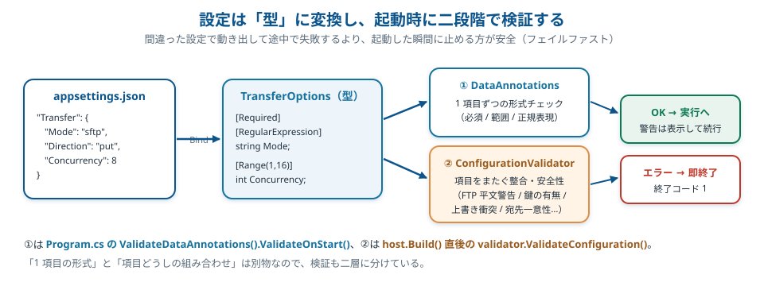

### ① DataAnnotations（1 項目ずつの形式チェック）
`[Required]`（必須）、`[Range(1,16)]`（範囲）、`[RegularExpression("^(ftp|sftp)$")]`（形式）など、**1 つの項目だけで完結する**チェック。`ValidateDataAnnotations()` が担います。

### ② ConfigurationValidator（項目をまたぐ整合・安全性チェック）
「Mode が ftp なら平文だから警告を出す」「秘密鍵認証なのに鍵ファイルパスが無い」「サブフォルダ込み＋フォルダ構造を保たない、の組み合わせは同名上書き事故が起きる」など、**複数の項目の組み合わせ**で初めて判断できるチェック。これは `Program.cs` が `host.Build()` の直後に明示的に呼びます。

```csharp
// Program.cs（実物・抜粋）
var validator = host.Services.GetRequiredService<ConfigurationValidator>();
ConfigurationValidationResult validationResult = validator.ValidateConfiguration(
    watchOptions, transferOptions, retryOptions, hashOptions, cleanupOptions);

if (!validationResult.IsValid)
{
    Console.WriteLine("Configuration validation failed:");
    foreach (var error in validationResult.Errors)
        Console.WriteLine($"ERROR: {error}");
    Environment.Exit(1);   // 設定エラーは即終了（終了コード 1）
}
```

検証結果は 3 段階に分かれます。

| 区分 | 例 | 動作 |
|---|---|---|
| **Error** | RemotePath 未設定、鍵が見つからない | **即終了（終了コード 1）** |
| **Warning** | FTP 平文通信、ホスト鍵検証スキップ、上書き衝突の恐れ | 表示して**続行** |
| **Info** | 参考情報 | 表示して続行 |

💡 **なぜ二層に分けるのか？** 「1 項目の形式が正しいか」と「項目どうしの組み合わせが妥当か」は**まったく別の関心事**だからです。前者は DataAnnotations という標準機構で宣言的に書け、後者は自前のロジックが必要。役割で分けることで、それぞれが読みやすく・テストしやすくなります（`ConfigurationValidationTests` / `ConfigurationValidationAdvancedTests` が後者を手厚く検証しています）。

⚠️ **Warning と Error の線引きは設計判断です。** たとえば「FTP（平文）」はセキュリティ的に望ましくないが、**動作はする**ので Error にはせず Warning。一方「RemotePath が空」は**動作不能**なので Error。「止めるべきか、警告で済ますか」をユーザー目線で決めているのがポイントです。

## 2.4 主な設定セクション早見表

| セクション | 型 | 決めること |
|---|---|---|
| `Watch` | `WatchOptions` | 何を転送するか（フォルダ、拡張子、ワイルドカード、END 条件） |
| `Transfer` | `TransferOptions` | どこへどう送るか（FTP/SFTP、put/get、接続先、並列数、追加宛先） |
| `Retry` | `RetryOptions` | 失敗時に何回・どの間隔で粘るか |
| `Hash` | `HashOptions` | どのアルゴリズムで整合性検証するか |
| `Cleanup` | `CleanupOptions` | 成功後に元ファイルを消すか |
| `Smtp` | `SmtpOptions` | 障害を誰にメール通知するか |
| `Logging` | `LoggingOptions` | ログの出力先・保持日数 |
| `App` | `AppOptions` | ロックファイルの場所など |

🧪 **演習（第2回）**：`Configuration/` の中から好きな Options クラスを 1 つ開き、各プロパティに付いている `[ ... ]` 属性（DataAnnotations）を読み、「この属性は何を保証しているか」を声に出して説明してみましょう。例：`[Range(1, 3600)] public int TimeoutSeconds` →「1〜3600 秒の範囲しか許さない＝0 や負数、非現実的な巨大値を弾く」。

---

# 第3回　起動と依存性注入(DI)：Program.cs 完全読解

> **この回のゴール**：`Program.cs` を頭から終わりまで 1 区切りずつ読み切る。「依存性注入(DI)」「ファクトリ」という言葉を自分の言葉で説明できるようになる。

## 3.1 依存性注入(DI)とは何か、なぜ嬉しいのか

「依存性注入(Dependency Injection)」は名前が物々しいですが、考え方は単純です。**クラスが必要とする道具を、自分で作らず、外から渡してもらう**——それだけです。

```csharp
// ❌ DI を使わない（密結合）：自分で new する
public class Worker
{
    private readonly Logger _logger = new Logger();   // 自分で作っている
}

// ✅ DI を使う（疎結合）：外から受け取る
public class Worker
{
    private readonly ILogger<Worker> _logger;
    public Worker(ILogger<Worker> logger)   // コンストラクタで「ください」と宣言
    {
        _logger = logger;
    }
}
```

💡 **何が嬉しいのか？**
1. **テストしやすい**：本物のロガーや本物の転送クライアントの代わりに、テスト用の偽物（モック）を差し込める。第13回で「`Worker` のテストはモックの転送クライアントを注入して書く」のを見ますが、それが可能なのは DI のおかげです。
2. **差し替えが容易**：FTP 実装と SFTP 実装を、呼び出し側のコードを変えずに切り替えられる。
3. **依存関係が明示される**：コンストラクタを見れば「このクラスは何に依存しているか」が一目でわかる。

「誰がどの道具を作って配るか」を一手に引き受けるのが **DI コンテナ**で、`Host.CreateApplicationBuilder` が用意してくれます。`builder.Services.AddXxx(...)` が「コンテナへの登録」です。

## 3.2 Program.cs を順に読む

`Program.cs` はトップレベルステートメント（`Main` を書かずに直接処理を書く形式）です。順に見ます。

### (1) ホストの土台を作る
```csharp
var builder = Host.CreateApplicationBuilder(args);
```
設定・ロギング・DI コンテナの土台が用意される（第1回参照）。

### (2) 設定を DI に登録し、起動時検証を仕込む
```csharp
builder.Services.AddOptions<WatchOptions>().BindConfiguration("Watch").ValidateDataAnnotations().ValidateOnStart();
// ... 他のセクションも同様
builder.Services.AddOptions<AppOptions>().BindConfiguration("App");   // App だけ検証なし
```
第2回で見たとおり。`App` だけ `ValidateDataAnnotations()` が無いのは、必須項目がない緩い設定だからです。

### (3) ロギングを構成する
```csharp
var logging = builder.Configuration.GetSection("Logging").Get<LoggingOptions>() ?? new LoggingOptions();
var smtp = builder.Configuration.GetSection("Smtp").Get<SmtpOptions>() ?? new SmtpOptions();
builder.Logging.ClearProviders();             // 既定のログ出力を一旦消す
// ...ログレベルを設定（不正な文字列なら警告して Information にフォールバック）...
builder.Logging.AddSimpleConsole(o => o.TimestampFormat = "yyyy-MM-dd HH:mm:ss ");
if (!string.IsNullOrEmpty(logging.RollingFilePath))
{
    builder.Logging.AddProvider(new RollingFileLoggerProvider(logging));   // ファイルにも出す
    // 起動時に古いログを掃除（Retention 有効時）
}
if (smtp.Enabled)
{
    builder.Logging.AddProvider(new ErrorEmailLoggerProvider(smtp));       // エラーをメール送信
}
```
💡 ここで注目したいのは、`logging.Level` の文字列をパースする箇所です。

```csharp
var logLevel = LogLevel.Information;   // デフォルト
if (!string.IsNullOrEmpty(logging.Level) && !Enum.TryParse<LogLevel>(logging.Level, true, out logLevel))
{
    Console.WriteLine($"Warning: Invalid log level '{logging.Level}'. Using default 'Information'.");
    logLevel = LogLevel.Information;
}
```
**設定ミス（例：`"Level": "NotALevel"`）でアプリを落とさず、警告して安全な既定値で続行**しています。「ログレベルのタイプミスくらいで起動不能になるのは過剰」という判断です。（このふるまいは `ProgramStartupTests` でテストされています。）

### (4) サービスを登録する
```csharp
builder.Services.AddSingleton<ConfigurationValidator>();
builder.Services.AddSingleton<ApplicationExitCode>();
builder.Services.AddHostedService<Worker>();   // ← これがメイン処理
```
- `AddSingleton<T>`：アプリ全体で**1 つだけ**インスタンスを作って共有する（`ConfigurationValidator` も終了コード保持の `ApplicationExitCode` もアプリに 1 個でよい）。
- `AddHostedService<Worker>()`：`Worker` を「ホストが起動したら走らせるバックグラウンドサービス」として登録。これで `ExecuteAsync` が呼ばれるようになる。

### (5) 構築して検証
```csharp
var host = builder.Build();   // ここで全部が組み上がる
// ConfigurationValidator を取り出して項目横断の検証（第2回 ②）
// Error があれば Environment.Exit(1)
```

### (6) 二重起動を防ぐロックを取る
```csharp
var appOptions = host.Services.GetRequiredService<IOptions<AppOptions>>().Value;
ProcessLock? procLock;
try
{
    procLock = ProcessLock.Acquire(appOptions.LockFilePath, watchOptions.Path);
}
catch (InvalidOperationException ex)
{
    Console.Error.WriteLine($"ERROR: {ex.Message}");
    Environment.Exit(2);   // ← 二重起動は終了コード 2
    return;
}
```
💡 終了コードを **1（エラー）と 2（二重起動）で使い分け**ています。スケジューラ側から見ると「2 が頻発するなら実行間隔が短すぎる」と判断できる。終了コードは「外の世界（監視）との会話」なので、意味を持たせる価値があります（第11回・第12回で再登場）。

### (7) 実行 → 後始末
```csharp
var exitCodeTracker = host.Services.GetRequiredService<ApplicationExitCode>();   // Run の前に取得（1.3 参照）
try
{
    host.Run();                                   // ここで Worker.ExecuteAsync が走る。終わるまで戻らない
    if (exitCodeTracker.Code != 0)
        Environment.ExitCode = exitCodeTracker.Code;
}
finally
{
    procLock.Dispose();                           // 必ずロックを解放（成功でも失敗でも）
}
```
`finally` でロックを解放しているので、転送が例外で落ちても**ロックファイルが残りっぱなしにならない**。

## 3.3 ファクトリパターン：設定に応じてクライアントを作り分ける

`Worker` は「FTP か SFTP か」を設定に応じて選びます。ここで使われているのが **ファクトリ（工場）パターン**です。

```csharp
// Worker.cs（実物）
private IFileTransferClient CreateClientCore(DestinationOptions dest)
{
    return dest.Mode.ToLowerInvariant() switch
    {
        "sftp" => ActivatorUtilities.CreateInstance<SftpClientWrapper>(_services, dest),
        "ftp"  => ActivatorUtilities.CreateInstance<AsyncFtpClientWrapper>(_services, dest),
        _ => throw new ArgumentException($"Unsupported transfer mode: {dest.Mode}")
    };
}
```

- `switch` 式で `Mode` の文字列を見て、対応する実装を生成。
- `ActivatorUtilities.CreateInstance<T>(_services, dest)` は「**DI コンテナ(`_services`)から足りない依存（ロガーなど）を補いつつ、`dest` は手で渡して**、`T` のインスタンスを作る」ヘルパー。`new SftpClientWrapper(...)` と手書きすると、ロガーなどを自分で集める必要がありますが、これに任せれば DI が面倒を見てくれます。

💡 戻り値の型が**インターフェース `IFileTransferClient`** であることが重要。呼び出し側は「FTP か SFTP か」を意識せず、`IFileTransferClient` として同じように使えます（＝**Strategy パターン**。第5回で詳説）。

```csharp
protected virtual IFileTransferClient CreateClient() => CreateClientCore(_transfer);   // primary 用
protected virtual IFileTransferClient CreateClientFor(DestinationOptions dest) { ... }  // 宛先ごと
```

⚠️ `protected virtual` に注目。`virtual` は「サブクラスで上書き可能」という意味。テストでは `Worker` を継承した `TestWorker` がこの `CreateClient()` を**オーバーライドしてモックを返す**ことで、本物のサーバーなしに `Worker` を試せます（第13回で実物を見ます）。「テストのための拡張ポイント」を意図的に開けてあるのです。

🧪 **演習（第3回）**：`Program.cs` の (1)〜(7) を、コメントを隠して上から音読し、各ブロックが「何のためにあるか」を 1 文で言えるか確認しましょう。詰まったら本文に戻る。

---

# 第4回　非同期プログラミングの基礎（async / await）

> **この回のゴール**：`async` / `await` / `Task` / `CancellationToken` が「何のためにあるのか」を、FTP 転送という具体例で腹落ちさせる。これは本ツール全体の前提技術です。

## 4.1 同期 vs 非同期：何が違うのか

「ファイルを 1 個ダウンロードする」を考えます。

```csharp
// 同期（ブロッキング）
public void DownloadFile(string path)
{
    var data = client.Download(path);   // ここでサーバー応答を「待つ」間、このスレッドは何もできず塞がる
    File.WriteAllBytes(localPath, data);
}

// 非同期
public async Task DownloadFileAsync(string path)
{
    var data = await client.DownloadAsync(path);   // 「待ち」に入る瞬間、スレッドを手放す
    await File.WriteAllBytesAsync(localPath, data);
}
```

ネットワーク転送は、時間のほとんどが「リクエストを送って、サーバーの応答を待つ」時間です。この**待ち時間に CPU は何もしていません**。これを **I/O バウンド**（処理時間の主因が入出力待ち）と呼びます。

- **同期**だと、待っている間もそのスレッドが占有され続けます。同時に 10 ファイル送りたければ 10 スレッド要る。
- **非同期(`await`)**だと、待ちに入った瞬間スレッドを返却し、別の仕事に回せます。**少ないスレッドで多数の転送を同時進行**できます。

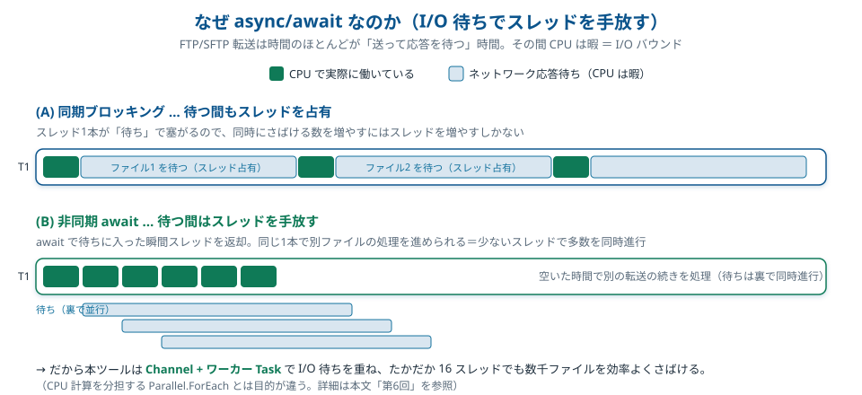

💡 これが、本ツールが徹底して `async/await` を使う理由です。FTP/SFTP 転送という **I/O バウンドな仕事**を、少ないスレッドで効率よくさばくため。第6回の並列処理も、この性質の上に成り立っています。

## 4.2 用語整理

| 用語 | 意味 |
|---|---|
| `Task` | 「いつか完了する処理」を表す箱。`await` で完了を待てる |
| `Task<T>` | 完了すると `T` 型の結果を返す `Task` |
| `async` | このメソッドの中で `await` を使う、という宣言 |
| `await` | 「この `Task` が終わるまで待つ。ただし待つ間スレッドは手放す」 |

```csharp
// 実例：HashUtil.ComputeHashAsync（実物・抜粋）
public static async Task<string> ComputeHashAsync(Stream stream, string algorithm, CancellationToken ct)
{
    using var hasher = IncrementalHash.CreateHash(ResolveAlgorithm(algorithm));
    var buffer = new byte[GetBufferSize(stream)];
    int read;
    while ((read = await stream.ReadAsync(buffer.AsMemory(0, buffer.Length), ct).ConfigureAwait(false)) > 0)
    {
        hasher.AppendData(buffer, 0, read);
    }
    return Convert.ToHexString(hasher.GetHashAndReset()).ToLowerInvariant();
}
```
`await stream.ReadAsync(...)` で「次のかたまりが読めるまで」待ちますが、その間スレッドは別の仕事に使えます。

## 4.3 `ConfigureAwait(false)` を全部に付けている理由

本ツールのほぼ全ての `await` に `.ConfigureAwait(false)` が付いています。

```csharp
await client.UploadAsync(localPath, remotePath, token).ConfigureAwait(false);
```

💡 `ConfigureAwait(false)` は「`await` の後、**元のスレッド（同期コンテキスト）に戻らなくてよい**」という指示です。UI アプリでは「UI スレッドに戻る」必要がありますが、本ツールのようなコンソール/サービスでは戻る必要がありません。戻らない方が**わずかに速く、デッドロックのリスクも減る**ため、ライブラリ的なコードでは付けるのが定石です。

⚠️ 「全部に付ける」のは規律です。1 か所でも付け忘れると意図が揺らぐので、コードベース全体で統一しています。

## 4.4 CancellationToken：協調的キャンセル

`CancellationToken`（キャンセルトークン）は「**そろそろやめてね**」という合図を運ぶオブジェクトです。

- ホストが停止するとき、Ctrl+C のとき、タイムアウトのときに「キャンセル要求」が立ちます。
- 各 `async` メソッドは `ct` を受け取り、要所で `ct.ThrowIfCancellationRequested()` を呼んだり、`ReadAsync(..., ct)` のように下流へ渡したりします。
- これは**協調的（cooperative）キャンセル**です。強制終了ではなく「キリのいいところで自分から止まる」方式。途中で無理やり殺さないので、リソースの後始末が安全にできます。

```csharp
// SftpClientWrapper.UploadAsync（実物・抜粋）
ct.ThrowIfCancellationRequested();
await using (var fs = File.OpenRead(localPath))
{
    _client.UploadFile(fs, temp, true);   // SSH.NET にキャンセル対応 API が無いので…
}
ct.ThrowIfCancellationRequested();        // …前後でチェックして「次のチェック点」で止まれるようにする
```
⚠️ ライブラリによってはキャンセル対応 API が無いものもあります（SSH.NET の `UploadFile` など）。その場合は**操作の前後で `ThrowIfCancellationRequested()` を挟み**、できる範囲でキャンセルに応じる、という現実的な工夫をしています。コメントにもその旨が書かれています。

🧪 **演習（第4回）**：`HashUtil.ComputeHashAsync(Stream, ...)` と、同じファイルの `ComputeHashSync(Stream, ...)`（同期版）を読み比べ、「非同期版が `await ... ReadAsync` を使うのに対し同期版は `Read` を使う」点を確認しましょう。なぜ同期版も用意されているか考えてみてください（ヒント：`ReadAsync` を持たないストリーム向け。コメントに理由あり）。

---

# 第5回　転送の中核：Strategy パターンとアトミック転送

> **この回のゴール**：「FTP と SFTP を同じように扱う」仕組み（インターフェース＝Strategy パターン）と、「中途半端なファイルを相手に見せない」アトミック転送の実装を理解する。

## 5.1 IFileTransferClient：転送の「契約」

FTP と SFTP はプロトコルが違いますが、**やりたいこと（アップロード・ダウンロード・一覧・削除…）は同じ**です。そこで「やりたいことの一覧」を**インターフェース**として定義します。

```csharp
// Services/IFileTransferClient.cs（実物・全文）
public interface IFileTransferClient : IDisposable
{
    Task UploadAsync(string localPath, string remotePath, CancellationToken ct);
    Task DownloadAsync(string remotePath, string localPath, CancellationToken ct);
    Task<string> GetRemoteHashAsync(string remotePath, string algorithm, CancellationToken ct, bool useServerCommand = false);
    Task<IEnumerable<string>> ListFilesAsync(string remotePath, CancellationToken ct, bool includeSubdirectories = false);
    Task<bool> ExistsAsync(string remotePath, CancellationToken ct);
    Task DeleteAsync(string remotePath, CancellationToken ct);
}
```

これを 2 つのクラスが実装します。

- `SftpClientWrapper`（SSH.NET ライブラリを使う SFTP 実装）
- `AsyncFtpClientWrapper`（FluentFTP ライブラリを使う FTP 実装。ファイル名は `FtpClient.cs`）

💡 これが **Strategy（戦略）パターン**です。「同じ目的を達成する複数のやり方」をインターフェースで抽象化し、**実行時に差し替える**。`Worker` は `IFileTransferClient` としか会話しないので、FTP か SFTP かを一切気にしません。新プロトコル（例：将来 S3）を足したくなっても、`IFileTransferClient` を実装するクラスを 1 つ追加するだけで `Worker` 側は無変更で済みます。

`IDisposable` を継承しているのは「接続という後始末が必要な資源を持つ」から。使い終わったら `Dispose()` で切断します。

## 5.2 アトミック転送：「半分だけのファイル」を作らない

ファイル連携の定番事故が「**転送中のファイルを相手のバッチが拾ってしまう**」です。`data.csv` を書いている最中に相手が `data.csv` を読むと、半分しかないデータを処理してしまう。

本ツールは**一時ファイル名で送ってから、完了後に正式名へリネーム**することでこれを防ぎます。

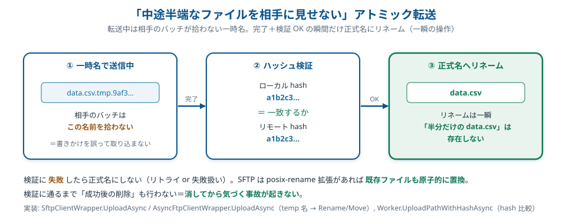

```csharp
// SftpClientWrapper.UploadAsync（実物・抜粋）
var temp = $"{remotePath}.tmp.{Guid.NewGuid():N}";   // 一意な一時名（相手のバッチは拾わない名前）
try
{
    ct.ThrowIfCancellationRequested();
    await using (var fs = File.OpenRead(localPath))
        _client.UploadFile(fs, temp, true);           // まず一時名で送る
    ct.ThrowIfCancellationRequested();

    await RenameOverwriteAsync(temp, remotePath, ct); // 完了したら正式名へリネーム（一瞬）
}
catch
{
    try { if (_client.Exists(temp)) _client.DeleteFile(temp); } catch { }  // 失敗時は一時ファイルを掃除
    throw;
}
```

💡 ポイント：
- リネームは（同一サーバー内では）**一瞬で終わる操作**。だから「半分だけ書かれた `data.csv`」が外から見える瞬間が存在しません。
- 失敗したら一時ファイルを消すので、**ゴミが溜まらない**。
- ダウンロードも同様に `localPath.tmp.xxxx` に落としてから `File.Move(temp, localPath, true)` でリネームします。

### posix-rename：さらに踏み込んだ原子性
SFTP では、リネーム先に既存ファイルがあると「削除してからリネーム」が必要になり、その**一瞬だけファイルが存在しない瞬間**が生まれます。これを避けるため、サーバーが `posix-rename` 拡張に対応していれば**上書きリネームを 1 操作で**行います。

```csharp
// SftpClientWrapper.RenameOverwriteAsync（実物・抜粋）
if (_posixRenameSupported != false)
{
    try
    {
        _client.RenameFile(tempPath, remotePath, isPosix: true);  // 原子的に置換
        _posixRenameSupported = true;
        return;
    }
    catch (Exception ex) when (ex is NotSupportedException or SshException && SafeExists(tempPath))
    {
        _posixRenameSupported = false;   // 未対応サーバーと判明 → 以後フォールバック
        // ...
    }
}
// フォールバック：Delete してから Rename（非原子的。未対応サーバーの制約）
```
⚠️ `_posixRenameSupported` を `bool?`（null=未判定）で覚えておき、一度判明したら以後は無駄なリトライをしない、という**接続先ごとの最適化**も入っています。「対応サーバーは速く安全に、未対応サーバーも一応動く」を両立。

## 5.3 ディレクトリの自動作成と並列の競合

転送先に中間ディレクトリが無ければ作ります。ここに並列処理ならではの罠があります。

```csharp
// SftpClientWrapper.EnsureDirectoryAsync（実物・抜粋）
try
{
    await _client.CreateDirectoryAsync(current, ct);
}
catch (SshException)
{
    // 並列ワーカーが同じディレクトリを同時に作ると Exists→Create の間で競合し得る。
    // 作成後に存在していれば成功として扱う。
    bool exists = await _client.ExistsAsync(current, ct);
    if (!exists) throw;
}
```
💡 「存在チェック → 作成」の間に別ワーカーが先に作ってしまう、という**時間差の競合（TOCTOU）**を、「作成に失敗しても結果的に存在すれば OK」という考え方でいなしています。並列を前提にすると、こういう「結果オーライ」の堅牢化があちこちに必要になります。

## 5.4 FTP 側の実装も見ておく

FTP 実装（`AsyncFtpClientWrapper`）も同じ `IFileTransferClient` を満たし、考え方は同じ（一時名→`MoveFile`）です。

```csharp
// AsyncFtpClientWrapper.UploadAsync（実物・抜粋）
var tempPath = $"{remotePath}.tmp.{Guid.NewGuid():N}";
try
{
    await _client.UploadFile(localPath, tempPath, FtpRemoteExists.Overwrite, true, FtpVerify.None, null, ct);
    await _client.MoveFile(tempPath, remotePath, FtpRemoteExists.Overwrite, ct);
}
catch
{
    try { await _client.DeleteFile(tempPath, ct); } catch { }
    throw;
}
```

⚠️ 1 つ FTP 特有の配慮：**存在しないディレクトリの一覧取得**。FTP サーバーの多くは存在しないディレクトリを `LIST` しても空応答を返すため、`RemotePath` の設定ミスが「0 件成功」として見逃されかねません。そこで明示的に存在確認します。

```csharp
// AsyncFtpClientWrapper.ListFilesAsync（実物・抜粋）
if (!string.IsNullOrEmpty(remotePath) && remotePath != "/" && remotePath != "."
    && !await _client.DirectoryExists(remotePath, ct))
{
    throw new DirectoryNotFoundException($"Remote directory not found: {remotePath}");
}
```
💡 SFTP 側は存在しないパスで例外になるので、**FTP の挙動を SFTP に合わせて揃える**ためのコードです。「2 つの実装の振る舞いを揃える」のも Strategy パターンを使う側の責任です。

🧪 **演習（第5回）**：`SftpClientWrapper.UploadAsync` と `AsyncFtpClientWrapper.UploadAsync` を並べて読み、「共通する考え方（一時名→リネーム→失敗時に掃除）」と「ライブラリ都合で異なる部分」を仕分けしてみましょう。

---

# 第6回　並列処理：Channel + ワーカー Task の「流れ作業」

> **この回のゴール**：本ツールの並列処理がなぜ `foreach` でも `Parallel.ForEach` でもなく **Channel + ワーカー Task** なのかを、自分の言葉で説明できるようになる。これは本ツール設計の核心の一つです。
> 📎 この回は [docs/fanout-and-parallelism.md](docs/fanout-and-parallelism.md) §7 と対応しています。より深い図解はそちらも参照。

## 6.1 まず「並列の作り方」には種類がある

「ファイルを並列で速く送る」と聞くと `Parallel.ForEach` を思い浮かべがちですが、並列の作り方は 1 つではありません。4 つ比べます。

### (A) ふつうの foreach … 1 人で順番に（並列ではない）
```
[ファイル1]→[ファイル2]→[ファイル3]→[ファイル4]
  送信…       送信…       送信…       送信…
└─────────── 時間（ぜんぶ足し算）───────────▶
```
通信の待ち時間の間ずっと何もせず待つ。だから遅い。

### (B) Parallel.ForEach … 先にそろった一覧を“パッと”分担
- もともと **CPU を使う計算を、コア数ぶんに分担する**のが得意な道具。
- 弱点①：**一覧が最初に全部そろっている前提**。「フォルダを見ながら見つけ次第流す」用途に向かない。
- 弱点②：単純に使うと、通信の待ち時間の間も**スレッドを占有して塞ぐ**（I/O バウンドと相性が悪い。第4回参照）。
- 弱点③：接続の使い回し・1 件ごとの再試行・宛先ごとの振り分けは**全部自前で作り込む**必要がある。

### (C) 全部いっぺんに投げる（Task.WhenAll）
```
[1][2][3]…[5000]   ← 5000 件なら 5000 接続を一斉に開きにいく
```
同時実行数に上限がなく、相手サーバーに殺到する。**ブレーキ（同時数制限）を自前で足さないと危険**。

### (D) 本実装 … 流れ作業（作る人と処理する人を分ける）
これが本ツールの採用形です。

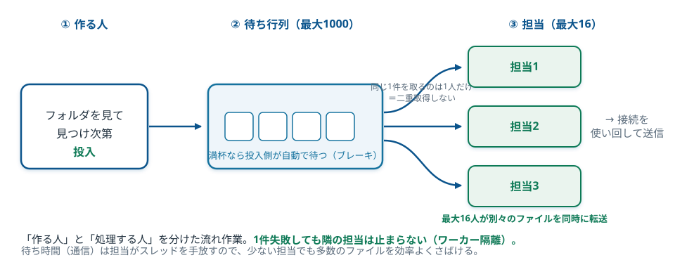

- **作る人（プロデューサ）**：フォルダを見て、見つけ次第「待ち行列（Channel）」へ投入。
- **待ち行列（Channel）**：最大 1000 件まで。満杯なら投入側が自動で待つ＝**ブレーキが標準で効く**。
- **担当（ワーカー Task）**：`Concurrency`（1〜16）人。待ち行列から 1 件ずつ取って転送。

💡 **核心：「Parallel.ForEach は計算を速くする道具」「本実装は通信を待ち合わせながら流す道具」**。同じ「並列」でも目的が違います。FTP/SFTP のような I/O バウンドな仕事には、待ち行列に担当をぶら下げる流れ作業（producer–consumer）が素直にはまります。

### 早見表

| | (A) foreach | (B) Parallel.ForEach | (D) 本実装 |
|---|---|---|---|
| 同時に何件 | 1 件ずつ | 複数（一覧を分担） | 複数（担当を固定数） |
| 入力 | 一覧 | **最初に全部そろう必要** | **流れてくるものを順次** |
| ブレーキ | — | 自分で足す | **標準で効く（待ち行列）** |
| 1 件ごとの再試行 | 自分で | 自分で | **組み込み済み（Polly）** |
| 1 件の失敗 | — | 全体が止まり得る | **隣は止まらない** |
| 接続の使い回し | 自明 | 難しい | **自然にできる（ClientPool）** |
| 向くもの | 少量・単純 | 計算(CPU)の分担 | 通信(I/O)を順次・宛先ごと |

## 6.2 Channel とは

`System.Threading.Channels.Channel<T>` は、**スレッドセーフな待ち行列**です。「書き込む人(Writer)」と「読み取る人(Reader)」を安全につなぎます。

```csharp
// Worker.cs（実物）：容量つきチャネルを作る
private static Channel<TransferItem> CreateTransferChannel()
{
    return Channel.CreateBounded<TransferItem>(new BoundedChannelOptions(QueueCapacity)  // QueueCapacity = 1000
    {
        FullMode = BoundedChannelFullMode.Wait,   // 満杯なら投入側が待つ＝ブレーキ
        SingleReader = false,                     // 読み手は複数（＝複数ワーカー）
        SingleWriter = false                      // 書き手も複数（＝複数プロデューサ）
    });
}
```

- `CreateBounded`（容量つき）にすることで、投入が速すぎても**メモリが青天井にならない**。満杯なら `WriteAsync` が待つ＝自然な流量調整。
- `SingleReader/Writer = false` で「複数の読み手・書き手」を許可（第9回のファンアウトで効いてきます）。

## 6.3 TransferQueue：ワーカー Task をぶら下げる

並列の本体は `TransferQueue.StartAsync` です。指定された並列数ぶんのワーカー Task を起動し、全員が同じチャネルからアイテムを「取り合い」ます。

```csharp
// TransferQueue.cs（実物・骨格）
public Task StartAsync(Func<TransferItem, CancellationToken, Task> handler,
                       Action<TransferItem, Exception?>? onFinalOutcome, CancellationToken ct)
{
    var tasks = new Task[_concurrency];
    for (int i = 0; i < _concurrency; i++)
    {
        int workerId = i;
        tasks[i] = Task.Run(async () => await Worker(workerId, ct).ConfigureAwait(false), ct);  // ワーカーを並列起動
    }
    return Task.WhenAll(tasks);   // 全ワーカーの完了を待つ Task を返す

    async Task Worker(int workerId, CancellationToken token)
    {
        while (await _reader.WaitToReadAsync(token).ConfigureAwait(false))   // 来るまで待つ（イベント駆動）
        {
            if (_reader.TryRead(out var item))   // 1 件取り出す（同じ1件は1人しか取れない）
            {
                // …重複抑止・統計・リトライ・結果通知（後述）…
            }
        }
    }
}
```

ここを読み解く 4 つのポイント：

### ① `while (await WaitToReadAsync)` がイベント駆動の心臓
アイテムが来たら起き、無ければ待つ。チャネルが `Complete` されると `WaitToReadAsync` が `false` を返してループ終了 → ワーカーが自然に止まる。CPU をぐるぐる回して待つ（ビジーループ）のではなく、**来たら起こされる**ので無駄がない。

### ②「取り合い」＝二重取得しない（≠ 同時に 1 人）
⚠️ よくある誤解：「みんなで 1 つのチャネルから取り合う＝結局 1 人ずつしか動かない」——これは**間違い**です。`TryRead` は 1 アイテムを必ず 1 ワーカーにだけ渡すので「**同じ 1 件を 2 人が掴まない**」という意味であって、担当が N 人いれば **N 件が同時に進みます**（最大 16 件並列）。第4回の `await` でスレッドを手放す性質と合わさり、少ないスレッドで多数を同時進行できます。

### ③ 並列度のクランプ
```csharp
_concurrency = Math.Max(1, Math.Min(concurrency, 16));   // 1〜16 に丸める
```
設定で範囲外（0 や 100）が来ても安全に 1〜16 に収める。設定バリデーションでも弾きますが、ここでも二重に守っています。

### ④ 重複抑止（DedupKey）
```csharp
// TransferQueue.Worker（実物・抜粋）
var itemKey = item.DedupKey;
Interlocked.Increment(ref _totalEnqueued);
if (!_processedItems.TryAdd(itemKey, true))   // すでに処理済みのキーなら
{
    var duplicateException = new InvalidOperationException($"Duplicate transfer item skipped: {itemKey}");
    Interlocked.Increment(ref _totalFailed);
    onFinalOutcome?.Invoke(item, duplicateException);   // 重複も「失敗」として 1 回通知
    continue;
}
```
`_processedItems` は `ConcurrentDictionary`（スレッドセーフな辞書）。`TryAdd` が `false`（＝すでにある）なら、同じものを二重に送らない。`DedupKey` は `TransferItem` が計算します（第9回で詳説。宛先違いは別物として扱う巧妙なキー）。

## 6.4 ワーカー隔離：1 件の失敗で全部止めない

並列処理で最重要の設計判断が「**1 ファイルの失敗を、他のワーカーに波及させない**」ことです。

```csharp
// TransferQueue.Worker（実物・抜粋）
try
{
    await _policy.ExecuteAsync(async (ctx, t) =>
    {
        await handler(item, t).ConfigureAwait(false);   // ← 実際の転送（Polly のリトライ込み）
    }, context, token).ConfigureAwait(false);

    Interlocked.Increment(ref _totalCompleted);
    onFinalOutcome?.Invoke(item, null);                 // 成功を 1 回通知
}
catch (Exception ex)
{
    Interlocked.Increment(ref _totalFailed);
    _logger.LogError(_finalFailureEventId, ex, "... failed ...");
    onFinalOutcome?.Invoke(item, ex);                   // 失敗を 1 回通知
    // 例外を再スローせず、他のワーカーの処理を継続させる ← ここが肝
}
```

💡 ハンドラの例外を `catch` して**握りつぶし、再スローしない**。だから 1 件失敗しても `while` ループは次のアイテムへ進み、他のワーカーも止まりません。失敗は「統計(`_totalFailed`)」と「ログ」と「`onFinalOutcome` 経由の通知」に計上され、**見えなくならない**。これが「ワーカー隔離」です。

⚠️ 「失敗を握りつぶす」と聞くと不安ですが、ここでは**握りつぶす＝なかったことにする、ではない**。失敗は確実に記録され、最終的に終了コードや通知に反映されます。「全体を止めずに、失敗を漏れなく集計する」ための握りつぶしです。

## 6.5 onFinalOutcome：結果を「1 アイテムにつき 1 回だけ」通知する

`onFinalOutcome` は、**Polly の再試行がすべて終わった後**に、1 キュー要素につき**ちょうど 1 回**呼ばれます（成功なら `null`、失敗なら例外を渡す）。

💡 なぜこれが大事か？ 第9回のファンアウトで「全宛先の最終結果を集約する」ために、「各宛先の最終結果が 1 回だけ確定して報告される」必要があるからです。リトライ中に何度も通知されたら集計が壊れます。「リトライを全部やり切った後の、確定した結果を 1 回」という契約を `TransferQueue` が保証しています。

## 6.6 ClientPool：接続を使い回す

1 ファイルごとに接続を張り直すのは、特に SFTP では**鍵交換・認証が重い**ので無駄です。そこで宛先ごとに接続プールを持ち、空き接続を使い回します。

```csharp
// ClientPool.cs（実物・抜粋）
private readonly ConcurrentBag<IFileTransferClient> _available = new();

public IFileTransferClient Rent(Func<IFileTransferClient> factory)
    => _available.TryTake(out var client) ? client : factory();   // 空きがあれば再利用、無ければ新規生成

public void Return(IFileTransferClient client, bool reusable)
{
    if (reusable && Volatile.Read(ref _disposed) == 0) { _available.Add(client); return; }  // プールへ戻す
    SafeDispose(client);   // 壊れている/破棄済みなら切断
}
```

ワーカー側の使い方（`Worker.ExecuteAsync` が渡すハンドラ、実物の要点）：

```csharp
var client = context.Pool.Rent(() => isUpload ? CreateClientFor(dest) : CreateClient());  // 借りる
var reusable = true;
try
{
    bytes = await ProcessUploadAsync(client, item, id, token);   // 使う
}
catch (Exception ex)
{
    reusable = !RetryableExceptionClassifier.IsConnectionBroken(ex);  // 接続が壊れたら再利用しない
    throw;   // Polly に投げてリトライ判定
}
finally
{
    context.Pool.Return(client, reusable);   // 返す（壊れていれば破棄）
}
```

💡 重要な設計：
- 中身は `ConcurrentBag`（スレッドセーフな袋）。`Rent`/`Return` を複数ワーカーが同時に呼んでも安全。
- ⚠️ クライアントラッパー（SFTP/FTP）は**スレッドセーフではない**ので、`Rent` した接続は `Return` まで他ワーカーが取りません（＝同時に 1 接続を使うのは 1 ワーカーだけ）。
- **接続が壊れた**ときは `IsConnectionBroken`（第7回）で判定し、`reusable=false` で返す → プールに戻さず破棄 → 次の `Rent` で張り直す。**壊れた接続を使い回す事故**を防ぐ。
- 全ワーカー終了後に `Pool.Dispose()` で残りをまとめて切断。

→ 結果として **接続生成回数 ≒ 並列数**（ファイル数ぶん張り直すより遥かに安い）。アイドル切断対策に `KeepAliveSeconds`（SFTP は KeepAliveInterval、FTP は NOOP + TCP KeepAlive）もあります。

🧪 **演習（第6回）**：同僚に「なぜ `Parallel.ForEach` を使わなかったの？」と聞かれたと想定して、3 文以内で答える練習をしましょう。模範例：「FTP 転送は通信待ちが主役の I/O バウンドな仕事で、`Parallel.ForEach` は CPU 計算の分担向き。本実装は Channel に担当をぶら下げる流れ作業なので、待ち行列によるブレーキ・1件ごとの再試行・失敗の隔離・接続の使い回しが自然に組み込める」。

---

# 第7回　リトライと例外分類：Polly と「待てば直る/直らない」

> **この回のゴール**：自動リトライがどう実装され、なぜ「全部の失敗をリトライしない」のかを理解する。

## 7.1 すべての失敗を等しく扱ってはいけない

エラーには 2 種類あります。

- **一時的なエラー**（待てば直る）：ネットワーク瞬断、タイムアウト、サーバー一時混雑。→ 少し待って**もう一度やれば成功するかも**。
- **恒久的なエラー**（待っても直らない）：パスワード間違い、設定ミス、権限不足。→ 何回やっても**同じ結果**。

⚠️ もし全部リトライすると、たとえば「パスワード間違い」を 3 回繰り返して**相手サーバーにアカウントロックをかけてしまう**ような事故が起きます。だから「リトライしていいエラーかどうか」を**見分ける**必要があります。

## 7.2 Polly による指数バックオフ

リトライの仕組みには **Polly** というライブラリを使います。

```csharp
// TransferQueue.cs（実物・抜粋）
_policy = Policy
    .Handle<Exception>(ex => RetryableExceptionClassifier.IsRetryable(ex))   // リトライ可能な例外だけ拾う
    .WaitAndRetryAsync(
        retryCount: options.MaxAttempts,
        sleepDurationProvider: attempt => TimeSpan.FromSeconds(
            Math.Min(options.DelaySeconds * Math.Pow(2, attempt - 1), MaxRetryDelaySeconds)),  // 指数バックオフ＋上限
        onRetry: (ex, ts, attempt, ctx) =>
        {
            var itemPath = ctx.ContainsKey("ItemPath") ? ctx["ItemPath"].ToString() : "Unknown";
            _logger.LogWarning(ex, "Retry {Attempt}/{MaxAttempts} for {ItemPath}: {Error}", attempt, options.MaxAttempts, itemPath, ex.Message);
        });
```

- `.Handle<Exception>(ex => IsRetryable(ex))`：**リトライしていい例外だけ**をリトライ対象にする（恒久エラーは即失敗）。
- **指数バックオフ**：`DelaySeconds * 2^(attempt-1)`。既定 `DelaySeconds=5` なら 5 秒 → 10 秒 → 20 秒…と間隔を倍々に広げる。
  - 💡 なぜ倍々？ 一時的な混雑に対して、間隔を空けるほど回復している可能性が上がるから。すぐ何度も叩くと相手にさらに負荷をかける。
- `Math.Min(..., MaxRetryDelaySeconds)`（=300 秒上限）：⚠️ これが無いと `MaxAttempts` が大きい設定で `2^attempt` が発散し、`TimeSpan.FromSeconds` がオーバーフローします。**上限キャップは安全装置**。
- `onRetry`：リトライのたびに警告ログを出す（運用者が「粘っている」のを見えるように）。

## 7.3 RetryableExceptionClassifier：例外を仕分ける頭脳

「この例外はリトライ可能か？」を一手に引き受けるのが `RetryableExceptionClassifier.IsRetryable` です。

```csharp
// RetryableExceptionClassifier.cs（実物・抜粋）
public static bool IsRetryable(Exception exception)
{
    return exception switch
    {
        // ネットワーク関連（リトライ可能）
        SocketException => true,
        TimeoutException => true,
        SshConnectionException => true,
        SshOperationTimeoutException => true,
        HashMismatchException => true,                         // 転送中の一過性破損 → 再転送で回復し得る
        FtpException ftpEx when IsRetryableFtpException(ftpEx) => true,
        IOException ioEx when IsRetryableIOException(ioEx) => true,

        // 設定・権限・セキュリティ（リトライ不可）
        UnauthorizedAccessException => false,
        ArgumentNullException => false,
        ArgumentException => false,
        InvalidOperationException => false,
        DirectoryNotFoundException => false,
        SecurityException => false,

        _ => IsRetryableByInnerException(exception)            // それ以外は内部例外を辿って判定
    };
}
```

`switch` 式で例外の型ごとに「リトライ可否」を宣言的に書いています。読みどころ：

### 💡 ハッシュ不一致をリトライ可能にしている
`HashMismatchException => true`。送ったファイルのハッシュが合わない＝転送中にビットが化けた可能性。**もう一度送れば直るかも**なのでリトライ対象。第8回と繋がります。

### 💡 FTP は応答コードで判定（言語非依存）
```csharp
// IsRetryableFtpException（実物・抜粋）
if (ftpException is FtpCommandException cmdEx)
{
    var code = cmdEx.CompletionCode;
    if (code[0] == '4') return true;    // 4xx = 一時的な拒否 → リトライ可能
    if (code[0] == '5') return false;   // 5xx = 恒久的な拒否 → リトライ不可
}
```
FTP の応答コードは RFC 959 で意味が決まっており**言語に依存しない**。だからメッセージ文字列より先に応答コードで判定するのが堅い。コードが取れないときだけメッセージのキーワード（"timeout","login" など）で推測し、不明なら安全側に倒してリトライします。

### 💡 IOException は HResult で Windows/Unix 両対応
```csharp
// IsRetryableIOException（実物・抜粋）
return ioException.HResult switch
{
    unchecked((int)0x80070020) => true, // Windows: ERROR_SHARING_VIOLATION（他プロセスが使用中）
    unchecked((int)0x80070070) => true, // Windows: ERROR_DISK_FULL
    11 => true,  // Unix: EAGAIN（一時的に利用不可）
    28 => true,  // Unix: ENOSPC（空き容量なし）
    _ => false
};
```
⚠️ `UnauthorizedAccessException`（権限拒否・読み取り専用属性）は**恒久的**なのでリトライ不可。一方、一時的なファイルロックは Windows では `IOException`（共有違反）として飛ぶので上で拾える。「似て見えるが原因が違う」例外をきちんと区別しています。

## 7.4 IsConnectionBroken：接続を捨てるべきか

リトライ可否とは**別の判定**として「この例外は**接続そのものが壊れた**ことを示すか？」があります。第6回の ClientPool で「壊れた接続は再利用しない」ために使いました。

```csharp
// RetryableExceptionClassifier.cs（実物・抜粋）
public static bool IsConnectionBroken(Exception exception)
{
    return exception switch
    {
        SocketException => true,
        SshConnectionException => true,
        TimeoutException => true,
        ObjectDisposedException => true,
        FtpException ftpEx => IsConnectionRelatedFtpException(ftpEx),

        HashMismatchException => false,   // ハッシュ不一致は接続は生きている → 再利用OK
        // 接続断は IOException の inner に SocketException 等としてラップされ得るので inner を辿る
        IOException ioEx => ioEx.InnerException is { } ioInner && IsConnectionBroken(ioInner),
        UnauthorizedAccessException => false,
        _ => exception.InnerException is { } inner && IsConnectionBroken(inner)
    };
}
```

💡 「**リトライ可能か(IsRetryable)**」と「**接続が壊れたか(IsConnectionBroken)**」は別の問い。たとえばハッシュ不一致は「リトライ可能（=true）だが接続は無事（=false）」。だから**リトライはするが接続は使い回す**。逆にソケット例外は両方 true なので「リトライするし接続も捨てて張り直す」。この 2 軸を分けているのが綺麗な設計です。

⚠️ `IOException` は「ローカルファイル起因なら接続は無事」だが「転送路の切断が inner にラップされることもある」ので、**inner を辿って判定**しています。この再帰的な掘り下げ（`IsRetryableByInnerException` も同様）が、例外がラップされていても正しく分類できる鍵です。

🧪 **演習（第7回）**：次の例外はそれぞれ「リトライ可？」「接続を捨てる?」のどちらか答えてみましょう。①パスワード間違い（認証エラー）②ネットワーク瞬断（SocketException）③ハッシュ不一致 ④RemotePath が存在しない（DirectoryNotFound）。（答え：①不可/捨てない ②可/捨てる ③可/捨てない ④不可/捨てない）

---

# 第8回　整合性：ハッシュ検証

> **この回のゴール**：「送れた」ではなく「**壊れずに送れた**」をどう機械的に確かめるか、その実装を理解する。

## 8.1 ハッシュとは「ファイルの指紋」

ハッシュ値（SHA256 など）は、ファイルの中身から計算される固定長の文字列です。**中身が 1 ビットでも違えば、まったく別の値**になります。だから「ローカルのファイルのハッシュ」と「送った先のファイルのハッシュ」を比べれば、**途中で壊れていないか**を機械的に確認できます。


## 8.2 検証付きアップロードの流れ

```csharp
// Worker.UploadPathWithHashAsync（実物・抜粋）
if (_hash.Enabled)
{
    var localHash = await HashUtil.ComputeHashAsync(localPath, _hash.Algorithm, token);   // ①ローカルの指紋
    await client.UploadAsync(localPath, remotePath, token);                               // ②送る（一時名→リネーム）
    var remoteHash = await client.GetRemoteHashAsync(remotePath, _hash.Algorithm, token, _hash.UseServerCommand);  // ③送った先の指紋

    if (!string.Equals(remoteHash, localHash, StringComparison.OrdinalIgnoreCase))        // ④比較
    {
        var error = $"Hash mismatch for {localPath} at {destLabel}: Local={localHash}, Remote={remoteHash}";
        throw new HashMismatchException(error);   // 不一致 → 専用例外（第7回でリトライ対象）
    }
    return fileSize;   // 一致 → 成功
}
```

💡 ポイント：
- 不一致なら `HashMismatchException` を投げる。これは第7回で見たとおり**リトライ可能**な専用例外なので、自動的にもう一度送り直されます（一過性の破損なら回復）。
- ⚠️ **検証に通るまで「成功」にならない**。だから「成功後にローカルを削除」も、検証 OK の後にしか起きません＝**消してから壊れていたと気づく事故が原理的に起きない**。これがアトミック転送（第5回）とハッシュ検証（第8回）を組み合わせる狙いです。

## 8.3 HashUtil：メモリ効率のよいストリーミング計算

```csharp
// HashUtil.cs（実物・抜粋）
public static async Task<string> ComputeHashAsync(Stream stream, string algorithm, CancellationToken ct)
{
    using var hasher = IncrementalHash.CreateHash(ResolveAlgorithm(algorithm));
    var buffer = new byte[GetBufferSize(stream)];
    int read;
    while ((read = await stream.ReadAsync(buffer.AsMemory(0, buffer.Length), ct)) > 0)
    {
        hasher.AppendData(buffer, 0, read);   // 少しずつ読んで少しずつ食わせる
    }
    return Convert.ToHexString(hasher.GetHashAndReset()).ToLowerInvariant();
}
```

💡 設計の妙：
- **`IncrementalHash`** を使い、ファイルを**少しずつ読んで少しずつハッシュに食わせる**（ストリーミング）。ファイル全体をメモリに載せないので、**何 GB のファイルでも一定の少ないメモリ**で計算できる。
- バッファサイズはファイルサイズで動的に調整（小さいファイルは 8KB、大きいファイルは 256KB）。小さいファイルに大きなバッファは無駄、大きいファイルに小さなバッファは遅い、のバランス。

```csharp
// GetBufferSize（実物・抜粋）
return streamLength switch
{
    < 1024 * 1024 => 8192,          // 1MB未満: 8KB
    < 10 * 1024 * 1024 => 32768,    // 10MB未満: 32KB
    < 100 * 1024 * 1024 => 131072,  // 100MB未満: 128KB
    _ => 262144                     // 100MB以上: 256KB
};
```

- ファイルパスを受け取る版では、`FileOptions.Asynchronous | FileOptions.SequentialScan` を指定して開く。⚠️ `Asynchronous` を指定しないと `ReadAsync` が「同期 I/O をスレッドプールでラップしただけ」になり**真の非同期にならない**。`SequentialScan` は「先頭から順に読む」というヒントで OS のキャッシュ戦略を最適化する。細かいが効く配慮です。

## 8.4 なぜ「ローカル計算」を基本にするのか

`GetRemoteHashAsync` には `useServerCommand` という引数があり、「サーバー側のハッシュコマンドを使うか」を選べます。が、既定はローカル計算（リモートファイルをストリームで読みながら自分で計算）です。

💡 理由：サーバー側ハッシュコマンドは**実装がバラバラ**（FTP の `HASH`/`XSHA256` 拡張はサーバー依存、SFTP プロトコルには標準のハッシュコマンドが無い）。当てにすると「あるサーバーでは動くが別では動かない」になる。**自分でリモートファイルを読んで計算すれば、どんなサーバーでも同じ方法で検証できる**。信頼性を取って、基本はローカル計算にしています。

```csharp
// SftpClientWrapper.GetRemoteHashAsync（実物・抜粋）
// SFTP にはサーバーサイドハッシュが無いので、リモートファイルをストリームで開いて自分で計算
await using var stream = await _client.OpenAsync(remotePath, FileMode.Open, FileAccess.Read, ct);
return await HashUtil.ComputeHashAsync(stream, algorithm, ct);
```

⚠️ `MD5` も技術的には選べますが、設定バリデーションで**禁止**されています（衝突攻撃に弱いため）。`SHA256` / `SHA512` のみが推奨・許可。「動くが安全でない選択肢」を設定段階で塞ぐ、というのもこのツールの一貫した姿勢です。

🧪 **演習（第8回）**：`HashUtil.ComputeHashAsync` がファイル全体をメモリに読み込まずに済む理由を説明してみましょう（ヒント：`IncrementalHash` と `while`ループ）。次に「もしファイル全体を `File.ReadAllBytes` で読んでから計算したら、10GB のファイルで何が起きるか」を考えてみましょう。

---

# 第9回　ファンアウト：1ファイルを複数宛先へ同時配信

> **この回のゴール**：「1 つのファイルを、本番＋大阪＋東京…の複数宛先へ同時に送る」機能（ファンアウト）が、どんな部品でどう実装されているかを理解する。
> 📎 この回は [docs/fanout-and-parallelism.md](docs/fanout-and-parallelism.md) と密接に対応しています。本書で概念を掴み、詳細は向こうで補完するのがおすすめ。

## 9.1 ファンアウトとは

put（アップロード）方向で、**1 つのファイルを primary 宛先＋追加宛先のすべてへ同時送信**することです。

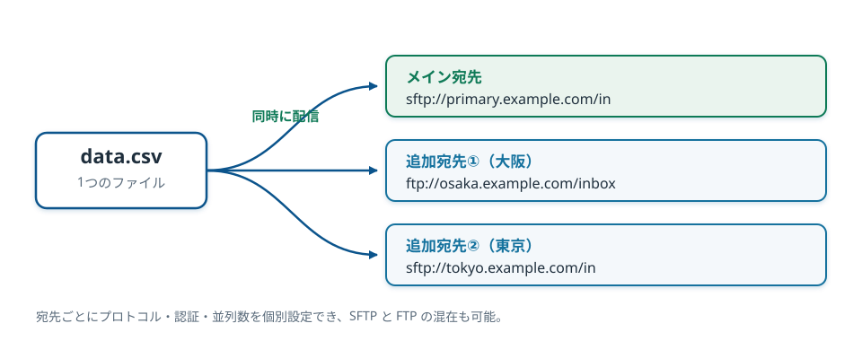

設定では `Transfer`（= primary 宛先）に `AdditionalDestinations`（追加宛先のリスト）を足すと有効になります。

```csharp
// Configuration/TransferOptions.cs（実物・抜粋）
public class TransferOptions : DestinationOptions   // primary は TransferOptions 自身
{
    public List<DestinationOptions> AdditionalDestinations { get; set; } = new();  // 追加宛先
    // ...
}
```

💡 `TransferOptions` が `DestinationOptions` を**継承**しているのが上手い設計。「primary も 1 つの宛先」として同じ型で扱え、`GetUploadDestinations()` が `primary + 追加宛先` を 1 本のリストにまとめます。

```csharp
// Worker.GetUploadDestinations（実物）
private IReadOnlyList<DestinationOptions> GetUploadDestinations()
{
    var list = new List<DestinationOptions> { _transfer };          // primary
    if (_transfer.AdditionalDestinations is { Count: > 0 })
        list.AddRange(_transfer.AdditionalDestinations);            // ＋追加宛先
    return list;
}
```

## 9.2 宛先ごとに「独立したライン」を作る

ファンアウトの肝は、**宛先 1 つにつき、独立した「投入チャネル・ワーカー群・接続プール」を 1 セットずつ持つ**ことです。これを `QueueContext` という入れ子クラスで表します。

```csharp
// Worker.cs（実物・要約）
private sealed class QueueContext
{
    public DestinationOptions Destination { get; }   // この宛先
    public string Name { get; }                      // ログ用ラベル
    public Channel<TransferItem> Channel { get; }    // この宛先専用の投入口
    public TransferQueue Queue { get; }              // この宛先専用のワーカー群
    public ClientPool Pool { get; }                  // この宛先専用の接続プール
}
```

```
                    ┌──────────────────────────────────────────┐
 計画→投入           │ QueueContext[0]=primary                   │
 ┌─────────┐  ┌──▶ │  Channel → TransferQueue(×N) → ClientPool  │──▶ primary
 │ Worker  │  │    └──────────────────────────────────────────┘
 │Execute  ├──┤    ┌──────────────────────────────────────────┐
 │ Async   │  └──▶ │ QueueContext[1]=osaka                     │──▶ 大阪
 └─────────┘       │  Channel → TransferQueue(×N) → ClientPool  │
      │            └──────────────────────────────────────────┘
      │            ┌──────────────────────────────────────────┐
      └──────────▶ │ QueueContext[2]=tokyo …                   │──▶ 東京
                   └──────────────────────────────────────────┘
                              │
            全宛先の結果を ────┘──▶ FanoutCoordinator（GroupId 単位に集約）
```

💡 **なぜ宛先ごとに完全分離するのか？** 「1 宛先の不調が、他の健全な宛先の足を引っ張らない」ためです（**非結合 / decoupling**）。仮に全宛先で 1 本のチャネルを共有すると、応答停止中の宛先が消費しないせいで、そのチャネルへの投入(`WriteAsync`)が容量上限で待たされ、**健全な宛先への投入まで止まってしまう**。宛先ごとにチャネルもワーカーも分ければ、詰まるのはその宛先のラインだけ。（この性質は `WorkerFanoutDecouplingTests` でテストされています。）

## 9.3 3 つのフェーズ：計画 → 投入 → 集約

`Worker.ExecuteAsync` の put 経路は 3 段構えです。

### フェーズ① 計画（逐次・シングルスレッド）
列挙したファイルを `foreach` で 1 件ずつ処理し、「このファイルをどの宛先へ送るべきか」を決めて `plans` リストに貯めます。

- トラッキング有効なら、現在の指紋を計算し、`DeliveryStateStore.GetDeliveredDestinations()` で**配信済みの宛先**を求める（第10回）。
- `pending = 全宛先 − 配信済み` を計算。`pending` が空なら送らず後始末だけ。
- `FanoutCoordinator.Register(groupId, file, pending.Count, 完了コールバック)` で**このファイルのファンアウトグループ**を登録。

⚠️ この時点では**まだキューに何も投入していない**。計画を作るだけ。だから「計画中に完了コールバックが暴発する」ことがなく、マーカーの読み書きを単一スレッドで安全に行えます。

> 💡 `foreach` を使っているのは「計画フェーズの逐次ループ」。並列を生むのはこの後のチャネルとワーカー Task であって、`foreach` ではない——第6回の話と繋がります。

### フェーズ② 投入（宛先ごとに並列・非結合）
`Worker.EnqueueFanoutPlansAsync` が、**宛先ごとに独立したプロデューサ Task** を立てて、各プロデューサは**自分の宛先のチャネルにだけ**書きます。

```csharp
// Worker.EnqueueFanoutPlansAsync（実物・要約）
var producers = new Task[queueContexts.Count];
for (int i = 0; i < queueContexts.Count; i++)
{
    var context = queueContexts[i];
    producers[i] = Task.Run(async () =>
    {
        try
        {
            foreach (var plan in plans)
            {
                if (!plan.Pending.Any(d => ReferenceEquals(d, context.Destination)))
                    continue;   // この宛先が未配信先に含まれるファイルだけ投入
                await context.Channel.Writer.WriteAsync(new TransferItem(...), token);
            }
        }
        finally
        {
            context.Channel.Writer.TryComplete();   // 投入完了でチャネルを閉じる（ワーカーが止まれる）
        }
    }, token);
}
await Task.WhenAll(producers);
```

💡 `Writer.TryComplete()` を `finally` で必ず呼ぶのが重要。チャネルを閉じると、第6回で見た `while (await WaitToReadAsync)` が `false` を返してワーカーが自然に終了できます。閉じ忘れるとワーカーが永遠に待ち続けます。

### フェーズ③ 集約（FanoutCoordinator）
各 `TransferQueue` は、1 アイテムの最終結果（リトライ後）が確定すると `onFinalOutcome`（第6回）を呼びます。Worker はそこで `FanoutCoordinator.ReportResult()` に通知。全宛先の結果が出そろうと、登録時のコールバックが**1 ファイルにつき 1 回だけ**発火します。

## 9.4 FanoutCoordinator：カウントダウン＋1回だけコールバック

`FanoutCoordinator` の仕事は「**宛先数をカウントダウンして、0 になったら 1 回だけコールバック**」。これだけです。

```csharp
// FanoutCoordinator.ReportResult（実物・全文）
public void ReportResult(string groupId, DestinationResult result)
{
    if (!_groups.TryGetValue(groupId, out var state)) return;

    state.Results.Add(result);                                   // ① 結果を貯める（ConcurrentBag）
    var remaining = Interlocked.Decrement(ref state.Remaining);  // ② 残り宛先数を 1 減らす（アトミック）
    if (remaining == 0 && Interlocked.Exchange(ref state.Completed, 1) == 0)  // ③ 0 になった最初の1回だけ
    {
        _groups.TryRemove(groupId, out _);
        var snapshot = state.Results.ToList();
        state.OnComplete?.Invoke(state.SourcePath, snapshot);    // ④ 完了コールバックを 1 回だけ呼ぶ
    }
}
```

💡 スレッド安全性の作り込みを 1 行ずつ味わってください：
- `Interlocked.Decrement`：複数の宛先ワーカーが**別スレッドから同時に**減算しても、数え間違えない（アトミックなデクリメント）。
- `remaining == 0 && Interlocked.Exchange(ref Completed, 1) == 0` の**二重ガード**：もし 2 ワーカーがほぼ同時に「最後の 1 件」を報告しても、`Interlocked.Exchange` が成功する（=以前の値が 0 だった）のは**ただ 1 人**。だからコールバックは**厳密に 1 回**しか走らない。
- `_groups` は `ConcurrentDictionary`、結果は `ConcurrentBag`。すべてスレッドセーフな部品で組んでいる。

これがどれだけ正しく動くかは、第6回でちらっと見た `FanoutCoordinatorTests.OnCompleteFiresExactlyOnce_UnderParallelReport` が `Parallel.For` で 50 並列報告して「コールバックがちょうど 1 回」を検証しています。

時系列で見ると：

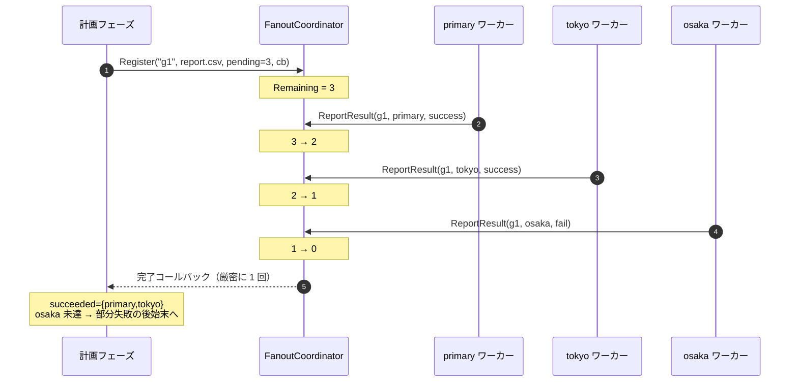
```mermaid
sequenceDiagram
    autonumber
    participant Plan as 計画フェーズ
    participant FC as FanoutCoordinator
    participant Wp as primary ワーカー
    participant Wt as tokyo ワーカー
    participant Wo as osaka ワーカー

    Plan->>FC: Register("g1", report.csv, pending=3, cb)
    Note over FC: Remaining = 3
    Wp->>FC: ReportResult(g1, primary, success)
    Note over FC: 3 → 2
    Wt->>FC: ReportResult(g1, tokyo, success)
    Note over FC: 2 → 1
    Wo->>FC: ReportResult(g1, osaka, fail)
    Note over FC: 1 → 0
    FC-->>Plan: 完了コールバック（厳密に 1 回）
    Note over Plan: succeeded={primary,tokyo}<br/>osaka 未達 → 部分失敗の後始末へ
```

💡 設計思想：**「各ワーカーは自分の結果を投げ込むだけ」「最後の1件を報告したワーカーがコールバックを引く」**。誰が最後になるかは実行時まで分かりませんが、二重ガードのおかげで後始末は必ず 1 回だけ。

## 9.5 完了後の後始末

完了コールバックの中身（`Worker.HandleFanoutCompletion`）は、トラッキングの有無で分岐します。

- **トラッキング無効**（単一宛先など）→ all-or-nothing：全宛先成功ならローカル削除、1 つでも失敗ならローカル保持。
- **トラッキング有効**（複数宛先）→ `HandleFanoutCompletionTracked`（第10回で詳説）：未送先だけ次回再送できるよう、成功宛先のマーカーを記録し、ファイルを retry へ退避。

🧪 **演習（第9回）**：`FanoutCoordinator.ReportResult` の二重ガード（`remaining == 0 && Interlocked.Exchange(...) == 0`）について、「もし `Interlocked.Exchange` の部分を消したら、どんな事故が起き得るか」を考えてみましょう（ヒント：2 つのワーカーがほぼ同時に最後の報告をしたら？）。

---

# 第10回　配信トラッキング：未送先だけ再送する

> **この回のゴール**：「宛先 A には送れたが B には未送」という**中間状態**を、ステートレスなバッチでどう表現・永続化しているかを理解する。これは本ツールでもっとも知恵が詰まった部分です。
> 📎 この回は [docs/per-destination-delivery-tracking.md](docs/per-destination-delivery-tracking.md) と対応。設計判断の「なぜ」はそちらが網羅的です。

## 10.1 解決したい問題

第0回で触れた「バッチはステートレス（毎回まっさら）」がここで牙をむきます。

複数宛先配信で、こんな状況を考えます。

1. 宛先 A は成功、宛先 B はメンテで失敗。
2. 従来（all-or-nothing）だと「1 つでも失敗したらローカル保持」なので、ファイルは残る。
3. 次回バッチでファイルを再列挙 → **また A と B の両方へ送信**。
4. A はすでに受け取っているのに**重複配信**される。

⚠️ B が 1 日ダウンしていると、その間ずっと A へ重複配信が続く。受信側 A の運用によっては二重取り込み事故になります。

**やりたいこと**：送れた宛先(A)には二度と送らない／送れていない宛先(B)には送り直す。B が何日落ちていても安全に。

⚠️ **なぜ単純な実装では足りないか**：バッチはステートレスなので「A には送れた」をプロセス内に覚えても次回には消える。`Watch.Path` 上のファイルは「ある／ない」の 1 ビットしか表現できず、「A は済・B は未」という**中間状態を置く場所がない**。

## 10.2 解決策：マーカー方式

→ 唯一の永続記憶であるディスクに、**(ファイル × 宛先) 単位の小さなマーカーファイル**を残します。「END ファイルで転送準備完了を示す」発想の「配信完了マーカー」版です。

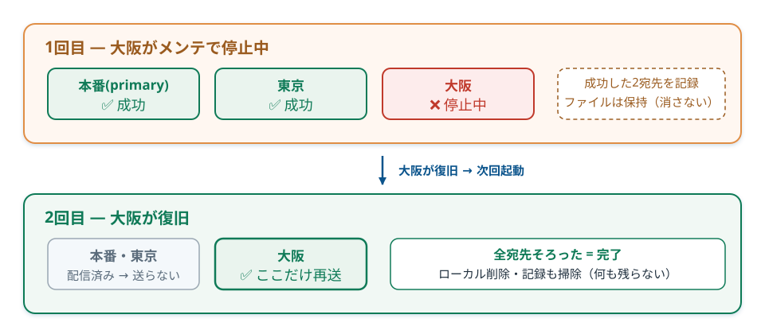

```
watch/
  report.csv                ← 元データ。トラッキングは触らない

<StateDirectory>/
  <hash>.marker             ← 「report.csv は宛先 primary へ配信済み」を表す小さな JSON
```

マーカーの中身（JSON 1 つ）：
```json
{
  "RelativePath": "report.csv",
  "DestinationName": "primary",
  "Signature": "st:11-638...ticks",
  "DeliveredAtUtc": "2026-06-18T01:23:45Z"
}
```

## 10.3 マーカーのライフサイクル

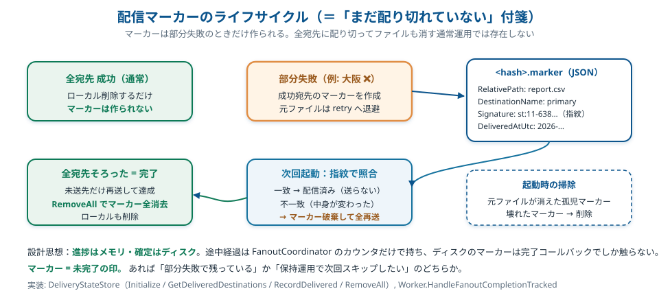

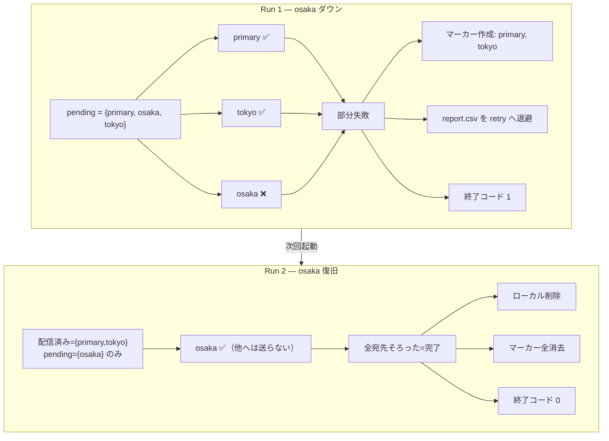
```mermaid
flowchart TB
    subgraph R1["Run 1 — osaka ダウン"]
        A1["pending = {primary, osaka, tokyo}"] --> B1p["primary ✅"]
        A1 --> B1t["tokyo ✅"]
        A1 --> B1o["osaka ❌"]
        B1p --> C1["部分失敗"]
        B1t --> C1
        B1o --> C1
        C1 --> D1["マーカー作成: primary, tokyo"]
        C1 --> E1["report.csv を retry へ退避"]
        C1 --> F1["終了コード 1"]
    end
    R1 -->|次回起動| R2
    subgraph R2["Run 2 — osaka 復旧"]
        A2["配信済み={primary,tokyo}<br/>pending={osaka} のみ"] --> B2["osaka ✅（他へは送らない）"]
        B2 --> C2["全宛先そろった=完了"]
        C2 --> D2["ローカル削除"]
        C2 --> E2["マーカー全消去"]
        C2 --> F2["終了コード 0"]
    end
```

💡 **設計思想は 3 つ**（[docs/fanout-and-parallelism.md](docs/fanout-and-parallelism.md) §5 より）：
1. **進捗はメモリ、確定はディスク** — 途中経過は `FanoutCoordinator` のカウンタだけ。ディスクのマーカーは**完了コールバックの中でしか触らない**（各宛先成功のたびに逐次書かない）。
2. **マーカーは "未完了" の印** — 全部配ってファイルも消す通常運用ではマーカーは残らない。あれば「部分失敗で残っている」か「保持運用で次回スキップしたい」のどちらか。
3. **再送は差分だけ** — Run 2 では `pending = 全宛先 − 配信済み` を取り直すので、復旧した osaka にだけ送る。

⚠️ だから **「全宛先成功（通常時）はマーカーを 1 つも作らない」**＝通常運用の追加コストはゼロ。マーカーは詰まったファイルの分しか存在しないので軽量です。

## 10.4 DeliveryStateStore：マーカーの管理人

```csharp
// DeliveryStateStore.cs（実物・主要メソッド）
public void Initialize()                          // 起動時に状態Dirを1回走査してメモリへ。孤児/破損は削除
public Task<string> ComputeSignatureAsync(...)    // ファイルの指紋を計算（sizetime / hash）
public IReadOnlyCollection<string> GetDeliveredDestinations(relativePath, currentSignature, candidates)  // 配信済み宛先を返す
public bool RecordDelivered(relativePath, destinationName, signature)   // 配信成功を記録（アトミック書き込み）
public void RemoveAll(relativePath)               // 全宛先完了/掃除時に全マーカー削除
```

### 起動時のスキャンは 1 回だけ
```csharp
// Initialize（実物・要約）
files = Directory.GetFiles(_stateDir, "*" + MarkerExtension, SearchOption.TopDirectoryOnly);
foreach (var path in files)
{
    var data = TryReadMarker(path);
    if (data is null || ...) { TryDeleteFile(path); continue; }   // 壊れたマーカーは削除
    if (!SourceFileExists(data.RelativePath)) { TryDeleteFile(path); continue; }  // 孤児（元ファイルが消えた）は削除
    _markers[Key(data.RelativePath, data.DestinationName)] = new MarkerEntry(...);  // メモリに載せる
}
```
💡 **ディスク探索は起動時の 1 回だけ**。以降はメモリ上の `ConcurrentDictionary` で照合するので、ファイルごとにディスクを探さない。マーカーは「詰まったファイル分」しかないので軽い。

### 指紋で「中身が差し替わった」を検出する
これが地味だが超重要な安全装置です。

```csharp
// GetDeliveredDestinations（実物・要約）
foreach (var destinationName in candidateDestinationNames)
{
    var key = Key(relativePath, destinationName);
    if (!_markers.TryGetValue(key, out var entry)) continue;

    if (string.Equals(entry.Signature, currentSignature, StringComparison.Ordinal))
        delivered.Add(destinationName);                 // 指紋一致 → 配信済み
    else
    {
        // 中身が変わっている → 古い配信記録は無効。削除して再送対象にする
        if (_markers.TryRemove(key, out _)) TryDeleteFile(entry.MarkerFilePath);
    }
}
```

⚠️ **なぜ指紋が要るのか？** 配信途中（A 済・B 未）のファイルが、別内容で**同名上書き**されたとします。指紋なしで「A のマーカーがあるから A はスキップ」とすると、**A には古い内容しか届かず、新内容が永遠に届かない**（静かなデータ欠落）。指紋を見れば「中身が変わった＝古いマーカーは無効」と判断でき、**全宛先へ再送**できます。

指紋の方式は 2 つ：
```csharp
// ComputeSignatureAsync（実物・要約）
if (_signatureMode == SignatureModeHash)
    return "h:" + await HashUtil.ComputeHashAsync(localPath, _hashAlgorithm, ct);   // 厳密（ハッシュ）
var info = new FileInfo(localPath);
return $"st:{info.Length}-{info.LastWriteTimeUtc.Ticks}";   // 軽量（サイズ＋更新時刻）
```
- `sizetime`（既定）：サイズ＋最終更新時刻。軽い。⚠️ サイズも更新時刻も据え置きで中身だけ変わると検出できない（既知の限界）。
- `hash`：ファイルハッシュ。厳密だが、保持ファイルごとに計算が必要でコストは高い。

### アトミックなマーカー書き込み
```csharp
// RecordDelivered（実物・要約）
var tempPath = markerPath + ".tmp." + Guid.NewGuid().ToString("N");
File.WriteAllText(tempPath, json, Encoding.UTF8);
File.Move(tempPath, markerPath, overwrite: true);   // 一時名→本番名（書きかけが読まれない）
```
💡 マーカー自身も「一時名→リネーム」で書く（第5回のアトミック転送と同じ発想）。さらに書き込み失敗時は `false` を返し、呼び出し側が**終了コード失敗として扱える**ようにする（成功と誤認しない）。

### マーカーのファイル名
```csharp
// MarkerFilePath（実物・要約）
var hash = SHA256.HashData(Encoding.UTF8.GetBytes(relativePath + "\0" + destinationName));
return Path.Combine(_stateDir, Convert.ToHexString(hash).ToLowerInvariant() + ".marker");
```
(相対パス + 宛先名) を SHA256 でハッシュ化してファイル名に。パス区切りや特殊文字を避けつつ、決定論的で衝突しない名前を作る。

## 10.5 宛先の識別：なぜ Name が必須なのか

マーカーは「どの宛先か」を区別する鍵が要ります。接続情報（host/port/path）を鍵にすると、サーバー移転やパス変更・typo 修正のたびに「別の宛先」とみなされ、全ファイル再送になってしまう。

→ 接続情報と独立した**安定した `Name`** を鍵にします。トラッキング有効時は **primary を含む全宛先で `Name` を必須かつ一意**とし、起動時バリデーション（`ConfigurationValidator.ValidateDeliveryTracking`）で強制（未設定・重複はエラーで停止）。

💡 「鍵に何を使うか」は地味ですが、間違えると「重複配信」か「取りこぼし」のどちらかの事故になる。**接続情報ではなく安定した名前を鍵にする**、という判断がトラッキングの正しさを支えています。

## 10.6 部分失敗ファイルの退避（RetryDirectory）

部分失敗したファイルは `Watch.Path` に置いたままだと、次回の通常列挙がまた拾ってしまう。そこで `RetryDirectory` へ「移動」して、通常列挙と混ざらないようにします。

| 設定 | 退避先 |
|---|---|
| 未指定（既定） | `<LocalApplicationData>/FtpTransferAgent/delivery-retry/<watchハッシュ>/`（watch の外） |
| 相対パス | `Watch.Path/<相対>`（watch の中＝同じドライブ） |
| 空文字 `""` | 移動しない（watch にそのまま残す） |

⚠️ クロスドライブ移動の注意：既定の retry 先は C ドライブになりがちで、`Watch.Path` が D だとドライブをまたぐ。`File.Move` はドライブが違っても動く（中身コピー→元削除に自動切替）が、その際**更新時刻が変わると `sizetime` 指紋がずれて全再送**になる。そこで退避・復元の両方で**元の最終更新時刻を明示的に再適用**しています（[docs/per-destination-delivery-tracking.md](docs/per-destination-delivery-tracking.md) §3.4.2）。こういう「一見動くが微妙にズレる」罠を潰しているのが実戦的なところ。

🧪 **演習（第10回）**：「全宛先に成功してファイルも消す通常運用ではマーカーが 1 つも作られない」のはなぜか、`HandleFanoutCompletionTracked` の「全宛先完了」分岐の考え方から説明してみましょう。次に「`sizetime` 指紋の既知の限界」を 1 つ挙げてください。

---

# 第11回　安全機構：END・二重起動防止・ホスト鍵検証

> **この回のゴール**：転送本体以外の「安全のための仕掛け」を一通り押さえる。実務で効くのはこういう細部です。

## 11.1 END ファイル制御

ファイル連携の定番プロトコル「**データを置き終わったら、目印ファイル(END)を置く**」に対応しています。

```
連携元の置き方:
  data_20260612.csv        ← データ本体（書き込みに時間がかかる）
  data_20260612.csv.END    ← 書き終わった合図（0バイトでOK）
```

`RequireEndFile: true` のとき、**END がある data だけを転送**します（書きかけのデータを拾わない）。

💡 これは第5回のアトミック転送（受け手が中途半端を拾わない工夫）の**送り手版**。「相手が END を見てから処理する」運用に、こちらが END を確実に「データ→END の順」で送ることで応えます。`Worker.IsEndFile` / `HasEndFile`（ローカル）と `IsEndFileRemote` / `HasEndFileRemote`（リモート）が判定を担い、`EndFileExtensions`（`.END` `.TRG` など複数可）で拡張子を設定できます。

⚠️ 転送順序の保証が肝。`ProcessUploadAsync` は「データ本体を送って検証 → 関連 END を送る」順を守ります。列挙時に確定した関連 END ファイルを使い（ファイルシステムを再探索しない）、成功時に削除される END と完全に一致させる、という細かい整合も取っています。

## 11.2 二重起動防止（ProcessLock）

「5 分おきに実行」していて前回がまだ終わっていなかったら、同じファイルを 2 プロセスが同時に送ってしまう。これを **PID 方式のロックファイル**で防ぎます。

```csharp
// ProcessLock.Acquire（実物・要約）
if (File.Exists(path))
{
    if (TryReadLockInfo(path, out var pid, out var name) && IsProcessAlive(pid, name))
        throw new InvalidOperationException($"Another instance is running (PID={pid}, ...)");  // 生きてる → 起動拒否
    File.Delete(path);   // 死んだ PID のロックなら掃除して続行
}
var fs = new FileStream(path, FileMode.CreateNew, FileAccess.Write, FileShare.Read);  // 排他作成
// 1行目: PID、2行目: プロセス名 を書く
```

💡 工夫が 2 つ：
- **PID＋プロセス名**を記録する。`IsProcessAlive` は PID が生きているかだけでなく**プロセス名も照合**する。なぜか？ ⚠️ OS は終了した PID を**別の無関係なプロセスに再利用**することがある。PID だけ見ると「無関係なプロセスが生きている＝前回がまだ動いている」と誤判定し、永遠に起動拒否になりかねない。プロセス名も照合すれば誤判定を防げる。
- **クラッシュ後の自動回復**：前回が異常終了してロックファイルが残っていても、その PID が死んでいれば（または別プロセスに再利用されていれば）安全に上書きする。運用者が手でロックファイルを消す必要がない。

二重起動を検出したら `Program.cs` は**終了コード 2** で終了（第3回参照）。スケジューラから「2 が頻発＝実行間隔が短すぎ」と判断できます。

⚠️ 既定のロックパスは `watch パスのハッシュ`でサブフォルダ分けされる。だから**別々の watch フォルダを別スケジュールで並走させても相互ブロックしない**。「同じ構成の二重起動だけ」を正しく防ぎます。

## 11.3 ホスト鍵検証（なりすましサーバー対策）

SFTP では、接続先サーバーが「本物か」を**ホスト鍵の指紋**で確認できます。設定 `HostKeyFingerprint` を指定すると、サーバーが提示した鍵の指紋と照合し、一致しなければ接続を拒否します。

```csharp
// SftpClientWrapper.AttachHostKeyValidation（実物・要約）
_client.HostKeyReceived += (sender, e) =>
{
    var expected = _options.HostKeyFingerprint;
    if (string.IsNullOrEmpty(expected))
    {
        _logger.LogWarning("HostKeyFingerprint is not configured. Trusting server key without verification: SHA256:{...}");
        e.CanTrust = true;   // 未設定なら警告して信頼（MITM 注意）
        return;
    }
    if (expected.StartsWith("SHA256:", ...))   // OpenSSH 形式の SHA-256 指紋
    {
        if (!string.Equals(expectedSha, receivedSha, StringComparison.Ordinal))
        {
            e.CanTrust = false;   // 不一致 → 接続拒否
            _logger.LogError("Host key fingerprint mismatch...");
            return;
        }
        e.CanTrust = true;
    }
    // 後方互換: MD5 16進指紋にも対応
};
```

💡 これは **中間者攻撃(MITM)対策**です。指紋を設定しておけば、攻撃者がなりすましたサーバーに繋がされても「指紋が違う」と検出して拒否できます。⚠️ 未設定だと「とりあえず信頼するが警告を出す」。本番では必ず設定すべき、という方針が警告ログに表れています。

### 弱いアルゴリズムの除外
さらに、接続時に**弱い暗号方式を能動的に除外**しています。

```csharp
// ConfigureConnectionSecurity（実物・要約）
conn.HostKeyAlgorithms.Remove("ssh-rsa");   // 弱いホスト鍵アルゴリズムを除去
conn.HostKeyAlgorithms.Remove("ssh-dss");
foreach (var algo in new[]{ "diffie-hellman-group-exchange-sha1", "diffie-hellman-group14-sha1", "diffie-hellman-group1-sha1" })
    conn.KeyExchangeAlgorithms.Remove(algo);   // SHA-1 ベースの鍵交換を除去
```
💡 「使えるけど弱い」アルゴリズムをライブラリの既定から外す。第8回の「MD5 を禁止」、第2回の「FTP 平文に警告」と同じ**安全側に倒す**一貫した姿勢です。

## 11.4 パストラバーサル対策

設定や相対パスを使ってフォルダ外に書き込む攻撃（`../../etc/passwd` のようなパス）を防ぐため、パスの正規化・検証を行っています（`Worker` のパス正規化・`IsUnderDirectory` 系のチェック、`ConfigurationValidator` の検証）。「外から来た文字列をそのままパスに使わない」という鉄則です。

🧪 **演習（第11回）**：`ProcessLock` が「PID だけでなくプロセス名も記録・照合する」理由を、PID 再利用のシナリオを使って説明してみましょう。

---

# 第12回　監視と運用：ログ・メール通知・終了コード

> **この回のゴール**：障害が起きたとき「何が見えるか」を理解する。運用者の目線に立った仕組みを押さえる。

## 12.1 カスタムロギングプロバイダ

.NET のロギングは「`ILogger` に書く → 登録されたプロバイダ群が受け取って各所へ出力する」仕組みです。本ツールは標準のコンソール出力に加え、自前のプロバイダを 2 つ足しています（第3回 (3) で登録）。

- `RollingFileLoggerProvider` … 日付・サイズでファイルを分割するファイルログ
- `ErrorEmailLoggerProvider` … エラーをメール送信

### RollingFileLogger（ローテーションするファイルログ）
```csharp
// RollingFileLogger.GetPath（実物・要約）
return Path.Combine(dir, $"{name}{_currentDate:yyyyMMdd}{suffix}{ext}");
// 例: log20260621.txt / サイズ超過で log20260621_1.txt
```
- **日付で分割**：`log20260621.txt`。日付が変わると自動で新ファイル。
- **サイズで分割**：上限を超えると `_1` `_2`… と連番。
- **保持日数で自動削除**：`Retention.Enabled` のとき、起動時に古いログを掃除（`CleanupOldLogs`、第3回 (3)）。

💡 ローリングログは「永遠に肥大化しない」ための実務必須機能。日付ベースのファイル名にすることで「いつのログか」が一目で分かり、保持日数で自動的に古いものが消える。

### ErrorEmailLogger（エラーメール通知）と選択的抑制
```csharp
// ErrorEmailLogger（実物・要約）
public bool IsEnabled(LogLevel logLevel) => logLevel >= LogLevel.Error;   // Error 以上だけ拾う
```
- エラー発生時に SMTP でメール送信。宛先は複数指定可。1 回の実行での送信上限あり（**大量エラー時のメール洪水を防止**）。

⚠️ **選択的なメール抑制**という凝った仕組みがあります（[docs/per-destination-delivery-tracking.md](docs/per-destination-delivery-tracking.md) §3.8）。複数宛先で 1 宛先が 1 日落ちていると、バッチのたびに「転送失敗」メールが鳴り続けてアラート疲れを起こす。そこで、

```csharp
// LogEvents.cs（実物・要約）
public static readonly EventId MultiDestinationTransferFailure = new(1001, ...);   // 個々の宛先失敗の詳細
public static readonly EventId MultiDestinationPartialFailure  = new(1002, ...);   // ファイル単位の部分失敗サマリ
public static bool IsSuppressiblePerDestinationDetail(EventId e) => e.Id == 1001;  // 1001 だけ抑制可
```

- ログに `EventId`（種別の番号）を付け、`Smtp.SuppressPerDestinationFailureDetailEmails: true` のとき**個々の宛先失敗の詳細(1001)メールだけ**抑制する。
- ⚠️ ただし**ファイル単位の部分失敗サマリ(1002)は残す**（どのファイルがどの宛先へ未配信かは運用者が把握できるべき）。設定不備・認証エラーなど**他のエラーメールも継続**。
- 💡 そして「メールを止めても**終了コードは失敗なら 1 のまま**」。メール抑制は通知だけを止め、監視（終了コード）には影響しない。「うるさいから全部黙らせる」ではなく「うるさい部分だけ、過不足なく黙らせる」という繊細な設計です。

## 12.2 終了コード：外の世界との会話

| 終了コード | 意味 | スケジューラ側の対応 |
|---|---|---|
| `0` | 全件成功（または対象なし） | 対応不要 |
| `1` | 設定エラー、または転送失敗あり | ログを確認して原因対応 |
| `2` | 二重起動を検出してスキップ | 頻発するなら実行間隔を見直し |

💡 終了コードは「ジョブ管理基盤・監視との唯一の機械的な会話」。`Worker` は失敗件数で終了コードを判定し、`ApplicationExitCode` に記録、`Program.cs` が `Environment.ExitCode` に反映します（第3回 (7)）。**ログレベルやメールとは独立**しているのがポイント（メールを止めても異常は終了コードで分かる）。

## 12.3 パフォーマンス監視

```csharp
// Worker.StartPerformanceMonitoringAsync（実物・要約）
// 宛先（キュー）ごとに監視 Task を立て、1 分間隔で:
//  - 統計（Total/Completed/Failed/Active/Memory/成功率）をログ出力
//  - 5 分以上動いているアイテムを「Long running」警告
//  - メモリ 500MB 超で警告
// 転送が全部終わると monitorCts.Cancel() で監視 Task を畳む
```
💡 `TransferQueue.GetStatistics()` がスレッドセーフに集計した数値（第6回で `Interlocked` を使っていたのを思い出してください）を、定期的にログへ。長時間 1 件に張り付いている転送やメモリ肥大を早期に可視化します。

🧪 **演習（第12回）**：「複数宛先で 1 宛先が 3 日落ちている」状況で、`SuppressPerDestinationFailureDetailEmails: true` のとき (a) どのメールが止まり (b) どのメールは届き (c) 終了コードはどうなるか、を答えてみましょう。

---

# 第13回　テストの書き方：どんなテストをどう書いているか

> **この回のゴール**：このプロジェクトのテストの「種類」と「書き方のパターン」を、実物のコードで理解する。テストを読めること・書けることは、コードを理解する最短路でもあります。
> テストは `FtpTransferAgent.Tests/` に約 47 ファイルあります。

## 13.1 テストの全体像：4 つの層

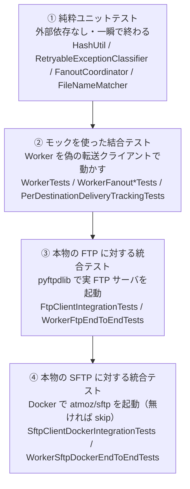
```mermaid
flowchart TB
    U["① 純粋ユニットテスト<br/>外部依存なし・一瞬で終わる<br/>HashUtil / RetryableExceptionClassifier / FanoutCoordinator / FileNameMatcher"]
    M["② モックを使った結合テスト<br/>Worker を偽の転送クライアントで動かす<br/>WorkerTests / WorkerFanout*Tests / PerDestinationDeliveryTrackingTests"]
    F["③ 本物の FTP に対する統合テスト<br/>pyftpdlib で実 FTP サーバを起動<br/>FtpClientIntegrationTests / WorkerFtpEndToEndTests"]
    D["④ 本物の SFTP に対する統合テスト<br/>Docker で atmoz/sftp を起動（無ければ skip）<br/>SftpClientDockerIntegrationTests / WorkerSftpDockerEndToEndTests"]
    U --> M --> F --> D
```

下に行くほど「本物に近い／遅い／環境が要る」。上に行くほど「速い／どこでも動く」。本プロジェクトはこの 4 層を使い分けています。

## 13.2 使っているテストの道具（フレームワーク）

| 道具 | 役割 |
|---|---|
| **xUnit (xunit.v3)** | テストフレームワーク。`[Fact]` `[Theory]` でテストを書き、`Assert.*` で検証 |
| **Moq** | モック（偽物）ライブラリ。`Mock<IFileTransferClient>` で偽の転送クライアントを作る |
| **Microsoft.NET.Test.Sdk** | `dotnet test` でテストを発見・実行する土台 |
| **xunit.runner.visualstudio** | IDE / VSTest でテストを動かすアダプタ |
| **coverlet.collector** | コードカバレッジ（どれだけテストが通ったか）の計測 |
| **pyftpdlib**（Python） | 本物の FTP サーバを一時的に立てる（③で使用） |
| **atmoz/sftp**（Docker イメージ） | 本物の SFTP サーバをコンテナで立てる（④で使用） |

## 13.3 xUnit の基本：Fact と Theory

```csharp
// HashUtilTests.cs（実物・抜粋）
[Theory]                          // パラメータ違いで同じテストを繰り返す
[InlineData("SHA256")]
[InlineData("SHA512")]
public async Task ComputeHashAsync_ReturnsExpectedHash(string algorithm)
{
    var tempFile = Path.GetTempFileName();
    await File.WriteAllTextAsync(tempFile, "test data");

    // .NET 標準ライブラリで「期待値」を作る
    string expected;
    using (HashAlgorithm hasher = algorithm == "SHA256" ? SHA256.Create() : SHA512.Create())
    using (var stream = File.OpenRead(tempFile))
        expected = BitConverter.ToString(hasher.ComputeHash(stream)).Replace("-", "").ToLowerInvariant();

    // テスト対象の結果と比較
    var actual = await HashUtil.ComputeHashAsync(tempFile, algorithm, CancellationToken.None);
    Assert.Equal(expected, actual);
}
```

- `[Fact]` = パラメータなしのテスト 1 件。`[Theory]` + `[InlineData(...)]` = 同じロジックを値違いで何度も。
- 💡 **テストの基本構造は AAA（Arrange/Act/Assert）**：準備して(Arrange)、実行して(Act)、検証する(Assert)。上の例も「ファイル作成→ハッシュ計算→`Assert.Equal`」です。
- 💡 **検証の作り方が上手い**：テスト対象(`HashUtil`)とは**別の手段**（.NET 標準 `SHA256.Create()`）で期待値を作って比べている。同じコードで期待値を作ると「間違いも一致してしまう」ので、独立した方法で照合するのが鉄則。

## 13.4 純粋ユニットテスト：例外分類と並行性

### 例外分類のテスト（境界を 1 つずつ）
```csharp
// RetryableExceptionClassifierTests.cs（実物・抜粋）
[Fact]
public void IsConnectionBroken_IOExceptionWithSocketInner_True()
    => Assert.True(RetryableExceptionClassifier.IsConnectionBroken(
        new IOException("Unable to read data from the transport connection", new SocketException())));

[Fact]
public void IsConnectionBroken_HashMismatch_False()
    => Assert.False(RetryableExceptionClassifier.IsConnectionBroken(new HashMismatchException("hash mismatch")));
```
💡 第7回で見た「IOException の inner に SocketException がラップされる典型ケース」を、まさにそのまま組み立ててテストしている。**判定ロジックの分岐 1 本ごとにテストを 1 つ**書くと、後で分類を変えたときに壊れた箇所がすぐ分かる。

### 並行性のテスト（FanoutCoordinator）
```csharp
// FanoutCoordinatorTests.cs（実物・抜粋）
[Fact]
public void OnCompleteFiresExactlyOnce_UnderParallelReport()
{
    var coord = new FanoutCoordinator();
    var callCount = 0;
    const int n = 50;
    coord.Register("g1", "/src/file.txt", n, (_, _) => Interlocked.Increment(ref callCount));

    Parallel.For(0, n, i =>                          // 50 並列で同時に報告
        coord.ReportResult("g1", new FanoutCoordinator.DestinationResult("d" + i, "d" + i, true, null)));

    Assert.Equal(1, callCount);                      // それでもコールバックは「ちょうど1回」
}
```
💡 第9回の「二重ガードでコールバックは厳密に 1 回」を、`Parallel.For` で**わざと同時に殺到させて**検証している。並行処理のバグは「たまたま動いてしまう」ので、**意図的に競合を起こすテスト**が要る。これは [メモリ：並列転送の堅牢性が最優先] の方針そのものです。

⚠️ **このプロジェクトの大原則**：並行処理に手を入れるときは「競合・同時使用で失敗しないテストを必ず追加する」。`ParallelTransferQueueTests` / `WorkerFanoutMultiDestinationTests`（24 ファイル×3 宛先の並行転送）/ `WorkerFanoutDecouplingTests`（1 宛先が詰まっても他は止まらない）などが、この原則を体現しています。

## 13.5 モックを使った Worker テスト

`Worker` を本物のサーバーなしでテストする鍵が、第3回で触れた **`protected virtual CreateClient()` の差し替え**です。テスト用に `Worker` を継承した `TestWorker` を作り、`CreateClient()` をオーバーライドしてモックを返します。

```csharp
// 各 Worker 系テストの末尾（実物・要約）
private class TestWorker : Worker
{
    private readonly IFileTransferClient _client;
    public TestWorker(..., IFileTransferClient client) : base(...) { _client = client; }

    protected override IFileTransferClient CreateClient() => _client;   // ← 本物の代わりにモックを返す

    public async Task RunAsync(CancellationToken token)
    {
        using var timeoutCts = new CancellationTokenSource(TimeSpan.FromSeconds(5));   // テストが固まらないよう保険
        using var combinedCts = CancellationTokenSource.CreateLinkedTokenSource(token, timeoutCts.Token);
        await base.ExecuteAsync(combinedCts.Token);
    }
}
```

そして Moq で「偽の転送クライアント」を組み立てます。

```csharp
// WorkerTests.ExecuteAsync_UploadsFileAndDeletesAfterVerification（実物・抜粋）
var mock = new Mock<IFileTransferClient>();
mock.Setup(c => c.UploadAsync(file, remotePath, It.IsAny<CancellationToken>()))
    .Returns(Task.CompletedTask).Verifiable();                          // UploadAsync が呼ばれたら成功を返す
mock.Setup(c => c.GetRemoteHashAsync(remotePath, "SHA256", It.IsAny<CancellationToken>(), false))
    .ReturnsAsync(localHash);                                           // リモートハッシュはローカルと同じ＝検証成功にする

var worker = new TestWorker(watch, transfer, retry, hash, cleanup, provider, logger, lifetime,
                            new NoDisposeClient(mock.Object));
await worker.RunAsync(CancellationToken.None);

mock.Verify();                          // Verifiable に印を付けた呼び出しが実際に起きたか検証
Assert.False(File.Exists(file));        // 検証成功後にローカルが削除されたか
```

Moq の読み方：
- `mock.Setup(c => c.UploadAsync(...)).Returns(...)` … 「このメソッドが呼ばれたら、こう返す」を仕込む。
- `It.IsAny<CancellationToken>()` … 「引数は何でもいい」を表すマッチャ。
- `.Verifiable()` + `mock.Verify()` … 「この呼び出しは必ず起きるはず」を表明し、後でまとめて確認。
- `ReturnsAsync(localHash)` … リモートハッシュをローカルと同じ値に仕込む＝**ハッシュ検証が成功する状況を人工的に作る**。

💡 補助クラス 2 つ：
- `NoDisposeClient` … モックをラップし `Dispose()` を握りつぶす。`ClientPool` が接続を `Dispose` しても、テスト全体で使い回す 1 個のモックが壊れないようにするため。
- `DummyLifetime` … `IHostApplicationLifetime` の偽物。`StopApplication()` でキャンセルトークンを立てるだけ。Worker のバッチ終了（第1回 1.3）をテスト内で再現する。

💡 これらがあるおかげで、**ネットワークもサーバーも無しに、`Worker` の「列挙→転送→検証→削除」という本筋を一瞬でテストできる**。`PerDestinationDeliveryTrackingTests` は、このモック方式で「バッチを 2 回実行して未送先だけ再送される」ことまで検証しています（実サーバー不要で配信トラッキングの正しさを担保）。

## 13.6 本物の FTP に対する統合テスト（pyftpdlib）

モックは速いですが「本物のプロトコルで本当に動くか」は確かめられません。そこで Python の `pyftpdlib` で**一時的に本物の FTP サーバを起動**して試します。

```csharp
// FtpClientIntegrationTests.cs（実物・抜粋）
private async Task<Process> StartFtpServerAsync(string root, int port)
{
    var python = RuntimeInformation.IsOSPlatform(OSPlatform.Windows) ? "python" : "python3";
    var psi = new ProcessStartInfo(python, $"-m pyftpdlib -p {port} -w -d {root} -u user -P pass") { ... };
    var proc = Process.Start(psi)!;

    // ポートに繋がるまでポーリングして「起動完了」を待つ
    while (DateTime.Now - startTime < TimeSpan.FromSeconds(3) && !connected)
    {
        try { using var client = new TcpClient(); await client.ConnectAsync("127.0.0.1", port); connected = true; }
        catch { await Task.Delay(100); }
    }
    return proc;
}

[Fact]
public async Task UploadAndDownload_WorksAgainstLocalFtpServer()
{
    var server = await StartFtpServerAsync(tempDir, 2121);
    try
    {
        var wrapper = new AsyncFtpClientWrapper(opts, NullLogger<AsyncFtpClientWrapper>.Instance);
        await wrapper.UploadAsync(localPath, "/upload.txt", CancellationToken.None);
        var files = await wrapper.ListFilesAsync("/", CancellationToken.None);
        Assert.Contains("/upload.txt", files);              // 本当に送れたか一覧で確認
        await wrapper.DownloadAsync("/upload.txt", downloadPath, CancellationToken.None);
        Assert.True(File.Exists(downloadPath));
    }
    finally
    {
        if (!server.HasExited) { server.Kill(); server.WaitForExit(5000); }   // サーバを必ず止める
        Directory.Delete(tempDir, true);                                      // 後片付け
    }
}
```
💡 ポイント：
- **起動を `TcpClient` でポーリング**して確実に待つ（`Task.Delay` で適当に待つより堅い）。
- `try/finally` で**サーバープロセスと一時フォルダを必ず後片付け**。テストが失敗してもゴミを残さない。
- `NullLogger<T>.Instance` … ログを捨てる「何もしないロガー」。テストではログ出力が不要なので使う。

## 13.7 本物の SFTP に対する統合テスト（Docker）

SFTP は Docker の `atmoz/sftp` イメージでコンテナを起動して試します。Docker が無い環境（CI の一部や開発者の手元）では**自動でスキップ**されるよう、専用の属性を自作しています。

```csharp
// SftpClientDockerIntegrationTests.cs（実物・要約）
public sealed class DockerFactAttribute : FactAttribute   // [Fact] を拡張した自作属性
{
    public DockerFactAttribute(...)
    {
        var reason = SkipReason.Value;                     // docker version が動くか調べる
        if (!string.IsNullOrEmpty(reason)) Skip = reason;  // 動かなければ Skip 理由をセット → テストは skip 扱い
    }
}

public sealed class DockerSftpFixture : IAsyncLifetime    // テスト群で共有する SFTP サーバ
{
    public async ValueTask InitializeAsync()
    {
        await RunDockerAsync($"run -d --rm -p {Port}:22 --name {_containerName} atmoz/sftp testuser:testpass:...");
        await WaitForPortAsync(Host, Port, ...);           // ポート開放を待つ
        await WaitForSshReadyAsync(...);                   // SSH ハンドシェイクができるまで待つ
        IsAvailable = true;
    }
    public async ValueTask DisposeAsync() => await RunDockerAsync($"rm -f {_containerName}");  // 後始末でコンテナ削除
}
```
💡 設計の妙：
- **`DockerFact` で「Docker が無ければ skip」**。これにより、Docker のある環境（CI、Docker Desktop 起動中の開発機）では本物の SFTP で検証し、無い環境ではテスト全体を止めずにスキップできる。実際、`dotnet test` の結果は環境により「347 合格 / 6 スキップ」または「347 合格 / 0 スキップ」になります。
- **`IAsyncLifetime` + `ICollectionFixture`** で、複数テストが 1 個のコンテナを共有（毎テストで起動し直さない＝速い）。`--rm` と `DisposeAsync` の `rm -f` で確実に後片付け。

## 13.8 テストの実行方法

```bash
# Python 依存（FTP 統合テスト用）を入れる
python3 -m pip install pyftpdlib

# 全テスト実行
dotnet test FtpTransferAgent.Tests/FtpTransferAgent.Tests.csproj --configuration Release

# 特定クラスだけ
dotnet test --filter "ClassName=FanoutCoordinatorTests"

# 名前で部分一致
dotnet test --filter "DisplayName~Fanout"
```

CI（GitHub Actions）では、`pyftpdlib` を入れ、`dotnet format`（コード整形チェック）→ `build` → `test` を毎回実行します。SFTP の Docker テストは CI ランナー上では Docker が使えるので実行されます。

🧪 **演習（第13回）**：`WorkerTests` のモック方式で「アップロードは成功するがハッシュ検証で不一致になる」テストを書くとしたら、`mock.Setup(c => c.GetRemoteHashAsync(...))` に何を返させればよいか考えてみましょう（ヒント：ローカルと**違う**ハッシュ）。実際に `ReliableTransferTests.HashVerification_ShouldFailOnMismatch` がそれをやっています。

---

# 第14回　使用パッケージ詳説：それぞれ何者か

> **この回のゴール**：依存している外部ライブラリが「何をしてくれる道具なのか」「なぜそれを選んだのか」を理解する。`*.csproj`（プロジェクトファイル）に列挙されています。

## 14.1 本体（FtpTransferAgent.csproj）の依存

```xml
<TargetFramework>net10.0</TargetFramework>
<PackageReference Include="FluentFTP" Version="52.1.0" />
<PackageReference Include="SSH.NET" Version="2025.0.0" />
<PackageReference Include="Polly" Version="8.6.0" />
<PackageReference Include="Microsoft.Extensions.Hosting" Version="9.0.6" />
<PackageReference Include="Microsoft.Extensions.Options.DataAnnotations" Version="9.0.6" />
```

### FluentFTP（FTP 通信）
- **何者**：.NET 用の高機能な FTP/FTPS クライアントライブラリ。`AsyncFtpClient` が非同期 API を提供。
- **本ツールでの使い方**：`AsyncFtpClientWrapper`（`FtpClient.cs`）が薄くラップして `IFileTransferClient` に適合させる。アップロード/ダウンロード/一覧/ディレクトリ作成/`MoveFile`（リネーム）/`GetChecksum`（サーバーハッシュ）など。
- 💡 **なぜ自前で FTP を書かない？** FTP はアクティブ/パッシブモード、FTPS、各サーバーの方言など罠が多い。枯れたライブラリに任せ、本ツールは「アトミック転送・検証・並列・リトライ」という付加価値に集中する。

### SSH.NET（SFTP 通信）
- **何者**：.NET 用の SSH/SFTP ライブラリ。`SftpClient` が SFTP 操作を提供。
- **本ツールでの使い方**：`SftpClientWrapper` がラップ。接続/認証（パスワード・秘密鍵・併用）/アップロード/ダウンロード/`RenameFile`（posix-rename 含む）/ホスト鍵検証イベント/弱いアルゴリズム除外。
- 💡 第11回のホスト鍵検証・弱アルゴリズム除外は、SSH.NET が公開する `HostKeyReceived` イベントや `ConnectionInfo` をこのツールが**安全側に設定**して実現している。「ライブラリの既定が常に安全とは限らない」ので、明示的に締めている。
- ⚠️ バージョン `2025.0.0` を使用。`SftpFileStream` がキャンセル対応の `ReadAsync` をネイティブ実装している点（リモートハッシュをキャンセル可能にストリーミング計算できる）に依存している、とコメントに明記あり。

### Polly（リトライ・レジリエンス）
- **何者**：リトライ・サーキットブレーカー・タイムアウトなど「回復力(resilience)」のパターンを宣言的に書けるライブラリ。
- **本ツールでの使い方**：`TransferQueue` が `WaitAndRetryAsync` で指数バックオフのリトライポリシーを構築（第7回）。`Policy.Handle<Exception>(IsRetryable)` で「リトライ対象の例外」を絞る。
- 💡 **なぜ自前でリトライループを書かない？** 指数バックオフ・上限・例外フィルタ・リトライ毎のフック…を自分で正しく書くのは地味に難しくバグの温床。実績あるライブラリに任せる。

### Microsoft.Extensions.Hosting（汎用ホスト）
- **何者**：第1回で見た Generic Host（DI・設定・ロギング・ライフサイクル）の本体。`Host.CreateApplicationBuilder` / `BackgroundService` / `IHostApplicationLifetime` などを提供。
- **本ツールでの使い方**：アプリの土台そのもの。Worker Service・DI・設定バインド・ロギングプロバイダ登録の全部がこの上に乗る。

### Microsoft.Extensions.Options.DataAnnotations（設定検証）
- **何者**：Options パターンに DataAnnotations 検証（`[Required]` `[Range]` 等）を組み込むための拡張。
- **本ツールでの使い方**：`ValidateDataAnnotations()`（第2回）がこれ。設定の「①一項目ごとの検証」を担う。

⚠️ `Microsoft.Extensions.*` が `9.0.6`（.NET 8/9 世代）で、ターゲットが `net10.0` なのは互換上問題ありません（9.x は .NET 10 上でも動作）。揃えたいなら 10.x へ上げてもよい、という関係です。

## 14.2 テスト（FtpTransferAgent.Tests.csproj）の依存

```xml
<TargetFramework>net10.0</TargetFramework>
<PackageReference Include="Microsoft.NET.Test.Sdk" Version="18.6.0" />
<PackageReference Include="xunit.v3" Version="3.2.2" />
<PackageReference Include="xunit.runner.visualstudio" Version="3.1.5" />
<PackageReference Include="coverlet.collector" Version="10.0.1" />
<PackageReference Include="Moq" Version="4.20.72" />
```

| パッケージ | 役割 |
|---|---|
| **Microsoft.NET.Test.Sdk** | `dotnet test` でテストを発見・実行する基盤。これが無いとテストプロジェクトとして動かない |
| **xunit.v3** | テストフレームワーク本体（`[Fact]`/`[Theory]`/`Assert`）。xUnit の新世代 |
| **xunit.runner.visualstudio** | VSTest/IDE 経由でテストを走らせるアダプタ |
| **coverlet.collector** | コードカバレッジ計測。`--collect:"XPlat Code Coverage"` で使える |
| **Moq** | モックライブラリ。`Mock<T>` で偽のオブジェクトを作る（第13回） |

そして**コードには現れない 2 つの外部依存**：
- **pyftpdlib**（Python パッケージ）：FTP 統合テストが `python -m pyftpdlib` で起動する。`pip install pyftpdlib` が必要。
- **atmoz/sftp**（Docker イメージ）：SFTP 統合テストが `docker run atmoz/sftp` で起動する。Docker が必要（無ければ該当テストは skip）。

💡 「テスト用の依存」と「本番用の依存」が別プロジェクト・別 csproj に分かれているのも良い設計。Moq や xUnit が**本番のビルド成果物に混ざらない**（`IsPackable=false`、テスト専用）。

🧪 **演習（第14回）**：5 つの本体パッケージそれぞれについて「これが無かったら、自分で何を書く羽目になるか」を 1 行で言ってみましょう。例：Polly が無ければ「指数バックオフ＋例外フィルタ＋上限つきのリトライループを自前で正しく実装する羽目になる」。

---

# 第15回　総まとめ：同じものをゼロから書くなら

> **この回のゴール**：ここまでの知識を束ね、「自分が一から作るとしたら、どの順で何を作るか」を描けるようにする。

## 15.1 設計原則の総括（このコードが体現していること）

| 原則 | このツールでの現れ |
|---|---|
| **フェイルファスト** | 設定は起動時に二層検証。おかしければ 1 秒で止める（第2回） |
| **安全側に倒す** | MD5 禁止・FTP 平文警告・弱アルゴリズム除外・ホスト鍵検証（第8/11回） |
| **アトミック性** | 一時名→リネーム、マーカーも temp→Move（第5/10回） |
| **検証してから確定** | ハッシュ一致まで成功にしない、消す前に検証（第8回） |
| **失敗の隔離** | 1 件の失敗で全体を止めない（ワーカー隔離・宛先非結合）（第6/9回） |
| **再試行は賢く** | 「待てば直る」だけリトライ、指数バックオフ（第7回） |
| **状態は最小限・ディスクに確定** | ステートレスバッチ＋必要なときだけマーカー（第10回） |
| **抽象で差し替え可能に** | `IFileTransferClient` で FTP/SFTP を同一視（第5回） |
| **テスト可能性を設計に織り込む** | `protected virtual` の seam、DI（第3/13回） |
| **運用との会話** | 終了コード・ログ・選択的メール抑制（第12回） |

## 15.2 ゼロから作るときの推奨順序

1. **土台**：Generic Host + Worker Service の骨格（第1回）。`ExecuteAsync` で 1 回処理して `StopApplication()`。
2. **設定**：Options クラス + DataAnnotations + 起動時検証（第2回）。最初に「設定の形」を決めると全体の見通しが立つ。
3. **転送の抽象**：`IFileTransferClient` を定義し、まず 1 プロトコル（例：SFTP）だけ実装（第5回）。アトミック転送（temp→rename）を最初から入れる。
4. **検証**：ハッシュ計算と「ローカル＝リモート」比較（第8回）。
5. **直列で 1 ファイル転送が通る**ことをモックと実サーバ両方でテスト（第13回）。←ここで一度動くものを作る。
6. **並列化**：Channel + ワーカー Task + 重複抑止 + ワーカー隔離（第6回）。`ClientPool` で接続再利用。
7. **リトライ**：Polly + 例外分類（第7回）。
8. **運用機能**：ログ・メール・終了コード・二重起動防止（第11/12回）。
9. **ファンアウト**：宛先ごとの QueueContext + FanoutCoordinator（第9回）。
10. **配信トラッキング**：マーカー方式（第10回）。←最後に足す高度機能。並行性のテストを必ず添える。

💡 ポイントは **「単純な縦串（1 ファイルを 1 宛先へ確実に送る）を最初に通し切る」**こと。並列やファンアウトは後から重ねる。最初から全部を同時に作ろうとすると、どこで失敗しているか分からなくなる。

## 15.3 次に読むもの
- [docs/fanout-and-parallelism.md](docs/fanout-and-parallelism.md) … 第6・9回の実装機構をさらに深掘り
- [docs/per-destination-delivery-tracking.md](docs/per-destination-delivery-tracking.md) … 第10回の設計判断・既知の限界
- [ftp-transfer-agent-spec.md](ftp-transfer-agent-spec.md) … 全機能の詳細仕様
- そして何より **実際のソースコード**。本書を地図に、`Worker.cs` を端から読んでみてください。きっと「なぜこう書いてあるか」が見えるはずです。

---

# 巻末：用語集

| 用語 | 意味 |
|---|---|
| **バッチ型** | 常駐せず、起動のたびに 1 回処理して終了する動作モデル |
| **Generic Host / Worker Service** | .NET のアプリ土台（DI・設定・ログ）と、その上のバックグラウンド処理 |
| **DI（依存性注入）** | 必要な道具を自分で作らず外から渡してもらう設計。テスト容易性が上がる |
| **Options パターン** | 設定セクションを専用の型に対応づける仕組み |
| **DataAnnotations** | `[Required]` `[Range]` 等の「検証の付箋」 |
| **Strategy パターン** | 同じ目的の複数のやり方をインターフェースで抽象化し差し替える |
| **ファクトリ** | 設定などに応じて適切なインスタンスを作り分ける役 |
| **async / await** | 非同期処理。待ち時間にスレッドを手放し、I/O を効率化する |
| **I/O バウンド / CPU バウンド** | 処理時間の主因が「入出力待ち」か「計算」か |
| **CancellationToken** | 「そろそろやめて」を伝える協調的キャンセルの合図 |
| **Channel** | スレッドセーフな待ち行列。producer–consumer の中核 |
| **producer–consumer** | 「作る人」と「処理する人」を待ち行列で分ける流れ作業 |
| **ワーカー隔離** | 1 件の失敗を他のワーカーに波及させないこと |
| **アトミック転送** | 一時名で送り、完了後にリネーム。中途半端を見せない |
| **ハッシュ値** | ファイル内容から計算される「指紋」。1 ビット違えば値が変わる |
| **指数バックオフ** | リトライ間隔を 5→10→20 秒のように倍々に広げる |
| **Polly** | リトライ等の回復力パターンを提供するライブラリ |
| **ファンアウト** | 1 ファイルを複数宛先へ同時配信（put のみ） |
| **配信トラッキング / マーカー** | どのファイルをどの宛先まで送れたかを記録し、未送先だけ再送する仕組み |
| **指紋（Signature）** | マーカーに記録する送信時のファイル状態（sizetime / hash） |
| **END ファイル** | 「データを置き終わった」目印ファイル。トリガーファイルとも |
| **ホスト鍵検証** | 接続先 SFTP サーバーの指紋を照合し、なりすましを防ぐ |
| **二重起動防止 / ProcessLock** | 前回がまだ動いていれば起動しない（終了コード 2） |
| **終了コード** | 0=正常 / 1=エラーや転送失敗 / 2=二重起動。監視との会話 |
| **xUnit / Moq** | テストフレームワーク / モックライブラリ |
| **pyftpdlib / atmoz/sftp** | テストで本物の FTP / SFTP サーバを立てる道具 |

---

> 📘 この資料はソースコードと一緒に育てていくものです。コードを変えたら、対応する回の説明も更新してください。「なぜこう書いたか」を書き残すことが、次に読む人（未来の自分を含む）への最大の親切です。
