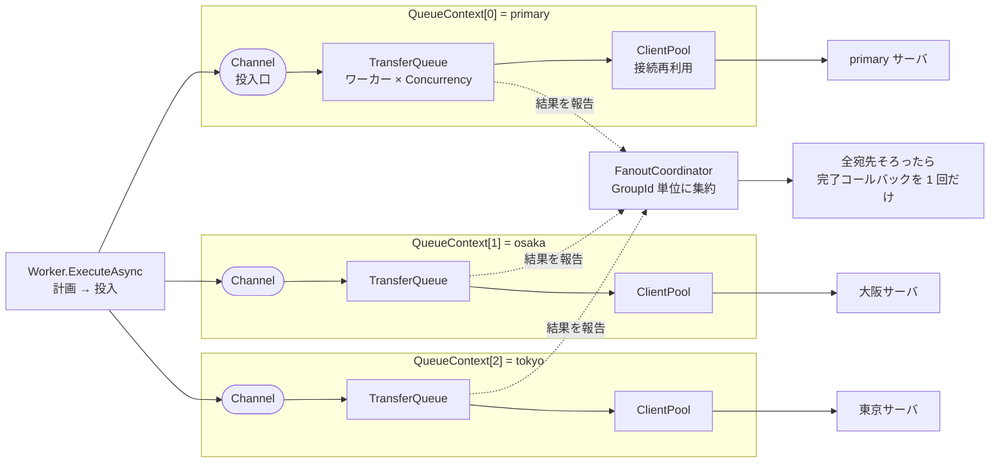
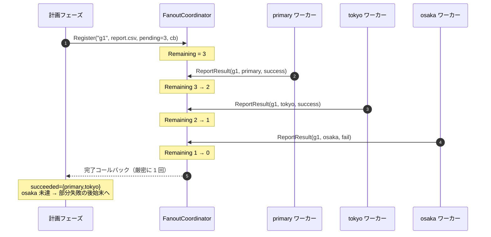
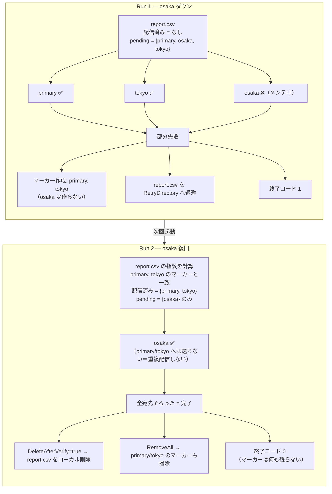
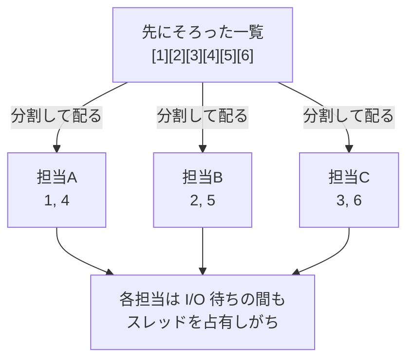
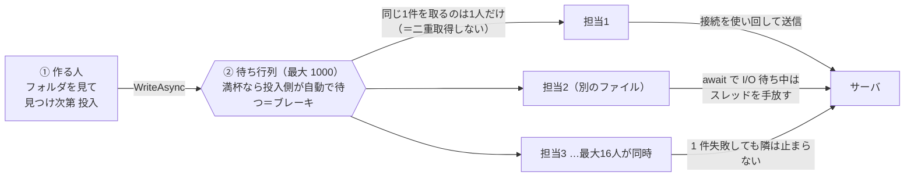
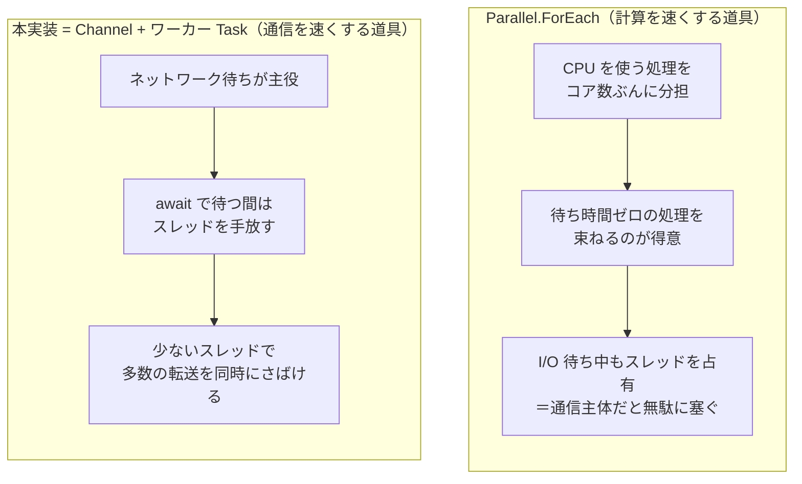

# ファンアウト と 並列処理 実装詳細

> 複数宛先配信（ファンアウト）と並列転送が **コード上どう実装されているか** を、ある程度プログラムが分かる人向けにまとめた資料。
> 「マーカー方式の設計判断・正しさ」は [per-destination-delivery-tracking.md](per-destination-delivery-tracking.md) に詳しいので、本書は **機構と実装** に寄せる。
> 主な実装: [`Worker.cs`](../FtpTransferAgent/Worker.cs) / [`Services/TransferQueue.cs`](../FtpTransferAgent/Services/TransferQueue.cs) / [`Services/FanoutCoordinator.cs`](../FtpTransferAgent/Services/FanoutCoordinator.cs) / [`Services/ClientPool.cs`](../FtpTransferAgent/Services/ClientPool.cs) / [`Services/DeliveryStateStore.cs`](../FtpTransferAgent/Services/DeliveryStateStore.cs)

---

## 0. 先に結論（よくある質問）

- **Q. 全宛先に送れたときマーカーは作られない？**
  **A. 作られない（既定の `DeleteAfterVerify: true` の場合）。** ファンアウトの完了コールバックで「全宛先成功」を判定すると、ローカルファイルを削除し、（過去の部分失敗で残っていれば）マーカーも掃除する。新規にマーカーは書かない。**マーカーは部分失敗したときだけ作られる**（例外として `DeleteAfterVerify: false` の保持運用では、全成功でも「次回送らない」ためのマーカーを残す）。
- **Q. マーカーはどこに作られる？**
  **A. 状態ディレクトリ。** 既定は `Watch.Path` ごとに分離した `<LocalApplicationData>/FtpTransferAgent/delivery-state/<watchパスのハッシュ16桁>/`。`Transfer.StateDirectory` で明示指定も可能。1 マーカー = 1 つの小さな JSON ファイル（`<sha256hex>.marker`）。
- **Q. 一部失敗した元データはどこへ行く？単一転送先のときは？**
  **A. 複数配信ではリトライフォルダへ「移動」する。単一転送先（既定）は `Watch.Path` にそのまま残って次回再送する。** リトライフォルダの場所・クロスドライブ移動・二重列挙にならない仕組みは §5.5 を参照。
- **Q. 並列処理は `foreach` で実装してる？**
  **A. いいえ。** 並列の本体は `System.Threading.Channels` の **producer–consumer**（流れ作業）+ **複数のワーカー Task**。`foreach` は「計画フェーズの逐次ループ」と「1 宛先プロデューサ内の投入ループ」で使うが、並列性そのものを生むのは Channel と Task。`Parallel.ForEach` は使っていない。`foreach` / `Parallel.ForEach` との違いは §7.5 に図解。

以下で順に詳しく説明する。

---

## 1. 登場するデータ構造

### 1.1 宛先（Destination）

- `TransferOptions`（= primary 宛先）は `DestinationOptions` を継承。さらに `AdditionalDestinations: List<DestinationOptions>` を持つ。
- put 方向で「全宛先」= **primary + 追加宛先**。`Worker.GetUploadDestinations()` がこのリストを返す。
- get 方向は primary のみ（追加宛先は無視され、警告が出る）。

### 1.2 TransferItem（キューに流れる 1 単位）

[`Services/TransferItem.cs`](../FtpTransferAgent/Services/TransferItem.cs)

```csharp
public record TransferItem(
    string Path,                 // 元データの物理パス（retry 経由なら retry 内のパス）
    TransferAction Action,       // Upload / Download
    DestinationOptions? Destination = null,  // Upload では送り先（必須）
    string? GroupId = null,      // 1 ファイル × N 宛先 を束ねるファンアウトキー
    IReadOnlyList<string>? RelatedEndFilePaths = null,
    string? OriginalRelativePath = null,
    ... // END / スナップショットのローカルパス上書き等
);
```

ポイント:

- **`GroupId`**: 同じファイルを N 宛先へ送るとき、N 個の `TransferItem` が同じ `GroupId` を持つ。これでファンアウトの結果を 1 ファイル単位に集約する。
- **`DedupKey`**: キュー内の重複検出キー。Upload では宛先情報と GroupId を含むので、**宛先違いの兄弟アイテムは別物**として扱える。

```csharp
// TransferItem.DedupKey（抜粋）
if (Action == TransferAction.Upload && Destination is not null)
{
    var destPart = $"{Destination.Mode}://{Destination.Host}:{Destination.Port}{Destination.RemotePath}";
    return $"Upload:{Path}|{destPart}|{GroupId ?? string.Empty}";
}
return $"{Action}:{Path}";
```

### 1.3 QueueContext（宛先ごとの処理単位）

[`Worker.cs`](../FtpTransferAgent/Worker.cs) の入れ子クラス。**宛先 1 つにつき 1 個** 作る。

```csharp
private sealed class QueueContext
{
    public DestinationOptions Destination { get; }   // この宛先
    public string Name { get; }                      // ログ用ラベル
    public Channel<TransferItem> Channel { get; }    // この宛先の投入口
    public TransferQueue Queue { get; }              // この宛先のワーカー群
    public ClientPool Pool { get; }                  // この宛先の接続プール
}
```

→ **宛先ごとに「投入チャネル・ワーカー群・接続プール」が完全に独立**しているのが、ファンアウトの肝。

---

## 2. ファンアウトの全体像

まず「ファンアウト」とは、**1 つのファイルを複数の宛先へ同時に配信する**こと（put のみ）。イメージは次のとおり。


これを実現するため、`Worker.CreateQueueContexts()` が宛先ごとの `QueueContext` を作る（primary + 追加宛先の数だけ）。内部構造は次のとおり。

```
                       ┌─────────────────────────────────────────────┐
                       │  QueueContext[0] = primary                  │
   計画→投入            │   Channel ──▶ TransferQueue(ワーカー×Concurrency)│──▶ primary サーバ
   ┌───────────┐  ┌──▶ │                       └─ ClientPool（接続再利用）  │
   │  Worker   │  │    └─────────────────────────────────────────────┘
   │ ExecuteAsync├──┤    ┌─────────────────────────────────────────────┐
   │           │  └──▶ │  QueueContext[1] = destination#1            │──▶ 大阪サーバ
   └───────────┘       │   Channel ──▶ TransferQueue ── ClientPool    │
        │              └─────────────────────────────────────────────┘
        │              ┌─────────────────────────────────────────────┐
        └────────────▶ │  QueueContext[2] = destination#2            │──▶ 東京サーバ
                       │   Channel ──▶ TransferQueue ── ClientPool    │
                       └─────────────────────────────────────────────┘
                                         │
                       全宛先の結果を ────┘──▶ FanoutCoordinator（GroupId 単位に集約）
                                                    └─ 全宛先そろったら完了コールバック
```

各 `TransferQueue` は独立に走り、各宛先の結果は `FanoutCoordinator` に集約される。

> 上の ASCII 図と同じ構造を、GitHub 上ではそのまま図として表示できる Mermaid で描くと次のとおり。



**この図のキモは「宛先ごとに縦 1 本のライン（Channel → ワーカー群 → 接続プール）が完全に独立している」こと。** Worker は計画した内容を各宛先の Channel に投入するだけで、あとは宛先ごとのラインが勝手に並列で走る。結果だけが横串の `FanoutCoordinator` に集まり、1 ファイル分の宛先が出そろった瞬間に後始末を 1 回判断する。

---

## 3. 3 つのフェーズ

`Worker.ExecuteAsync` の put 経路は **計画 → 投入 → 集約** の 3 段。

### 3.1 計画フェーズ（逐次・single thread）

`ExecuteAsync` 内で、列挙したデータファイルを **`foreach` で 1 件ずつ** 処理する。ここは並列ではない。

各ファイルについて:

1. トラッキング有効なら、現在の指紋を計算し、`DeliveryStateStore.GetDeliveredDestinations()` で **配信済みの宛先** を求める。
2. `pending = 全宛先 − 配信済み` を求める。`pending` が空なら送信せず後始末だけ（`HandleAlreadyDelivered`）。
3. `FanoutCoordinator.Register(groupId, file, pending.Count, 完了コールバック)` で **このファイルのファンアウトグループ** を登録する。
4. `FanoutPlan`（GroupId, ファイル, pending 宛先, 関連 END など）を `plans` リストに貯める。

> この時点では **まだキューに何も投入していない**。計画を作るだけ。だから完了コールバックが計画中に発火することはない（= `GetDeliveredDestinations` のマーカー読み書きは single thread で安全）。

### 3.2 投入フェーズ（宛先ごとに並列・非結合）

`Worker.EnqueueFanoutPlansAsync()`。**宛先ごとに独立したプロデューサ Task** を立て、各プロデューサは **自分の宛先のチャネルにだけ** 書く。

```csharp
var producers = new Task[queueContexts.Count];
for (int i = 0; i < queueContexts.Count; i++)
{
    var context = queueContexts[i];
    producers[i] = Task.Run(async () =>
    {
        try
        {
            foreach (var plan in plans)
            {
                // この宛先が当該ファイルの未配信先に含まれる場合だけ投入
                if (!plan.Pending.Any(d => ReferenceEquals(d, context.Destination)))
                    continue;

                await context.Channel.Writer.WriteAsync(new TransferItem(...), token);
            }
        }
        finally
        {
            context.Channel.Writer.TryComplete(); // 投入完了でチャネルを閉じる
        }
    }, token);
}
await Task.WhenAll(producers);
```

**なぜ宛先ごとに分けるのか（非結合）**: チャネルは容量 1000 の bounded（`FullMode = Wait`）。もし 1 本のチャネルに全宛先分を流すと、詰まった宛先（応答停止中など）が `WriteAsync` でブロックし、他の健全な宛先への投入まで止まる。宛先ごとにチャネルを分け、プロデューサも分けることで、**1 宛先の不調が全体を律速しない**。

### 3.3 集約フェーズ（FanoutCoordinator）

各 `TransferQueue` は、1 アイテムの最終結果（リトライ後）が確定すると `onFinalOutcome` を呼ぶ。Worker はそこで `FanoutCoordinator.ReportResult()` に通知する（後述 §4）。全宛先の結果が出そろうと、登録時のコールバック（`HandleFanoutCompletion`）が **1 ファイルにつき 1 回だけ** 発火する。

---

## 4. FanoutCoordinator の仕組み

[`Services/FanoutCoordinator.cs`](../FtpTransferAgent/Services/FanoutCoordinator.cs)。やっていることは「**宛先数のカウントダウン + 0 になったら 1 回だけコールバック**」。

```csharp
public void ReportResult(string groupId, DestinationResult result)
{
    if (!_groups.TryGetValue(groupId, out var state)) return;

    state.Results.Add(result);                                  // ConcurrentBag に結果を貯める
    var remaining = Interlocked.Decrement(ref state.Remaining); // 残り宛先数を 1 減らす
    if (remaining == 0 && Interlocked.Exchange(ref state.Completed, 1) == 0)
    {
        _groups.TryRemove(groupId, out _);
        var snapshot = state.Results.ToList();
        state.OnComplete?.Invoke(state.SourcePath, snapshot);   // 完了コールバックを 1 回だけ呼ぶ
    }
}
```

- `Remaining` は `Register` 時に `pending.Count` で初期化。各宛先が報告するたび `Interlocked.Decrement`。
- `remaining == 0` かつ `Interlocked.Exchange(Completed, 1) == 0` の二重ガードで、**コールバックは厳密に 1 回**（複数ワーカーが同時に最後の報告をしても一度しか走らない）。
- 結果は成功/失敗どちらも報告される（失敗時は `Error` 付き）。だから「2/3 成功」のような部分結果もコールバックで分かる。

> スレッド安全性: `_groups` は `ConcurrentDictionary`、カウンタは `Interlocked`、結果は `ConcurrentBag`。複数宛先のワーカーが別スレッドから同時に `ReportResult` してよい。

時系列で見るとこうなる（3 宛先のうち osaka が失敗するケース。報告の順番は宛先の速さ次第でバラバラに来る）。



ポイントは **「各ワーカーは自分の結果を投げ込むだけ」「最後の 1 件を報告したワーカーがコールバックを引く」** という点。誰が最後になるかは実行時まで分からないが、`Remaining==0` かつ `Interlocked.Exchange` の二重ガードで、同時に複数ワーカーが最後の報告をしても**コールバックは 1 回しか走らない**。

完了コールバックの中身は `Worker.HandleFanoutCompletion` → トラッキング無効なら all-or-nothing、有効なら `HandleFanoutCompletionTracked`（§6 で詳述）。

---

## 5. 具体例: 3 宛先・部分失敗 → 復旧

設定: `primary`（本番） / `osaka` / `tokyo` の 3 宛先、`DeleteAfterVerify: true`（既定）、ファイル `report.csv` 1 件。`osaka` が 1 回目はメンテで落ちているとする。

### Run 1（osaka ダウン）

```
計画:   report.csv の配信済み宛先 = なし → pending = {primary, osaka, tokyo}
        FanoutCoordinator.Register("g1", report.csv, 3, cb)

投入:   primary チャネル ← Upload(report.csv, primary, g1)
        osaka   チャネル ← Upload(report.csv, osaka,   g1)
        tokyo   チャネル ← Upload(report.csv, tokyo,   g1)
        （3 本のチャネルへ並列に投入。osaka が詰まっても他は進む）

転送:   primary ✅（ワーカーが Rent→Upload→Hash 検証→Return）→ ReportResult(g1, primary, success) → Remaining 3→2
        tokyo   ✅                                              → ReportResult(g1, tokyo,   success) → Remaining 2→1
        osaka   ❌（接続失敗、リトライも尽きる）                → ReportResult(g1, osaka, fail)      → Remaining 1→0
                                                                  └─ ここで完了コールバック発火（1 回だけ）

完了:   succeeded = {primary, tokyo}, 既存マーカー = なし
        全宛先 {primary, osaka, tokyo} を満たさない（osaka 未達）→ 部分失敗
        ⇒ primary と tokyo のマーカーを作成（osaka のマーカーは作らない）
        ⇒ report.csv（と関連 END）を RetryDirectory へ退避
        ⇒ 終了コード 1
```

このとき状態ディレクトリには **2 つのマーカー** ができる:

```
<StateDirectory>/
  <hash(report.csv\0primary)>.marker   → {"RelativePath":"report.csv","DestinationName":"primary","Signature":"st:...","DeliveredAtUtc":...}
  <hash(report.csv\0tokyo)>.marker     → {... "DestinationName":"tokyo" ...}
  （osaka のマーカーは無い）
```

### Run 2（osaka 復旧）

```
起動:   状態ディレクトリを走査しマーカーをメモリへ。元ファイルは RetryDirectory にあるので孤児ではない。
計画:   report.csv の指紋を計算 → primary, tokyo のマーカーと一致 → 配信済み = {primary, tokyo}
        pending = {osaka} のみ
        FanoutCoordinator.Register("g2", report.csv, 1, cb)   ← 宛先数 1

投入:   osaka チャネル ← Upload(report.csv, osaka, g2)   （primary/tokyo へは投入しない＝重複配信しない）

転送:   osaka ✅ → ReportResult(g2, osaka, success) → Remaining 1→0 → 完了コールバック

完了:   succeeded = {osaka}, 既存マーカー = {primary, tokyo}
        ∪ = {primary, osaka, tokyo} = 全宛先 → 完了！
        ⇒ DeleteAfterVerify=true なので report.csv をローカル削除
        ⇒ RemoveAll(report.csv) で primary/tokyo のマーカーも掃除
        ⇒ 終了コード 0
```

**ポイント**: Run 2 では配信済みの primary/tokyo へは送らず、未配信の osaka だけ送る。完了したのでマーカーは全部消える。**最終的に「全部送れた状態」ではマーカーは残らない。**

### 図で見る Run 1 → Run 2

まず全体像をざっくり掴むと、こういう動き（1 回目で大阪が落ちても、復旧後は大阪だけ送り直す）。


これを「宛先・マーカー・元ファイル」の動きまで含めて詳しく描くと次のとおり。**マーカーは "まだ配り切れていない分" を覚えておく付箋**、と捉えると分かりやすい。



この絵で押さえてほしいファンアウトの設計思想は 3 つ:

1. **進捗はメモリ、確定はディスク** — 「何宛先まで送れたか」の途中経過は `FanoutCoordinator` のメモリ上カウンタだけで持つ。ディスクのマーカーを書くのは**全宛先の結果が出そろった完了コールバックの中だけ**（各宛先成功のたびに逐次書かない）。
2. **マーカーは "未完了" の印** — 全部配ってファイルも消す正常運用ではマーカーは残らない。マーカーがある = 「部分失敗で残っている」か「保持運用で次回スキップしたい」のどちらか。
3. **再送は差分だけ** — Run 2 では `pending = 全宛先 − 配信済み` を取り直すので、復旧した osaka にだけ送る。配信済みへ二重に送らない。

---

## 5.5 補足: 一部失敗した元データはどこへ行く

### 単一転送先と複数配信で動きが違う

| ケース | 一部失敗したときの元ファイル |
|---|---|
| **単一転送先**（追加宛先なし＝トラッキング無効＝既定） | **そのまま `Watch.Path` に残る**。次回そのまま再送する |
| **複数配信**（追加宛先あり＝トラッキング有効） | **リトライフォルダへ「移動」**。次回は未配信の宛先だけ再送する |

単一転送先は「送れた／送れていない」の 2 状態しかないので、失敗したらファイルを残すだけで十分。複数配信は「A には送れたが B には未送」という途中状態があるので、元ファイルをいったん別フォルダ（retry）へよけて、`Watch.Path` の通常の列挙と混ざらないようにする。

### リトライフォルダの場所（`Transfer.RetryDirectory`）

| 設定 | 退避先 |
|---|---|
| **未指定 / `null`（既定）** | `<LocalApplicationData>/FtpTransferAgent/delivery-retry/<watchハッシュ>/`（**`Watch.Path` の外**。多くは C ドライブ） |
| 相対パス（例 `"retry"`） | `Watch.Path/retry/`（**`Watch.Path` の中＝同じドライブ**） |
| 絶対パス | そのパス |
| **空文字 `""`** | **移動しない**（部分失敗ファイルは `Watch.Path` にそのまま残す） |

### 「ドライブが違うと移動できないのでは？」への答え

既定のリトライフォルダは C ドライブ（`LocalApplicationData`）になりがち。`Watch.Path` が D ドライブだと、移動先がドライブをまたぐ。よくある疑問だが、心配は不要:

- **`File.Move` はドライブが違っても動く**。同じドライブなら一瞬の「名前変更」だけ。違うドライブのときは .NET が自動で **「中身を実体コピー → 元を削除」** に切り替える（**自分でコピー処理を書いているわけではない**）。
- だから **元ファイルは残らない**。コピー後に元を消すところまで `File.Move` がやる仕様なので、別途の削除処理は不要。
- ただしクロスドライブは実体コピーになるので、**同ドライブの名前変更より重い**。とはいえこれは **一部失敗したファイルだけ** に起きること。正常に全宛先へ送れた場合は移動自体が発生しない。
- **重さが気になるなら、リトライフォルダを `Watch.Path` と同じドライブに置く**のがおすすめ。`RetryDirectory` に相対パス（`"retry"` → `Watch.Path/retry`）か同ドライブの絶対パスを指定すれば、移動は一瞬の名前変更で済む。
- 退避のときは **わざわざ最終更新時刻を元に戻している**。クロスドライブのコピーで更新時刻が変わると、`sizetime` 指紋がずれて「全宛先へ誤って再送」になってしまうのを防ぐため。

### `Watch.Path` で二重列挙にならない仕組み

「retry に退避したファイルを、次回 watch 列挙がまた拾って二重送信しないか？」も心配になるところ。次の多層で防いでいる:

1. **既定の retry は `Watch.Path` の外** → そもそも watch 列挙に映らない。
2. **retry が `Watch.Path` の中（相対指定）でも、列挙から除外**する（retry 配下のファイルは通常列挙から弾く）。retry のファイルは別ルートで集める。
3. **同じ相対パスが watch と retry の両方にあったら、retry を優先し watch 側はその回スキップ**（警告つき）。だから 1 ファイルは 1 回しか処理されない。
4. **設定で禁止** — retry を `Watch.Path` 自身やその親にすることは起動時エラー（子フォルダや外側はOK）。

---

## 6. マーカーはいつ・どこに作られるか（詳細）

### 6.1 作られない（＝全成功＋既定）

`HandleFanoutCompletionTracked` の「全宛先完了」分岐:

```csharp
if (allDone)
{
    var deleted = DeleteLocalAfterSuccess(sourcePath, ...); // DeleteAfterVerify なら削除
    if (deleted)
    {
        _deliveryStore!.RemoveAll(tracking.RelativePath);   // マーカーを掃除（無ければ no-op）
        // ← 新規マーカーは書かない
    }
    else { /* DeleteAfterVerify=false の保持運用（§6.2）*/ }
    return;
}
```

- **全宛先成功 & `DeleteAfterVerify: true`（既定）** → ローカル削除 + `RemoveAll`。マーカーは作られない（過去の残りがあれば消えるだけ）。
- マーカー書き込み（`RecordDelivered`）は **完了コールバックの中だけ** で呼ばれる。**各宛先が成功するたびに逐次ディスクへ書く、ということはしない**（途中経過は `FanoutCoordinator` のメモリ上カウンタだけ）。

### 6.2 作られる条件

`RecordDelivered` が呼ばれるのは次の 2 ケースだけ:

1. **部分失敗**: 今回成功した宛先のマーカーを書く（失敗宛先には書かない）。ファイルは保持 / retry 退避。
2. **全成功 & `DeleteAfterVerify: false`（保持運用）**: ローカルを残すので、**次回送信をスキップさせるため全宛先分のマーカーを書く**。

> つまりマーカーは「**まだ配り切れていない**」または「**配り切ったがファイルを残す**」ことを表す。全部配ってファイルも消す（最も普通の運用）ならマーカーは存在しない。

### 6.3 物理的な場所・命名・中身

[`Services/DeliveryStateStore.cs`](../FtpTransferAgent/Services/DeliveryStateStore.cs)

- **状態ディレクトリ**（`Transfer.StateDirectory` 未指定時の既定）:
  ```
  <LocalApplicationData>/FtpTransferAgent/delivery-state/<watchパスのSHA256先頭16桁>/
    Windows 例: C:\Users\<user>\AppData\Local\FtpTransferAgent\delivery-state\3f2a9c1b8d7e6f50\
    Linux   例: ~/.local/share/FtpTransferAgent/delivery-state/3f2a9c1b8d7e6f50/
  ```
  `Watch.Path` ごとにサブフォルダを分けるので、別の監視フォルダのマーカーが相対パスで衝突しない。
- **マーカーのファイル名**: `SHA256(relativePath + "\0" + destinationName)` の 16 進小文字 + `.marker`。パス区切りや特殊文字を避けるためのハッシュ化。
- **中身**（JSON 1 つ）:
  ```json
  {
    "RelativePath": "report.csv",
    "DestinationName": "primary",
    "Signature": "st:11-638543210000000000",
    "DeliveredAtUtc": "2026-06-18T01:23:45Z"
  }
  ```
  `Signature` は「送ったときのファイル指紋」。`sizetime`（サイズ + 最終更新時刻 ticks。`st:` 接頭辞）か `hash`（ファイルハッシュ。`h:` 接頭辞）。関連 END があればデータ指紋と END 指紋を合成した値になる。
- **書き込みのアトミック性**: 一時ファイル（`*.tmp.<guid>`）へ書いてから本番名へ `File.Move(overwrite:true)`。書きかけが読まれない。

### 6.4 マーカーのライフサイクル

| 契機 | 何が起きるか | 実装 |
|---|---|---|
| 起動時 | 状態ディレクトリを 1 回走査しメモリへ。**元ファイルが消えたマーカー（孤児）と壊れたマーカーは削除** | `Initialize()` |
| 列挙時 | 指紋一致のマーカーを「配信済み」とみなす。**指紋不一致（＝内容が差し替わった）マーカーはその場で削除**し再送対象にする | `GetDeliveredDestinations()` |
| 部分失敗の完了時 | 今回成功した宛先のマーカーを書く | `RecordDelivered()` |
| 全宛先完了 & 削除時 | 当該ファイルの全マーカーを掃除 | `RemoveAll()` |

> 指紋による陳腐化検出が「送信後に同名で内容が差し替わったファイル」を取りこぼさない仕掛け。詳細は [per-destination-delivery-tracking.md](per-destination-delivery-tracking.md) を参照。

---

## 7. 並列処理の実装

### 7.1 結論: Channel + ワーカー Task（foreach ではない）

並列転送の本体は [`Services/TransferQueue.cs`](../FtpTransferAgent/Services/TransferQueue.cs)。
**`System.Threading.Channels` の producer–consumer** に、**指定並列数ぶんのワーカー Task** がぶら下がる形。

```csharp
public Task StartAsync(Func<TransferItem, CancellationToken, Task> handler, ..., CancellationToken ct)
{
    var tasks = new Task[_concurrency];
    for (int i = 0; i < _concurrency; i++)
    {
        int workerId = i;
        tasks[i] = Task.Run(async () => await Worker(workerId, ct), ct); // ← ワーカーを並列起動
    }
    return Task.WhenAll(tasks);

    async Task Worker(int workerId, CancellationToken token)
    {
        while (await _reader.WaitToReadAsync(token))   // チャネルに来るまで待つ
        {
            if (_reader.TryRead(out var item))         // 1 個取り出す（複数ワーカーが奪い合う）
            {
                // 重複抑止（同じ DedupKey は 1 回だけ）
                if (!_processedItems.TryAdd(item.DedupKey, true)) { /* duplicate→失敗 outcome */ continue; }

                try
                {
                    await _policy.ExecuteAsync(async (ctx, t) => await handler(item, t), context, token); // Polly リトライ
                    onFinalOutcome?.Invoke(item, null);     // 成功を 1 回通知
                }
                catch (Exception ex)
                {
                    onFinalOutcome?.Invoke(item, ex);       // 失敗を 1 回通知（再スローしない）
                    // ← ここで握って継続するので、1 件の失敗が他ワーカーを止めない（ワーカー隔離）
                }
            }
        }
    }
}
```

要点:

- **並列の単位はワーカー Task**。`_concurrency` 個の Task が同じチャネルから `TryRead` で奪い合う。`Parallel.ForEach` や `foreach` で回しているわけではない。
- **`while (await WaitToReadAsync)`** がイベント駆動の肝。アイテムが来たら起き、無ければ待つ。チャネルが `Complete` されると `WaitToReadAsync` が `false` を返してループ終了。
- **重複抑止**: `ConcurrentDictionary _processedItems.TryAdd(DedupKey)`。同じアイテムが二重に処理されない。
- **ワーカー隔離**: ハンドラ例外は `catch` して `onFinalOutcome` に渡すだけで **再スローしない**。だから 1 ファイルの失敗で他のワーカーやキュー全体が止まらない。失敗は統計とログに計上される。

### 7.2 並列度のクランプと容量

```csharp
_concurrency = Math.Max(1, Math.Min(concurrency, 16)); // 1〜16 に丸める
```

- `Transfer.Concurrency`（と各追加宛先の `Concurrency`）で指定。範囲外は起動時バリデーションで弾く（1〜16）。
- チャネルは bounded（容量 `QueueCapacity = 1000`、`FullMode = Wait`、`SingleReader/SingleWriter = false`）。投入が速すぎてもメモリが青天井にならない。

### 7.3 リトライ（Polly）

```csharp
_policy = Policy
    .Handle<Exception>(ex => RetryableExceptionClassifier.IsRetryable(ex)) // リトライ可能だけ拾う
    .WaitAndRetryAsync(
        retryCount: options.MaxAttempts,
        sleepDurationProvider: attempt => TimeSpan.FromSeconds(
            Math.Min(options.DelaySeconds * Math.Pow(2, attempt - 1), 300)), // 指数バックオフ、上限300秒
        onRetry: ...);
```

- 一時的エラー（Socket / Timeout / 一部 IOException / FTP 4xx / ハッシュ不一致 等）は **指数バックオフでリトライ**。
- 恒久的エラー（認証・設定・FTP 5xx 等）は `IsRetryable` が `false` を返し **即失敗**。
- 1 アイテムにつき、リトライが尽きた後に **`onFinalOutcome` が 1 回だけ** 呼ばれる（= ファンアウトへの報告も 1 回）。

### 7.4 ハンドラ本体（Worker 側）

`Worker.ExecuteAsync` が `StartAsync` に渡すハンドラが、実際の 1 ファイル転送。**接続プールから借りて使い、返す**（§8）。

```csharp
async (item, token) =>
{
    var isUpload = item.Action == TransferAction.Upload;
    var dest = isUpload ? (item.Destination ?? context.Destination) : context.Destination;
    var client = context.Pool.Rent(() => isUpload ? CreateClientFor(dest) : CreateClient()); // 借りる or 新規
    var reusable = true;
    try
    {
        var bytes = isUpload
            ? await ProcessUploadAsync(client, item, id, token)
            : await ProcessDownloadAsync(client, item, id, token);
        context.Queue.RecordBytesTransferred(bytes);
    }
    catch (Exception ex)
    {
        reusable = !RetryableExceptionClassifier.IsConnectionBroken(ex); // 接続が壊れたら再利用しない
        throw; // Polly に投げてリトライ判定させる
    }
    finally
    {
        context.Pool.Return(client, reusable); // 返す（壊れていれば破棄）
    }
}
```

---

## 7.5 図解: foreach / Parallel.ForEach との違い（並列の作り方）

「並列処理」と聞くと `foreach` を速くしたものを思い浮かべがちだが、作り方には種類がある。順に図で見ていく（専門用語は最小限にして説明する）。

### (A) ふつうの foreach … 1 人で順番に（並列ではない）

```
 担当は 1 人。前のファイルが終わるまで次に進めない

 [ファイル1]──▶[ファイル2]──▶[ファイル3]──▶[ファイル4]
   送信…          送信…          送信…          送信…
 └──────────────── 時間（ぜんぶ足し算）────────────────▶
```

通信の待ち時間の間、ずっと何もせず待つ。だから遅い。

### (B) Parallel.ForEach … 先にそろった一覧を“パッと”分担

```
 先に全部そろったファイルの一覧:  [1][2][3][4][5][6]
            │ いくつかに分けて担当へ配る
       ┌────┼────┐
     担当A   担当B   担当C
     [1][4]  [2][5]  [3][6]
```



- もともと **計算（CPU を使う処理）を分担する**のが得意な仕組み。
- 弱点①: **一覧が最初に全部そろっている前提**。「フォルダを見ながら、見つけ次第どんどん流す」用途には向かない。
- 弱点②: 単純な使い方だと、通信の待ち時間の間も **担当（処理を実行する係＝OS のスレッド）を占有して塞いでしまう**。通信（ネットワーク I/O）が主役の処理には不向き。
- 弱点③: 接続の使い回し・1 件ごとの再試行・宛先ごとの振り分けは、自分で作り込む必要がある。

### (C) 全部いっぺんに投げる（Task.WhenAll）

```
 [1][2][3][4] … [5000]   ← 5000 件なら 5000 接続を一斉に開きにいく
```

同時実行数に上限がなく、相手サーバに一気に殺到する。自前でブレーキ（同時数の制限）を足さないと危ない。

### (D) 本実装 … 流れ作業（作る人と処理する人を分ける）


同じ流れを、`await` でスレッドを手放す点まで含めて描くと次のとおり。



- 担当の数 = `Concurrency`（1〜16）。**「作る」と「処理する」を分けている**のがミソ。
- **「取り合い」は "同じ 1 件を 2 人が掴まない" という意味で、"同時に動く担当が 1 人" という意味ではない**。担当が N 人いれば **N 件が並列で送られる**（最大 16 件同時）。`TryRead` が 1 アイテムを必ず 1 ワーカーにだけ渡すので、二重取得＝二重送信が起きない。
- 待ち行列が満杯になると **投入する側が自動で待つ**（＝ブレーキ＝流量調整が標準で効く。メモリが膨らまない）。
- 担当は「待ち合わせ（`await`）」で待つので、**通信の待ち時間の間は担当（スレッド）をいったん手放す**。だから 8 担当でも 8 本のスレッドを常時占有するわけではなく、待ち時間は他の仕事に回せる（通信主体の処理に強い理由）。
- 1 件失敗しても、その担当が握りつぶして次へ進む（**他の担当は止まらない**＝失敗の隔離）。
- 各担当は接続を **使い回す**（毎回つなぎ直さない）ので、接続確立のコストを抑えられる。

### 核心: 「Parallel.ForEach」と本実装は何が本質的に違うのか

ここがいちばん混同されやすいので 1 点に絞ると、**違いは「何を速くしたいか」**。



- **Parallel.ForEach は「CPU バウンドな処理」を速くする道具**。100 万件の数値計算を 8 コアで割り算する、みたいな用途。各担当（スレッド）が休まず計算し続ける前提なので、**通信の待ち時間でスレッドを遊ばせる FTP/SFTP 転送には筋が悪い**（待っている間もスレッドを占有してしまう）。
- **本実装は「I/O バウンドな処理」を速くする形**。転送のほとんどは「送って応答を待つ」時間で、その間 CPU は暇。だから `await` で**スレッドをいったん手放し**、待っている間に別の転送を進める。結果、たかだか 16 スレッドでも数千ファイルの転送を効率よく回せる。
- おまけに本実装には **ブレーキ（待ち行列の容量）・1 件ごとの再試行（Polly）・失敗の隔離・宛先ごとの振り分け・接続の使い回し**が最初から組み込まれている。これらを `Parallel.ForEach` で再現しようとすると、結局これと同じものを自作することになる。

> 早い話、**`Parallel.ForEach` は「計算を分担」、本実装は「通信を待ち合わせながら流す」**。だから同じ「並列」でも道具が違う。FTP/SFTP のような通信主体の仕事には後者が素直にはまる、というのがこのツールの選択。

### 早見表

| | (A) foreach | (B) Parallel.ForEach | (D) 本実装（流れ作業） |
|---|---|---|---|
| 同時に何件 | **1 件ずつ** | 複数（一覧を分担） | 複数（担当を固定数） |
| 入力 | 一覧 | **最初に全部そろっている必要** | **流れてくるものを順次** |
| ブレーキ（流量調整） | — | 自分で足す | **標準で効く（待ち行列）** |
| 1 件ごとの再試行 | 自分で | 自分で | **組み込み済み** |
| 1 件の失敗 | — | 全体が止まり得る | **隣は止まらない** |
| 接続の使い回し | 自明 | 難しい | **自然にできる** |
| 向くもの | 少量・単純 | **計算（CPU 主体）の分担** | **通信（I/O 主体）を順次・宛先ごとに** |

### ひとことで

このツールは「**フォルダを見ながら次々ファイルを見つけ（作る人）、決まった人数の担当が通信で送る（処理する人）。しかも宛先ごとに別ライン**」という流れ作業。だから `Parallel.ForEach`（そろった一覧を計算で分担）ではなく、**待ち行列に担当をぶら下げる流れ作業**の形がいちばん素直にはまる。

> なお `foreach` 自体は本実装でも使っている（「計画フェーズの逐次ループ」や「1 宛先プロデューサ内の投入ループ」）。ただし **並列を生んでいるのは待ち行列と担当（Task）であって、`foreach` ではない**。

---

## 8. 接続の再利用（ClientPool）

[`Services/ClientPool.cs`](../FtpTransferAgent/Services/ClientPool.cs)。**宛先ごとに 1 プール**。1 ファイルごとに接続を張り直すと、特に SFTP は鍵交換・認証が重い。空き接続を使い回してそのコストを削る。

```csharp
public IFileTransferClient Rent(Func<IFileTransferClient> factory)
    => _available.TryTake(out var client) ? client : factory(); // 空きがあれば再利用、無ければ生成

public void Return(IFileTransferClient client, bool reusable)
{
    if (reusable && Volatile.Read(ref _disposed) == 0) { _available.Add(client); return; } // プールへ戻す
    SafeDispose(client); // 壊れている / 破棄済みなら切断
}
```

- 中身は `ConcurrentBag<IFileTransferClient>`。
- クライアントラッパー（FtpClient / SftpClientWrapper）は **スレッドセーフではない** ので、Rent した接続は Return まで他ワーカーが取らない（= 同時に 1 ワーカーだけが 1 接続を使う）。
- 接続断（`IsConnectionBroken` が `true`）の場合は `reusable=false` で返し、プールに戻さず破棄 → 次の `Rent` で張り直す。
- 全ワーカー終了後に `Pool.Dispose()` で残りの接続をまとめて切断。
- アイドル切断対策として `KeepAliveSeconds`（SFTP は KeepAliveInterval、FTP は NOOP + TCP KeepAlive）。

→ 実効的に **接続生成回数 ≦ 並列数（ワーカー数）** になり、ファイル数ぶん張り直すより遥かに安い。

---

## 9. 並列度の全体像（宛先別 × ファイル）

- **宛先内**: その宛先の `Concurrency` 個のワーカーが、その宛先のチャネルからアイテムを取って並列転送。
- **宛先間**: 各宛先の `TransferQueue` は独立 Task として同時に走る。
- したがって **同時に走り得る転送数 ≒ Σ(各宛先の Concurrency)**。
  - 例: primary=1, osaka=2, tokyo=2 なら、最大で 1+2+2 = 5 転送が同時進行。
- 宛先ごとに `Concurrency` を変えられるので、「速い宛先は多並列、弱い宛先は控えめ」を個別に設定できる。

---

## 10. 投入側の並列と「非結合」

§3.2 のとおり、投入も宛先ごとの独立プロデューサ Task。これが効くシナリオ:

```
3 宛先 / チャネル容量 1000 / 5000 ファイルを投入したい / tokyo が応答停止で詰まっている

× 1 本のチャネルに全部流す設計だと:
  tokyo のワーカーが消費しない → tokyo 向けの WriteAsync が容量で待つ
  → 同じチャネルを共有していると primary/osaka への投入まで巻き込まれて止まる

○ 宛先ごとにチャネル + プロデューサを分ける設計（現状）:
  tokyo のプロデューサだけが WriteAsync で待つ
  → primary/osaka のプロデューサとワーカーは最後まで走り切れる（非結合）
```

= **1 宛先の不調が全体のスループットを律速しない。**

---

## 11. パフォーマンス監視

`Worker.StartPerformanceMonitoringAsync`。宛先（キュー）ごとに 1 つの監視 Task を立て、1 分間隔で:

- 統計（Total / Completed / Failed / Active / Memory / 成功率）をログ出力
- 5 分以上動いているアイテムを「Long running」警告
- メモリ 500MB 超で警告

転送が全部終わると `monitorCts.Cancel()` で監視 Task を畳む。

---

## 12. まとめ（実装の地図）

| 関心事 | どこで | キモ |
|---|---|---|
| 宛先ごとの独立処理 | `Worker.CreateQueueContexts` | 宛先 = Channel + TransferQueue + ClientPool |
| どの宛先へ送るか | `Worker.ExecuteAsync`（計画） | `pending = 全宛先 − 配信済み` |
| 投入（非結合） | `Worker.EnqueueFanoutPlansAsync` | 宛先ごとの独立プロデューサ Task |
| 結果の集約 | `FanoutCoordinator.ReportResult` | カウントダウン + 1 回だけコールバック |
| 完了後の判断 | `Worker.HandleFanoutCompletion(Tracked)` | 削除 / 保持 / retry 退避 / マーカー |
| 並列転送 | `TransferQueue.StartAsync` | Channel + ワーカー Task ×Concurrency + Polly |
| 重複抑止 | `TransferQueue`（`_processedItems`） | `ConcurrentDictionary.TryAdd(DedupKey)` |
| 接続再利用 | `ClientPool` | `ConcurrentBag`、壊れた接続は破棄 |
| 配信状態の永続化 | `DeliveryStateStore` | (ファイル×宛先) マーカー、指紋で陳腐化検出 |

**ひとことで**:
- **ファンアウト** = 宛先ごとに独立した「チャネル + ワーカー群 + 接続プール」を並べ、`FanoutCoordinator` が結果を 1 ファイル単位に集約して後始末を 1 回だけ判断する。
- **並列処理** = `foreach` ではなく、Channel に複数ワーカー Task をぶら下げる producer–consumer。失敗は握って継続（ワーカー隔離）、接続はプールで再利用、リトライは Polly。
- **マーカー** = 「配り切れていない / 配り切ったが残す」ときだけ状態ディレクトリに作られる小さな JSON。全部配ってファイルも消す既定運用では作られない。
