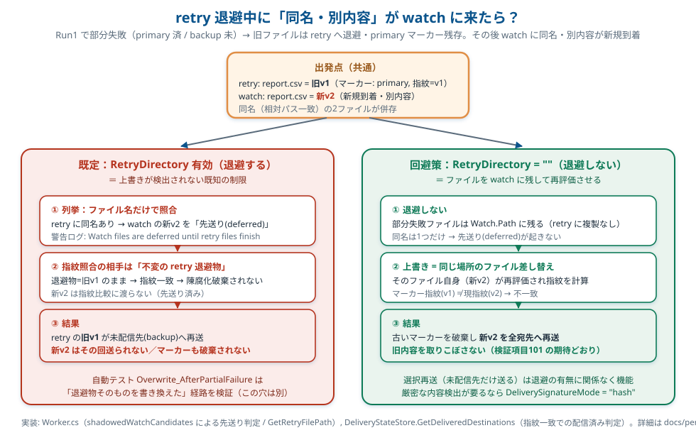

# 宛先別配信トラッキング 詳細解説

> 複数宛先（ファンアウト）転送で「未配信の宛先だけ再送する」機能の、設計・対策・設定・懸念をまとめた資料。
> 仕様の要約は [ftp-transfer-agent-spec.md 5.9](../ftp-transfer-agent-spec.md) を参照。本書はその背後にある判断と細部を後から読み返せるようにするためのもの。
> ファンアウトのキュー構成・並列処理の実装・マーカーの作成条件と保存先など **実装機構** は [ファンアウトと並列処理 実装詳細](fanout-and-parallelism.md) を参照。

- 対象バージョン: 3.2.1
- 関連設定: `Transfer.PerDestinationDeliveryTracking` / `Transfer.StateDirectory` / `Transfer.RetryDirectory` / `Transfer.DeliverySignatureMode` / `Transfer.Name`（各宛先） / `Smtp.SuppressPerDestinationFailureDetailEmails`
- 主な実装: [`Services/DeliveryStateStore.cs`](../FtpTransferAgent/Services/DeliveryStateStore.cs) / [`Worker.cs`](../FtpTransferAgent/Worker.cs) / [`Logging/LogEvents.cs`](../FtpTransferAgent/Logging/LogEvents.cs)

---

## 1. 何を解決する機能か

### 1.1 背景

このツールは **ステートレスなバッチ**として動く。起動するたびに `Watch.Path` を端から列挙し、見つかったファイルを設定された宛先へ送り、終わったら終了する。常駐せず、前回実行の記憶をプロセス内には持たない。

複数宛先（`AdditionalDestinations`）を設定すると、1 ファイルを primary + 各追加宛先へ同時送信する（ファンアウト）。

### 1.2 従来（all-or-nothing）の問題

従来は「全宛先成功時のみローカル削除、1 つでも失敗したらローカル保持」という all-or-nothing だった。すると:

1. 宛先 A は成功、宛先 B はメンテで失敗 → ローカルファイルは保持される
2. 次回バッチでファイルを再列挙 → **また A と B の両方へ送信**
3. A はすでに受け取っているのに**重複配信**される

宛先 B が 1 日ダウンしていると、その間ずっと A へ重複配信が続く。受信側 A の運用によっては、これが事故（二重取り込み等）につながる。

### 1.3 やりたいこと

- 送れた宛先（A）には**二度と送らない**
- 送れていない宛先（B）には**送り直す**
- B が何日ダウンしていても安全に再送し続けられる

### 1.4 なぜ単純な実装では足りないか

バッチはステートレスなので、「A には送れた」という情報をプロセス内に持っても次回には消える。`Watch.Path` 上のファイルは「ある / ない」の 1bit しか表現できず、「A には送れたが B には未送」という**中間状態を表現する場所がない**。

→ 唯一の永続記憶であるディスクに、**(ファイル × 宛先) 単位の配信状態**を残す必要がある。これがマーカー方式の出発点。

---

## 2. 全体アーキテクチャ（マーカー方式）

元のデータファイルには手を付けず、配信できた (ファイル × 宛先) ごとに**小さなマーカーファイル**を状態ディレクトリに残す。END ファイルの「転送準備完了マーカー」と同じ発想の「配信完了マーカー」版。

```
watch/
  report.txt                ← 元データ。配信トラッキングは触らない

<StateDirectory>/
  <hash>.marker             ← 「report.txt は宛先 primary へ配信済み」を表す小さな JSON
```

マーカー（`*.marker`）の中身は JSON 1 つ:

```json
{
  "RelativePath": "report.txt",
  "DestinationName": "primary",
  "Signature": "st:11-638...ticks",
  "DeliveredAtUtc": "2026-06-18T01:23:45Z"
}
```

処理の流れ:

1. **起動時**: 状態ディレクトリを 1 回走査してマーカーをメモリへ読み込む（対応する元ファイルが無いマーカーや壊れたマーカーは削除）。
2. **列挙時**: 各データファイルについて現在の指紋を計算し、「指紋が一致するマーカーを持つ宛先」を配信済みとみなす。関連 END ファイルがある場合は、データ指紋と END 指紋を合成した値で判定する。**未配信の宛先だけ**をキューへ投入する。全宛先配信済みなら送信自体をスキップする。複数宛先では投入前に一時スナップショットを作成し、全宛先が同じファイル内容を読む。
3. **完了時**: 「今回成功した宛先 ∪ 既存マーカーの宛先」が全宛先を満たせば完了。`DeleteAfterVerify: true`（既定）ならローカルファイル・マーカーを削除し、`false` なら退避していたファイルを `Watch.Path` へ復元してマーカーを保持する。満たさなければ、今回成功した宛先のマーカーを書き、対象ファイルを `RetryDirectory` へ退避する（次回は未配信の宛先だけ再送）。ただし完了処理前に元ファイルまたは関連 END ファイルの指紋が変わった場合は、ローカル削除・retry 退避を行わず次回実行に持ち越す。

---

## 3. 直面する問題と、入れてある対策（1 つずつ）

### 3.1 状態をどこに持つか → ディスク上のマーカー

- **問題**: ステートレスバッチなので状態をプロセス内に持てない。
- **対策**: `StateDirectory` 配下の (ファイル × 宛先) マーカーファイルで永続化。バッチを跨いでも、宛先が何日ダウンしても残る。
- **実装**: `DeliveryStateStore`（ロード／記録／削除／掃除）。

### 3.2 性能（毎回マーカーを探す／作るのは重くないか）→ 「部分失敗時だけ作る」「スキャンは 1 回」

- **問題**: ファイルごとにディスクを探索したり、毎回マーカーを作ると重い。
- **対策**:
  - マーカーは **部分失敗時にだけ**作る。全宛先成功（＝通常時）はマーカーを 1 つも作らず、従来どおりローカル削除するだけ。**通常時の追加コストはゼロ**。
  - 部分失敗したファイルは `RetryDirectory` へ移動する。未指定時の retry 先は `Watch.Path` の外に作られる。次回は retry 配下のファイルを元の相対パスとして扱うため、リモートパスやマーカーキーは Watch 配下にあったときと同じ。ユーザーが retry ファイルを削除した場合は、起動時に対応する元ファイルが無くなったマーカーも削除される。
  - retry 移動前にデータファイルと関連 END ファイルの移動先をすべて検証する。移動途中で I/O エラー等が起きた場合は、完了済みの移動を逆順で Watch 側へ戻し、データと END が分断されたまま残るリスクを下げる。
  - 探索は**起動時に状態ディレクトリを 1 回だけ走査**してメモリ（`ConcurrentDictionary`）に載せ、以降はメモリ照合。ファイルごとのディスク探索はしない。マーカーは「送りきれずに残ったファイル」の分しか存在しないため軽量。
  - 仮にマーカー I/O が発生しても、空に近いファイルの作成・削除はメタデータ操作でマイクロ秒オーダー。ネットワーク転送＋ハッシュ（ミリ秒〜秒）に比べれば誤差。
- **実装**: `DeliveryStateStore.Initialize()`（1 回走査）、`Worker.HandleFanoutCompletionTracked`（全成功時はマーカーを書かない）。

### 3.3 宛先の取り違え → `Name` 必須かつ一意

- **問題**: マーカーは宛先を区別する「鍵」が要る。接続情報（host/port/path）を鍵にすると、サーバ移転やパス変更・typo 修正のたびに「別の宛先」とみなされ、全ファイルが再送（重複配信）されてしまう。逆に鍵が衝突すると、未送信なのに「送った」と誤判定（取りこぼし）する。
- **対策**: 接続情報と独立した**安定した `Name`** を鍵に使う。トラッキング有効時は **primary を含む全宛先で `Name` を必須かつ一意**とし、起動時バリデーションで強制（未設定・重複はエラーで停止）。
- **実装**: `DestinationOptions.Name`、`ConfigurationValidator.ValidateDeliveryTracking`。

### 3.4 同名ファイルの上書き → 指紋（シグネチャ）ガード

- **問題**: 配信途中（A 済み・B 未）のファイルが、別内容で同名上書きされた場合、「A のマーカーがある → A をスキップ」とすると **A には古い内容しか届かず、新内容が永遠に届かない**（静かなデータ欠落）。
- **対策**: マーカーに送信時のファイル**指紋**を記録し、現在の指紋と一致する宛先だけを「配信済み」と判断する。関連 END ファイルがある場合はデータファイル指紋と END ファイル指紋を合成して記録する。指紋が違えば（＝内容が差し替わった）配信済み扱いにせず**全宛先へ再送**し、古いマーカーは破棄する。
  - `sizetime`（既定）: サイズ + 最終更新時刻（UTC ticks）。軽量。
  - `hash`: `Hash.Algorithm` でファイルハッシュを算出。厳密。
- **追加対策**: 複数宛先では、キュー投入前にデータファイルと関連 END ファイルを一時ディレクトリへコピーし、全宛先がそのスナップショットを送る。コピー後に元ファイルまたは関連 END ファイルの指紋が変わっていた場合は、その実行では投入しない。投入後に元ファイルや関連 END ファイルが変わった場合も、完了時の削除・retry 退避は行わず次回へ持ち越す。全宛先配信済みで送信をスキップする場合も、cleanup 直前に同じ再確認を行う。
- **実装**: `DeliveryStateStore.ComputeSignatureAsync` / `GetDeliveredDestinations`（指紋不一致のマーカーをその場で削除）、`Worker.TryCreateUploadSnapshotAsync` / `AreLocalFilesStillPlannedVersion`。

### 3.4.1 保持マーカーの指紋は「次回列挙時の指紋」に合わせる（3.2.1 で修正）

- **問題**: `DeleteAfterVerify: false` でローカルを残す構成で、成功後に END ファイルを削除する（`TransferEndFiles` / `DeleteLocalSkippedEndFiles`）と、マーカーに記録したフル指紋（データ+END）と、次回列挙時に再計算される指紋（END が消えているのでデータ単体）が食い違う。結果、配信済みなのに指紋不一致で「未配信」と誤判定し、**毎回全宛先へ再送**してしまう。
- **対策**: 完了時に保持マーカーを記録する指紋を「**cleanup 後にローカルへ残る状態で再計算される指紋**」に合わせる。END を削除する構成ならデータ単体指紋、END を残す構成ならフル指紋を記録する（`Worker.PersistedDeliverySignature`）。
- **追加対策**: 部分失敗時はフル指紋で記録し、復旧完了時にデータ単体指紋へ揃えるため、完了時は **全宛先分のマーカーを記録し直す**（成功宛先だけでなく既存マーカーも上書き）。これにより、先に配信済みだった宛先のフル指紋マーカーだけが古い記録とみなされて再送される事態を防ぐ。
- **実装**: `Worker.PersistedDeliverySignature` / `HandleFanoutCompletionTracked`（保持パスで `tracking.AllDestinationNames` を記録）。

### 3.4.2 retry からの復元でも指紋（mtime）を保持する（3.2.1 で修正）

- **問題**: 部分失敗で retry へ退避したファイルを全宛先完了時に `Watch.Path` へ復元する際、既定の retry 先は別ボリューム（`LocalApplicationData`）になり得る。クロスボリュームの copy+delete で最終更新時刻が変わると `sizetime` 指紋が変化し、復元後の指紋が保持マーカーと食い違って全再送になる。
- **対策**: 退避（`MovePartialFailureToRetryDirectory`）と対称に、復元（`RestoreFromRetryDirectoryIfNeeded`）でも元の最終更新時刻を明示的に再適用する。
- **実装**: `Worker.RestoreFromRetryDirectoryIfNeeded`。

### 3.4.3 retry 退避中に同名・別内容が watch に来た場合は「先送り」される（既知の制限）

3.4 の指紋ガードは「**次回再評価されるファイル**」の指紋を見て効く。問題は、既定構成では部分失敗したファイルが `Watch.Path` の外（`RetryDirectory`）へ**移動**してしまう点にある。



> このパターンに絞った運用判断の資料は [retry 退避中の「同名・別内容」ファイル — 挙動と運用判断](retry-vs-watch-overwrite.md) を参照。

- **状況**: Run1 で部分失敗（primary 済・backup 未）→ 旧ファイルは retry へ退避、primary のマーカーが残る。その後、上流システムが**同名・別内容の新しいファイルを `Watch.Path` に投入**する。
- **現状の挙動**: 列挙時、retry 側と watch 側に同じ相対パスのファイルが両方存在する。ここで **ファイル名（相対パス）の一致だけ**で「retry 退避物を優先し、watch の新ファイルは退避物の処理が終わるまで先送り（deferred）」する（`Worker.cs` の `shadowedWatchCandidates` 判定）。警告ログ "Retry directory contains ... Watch files are deferred until retry files finish" が出る。
  - 指紋比較（`GetDeliveredDestinations`）に渡るのは、内容が変わらない retry 退避物のほうだけ。よって**指紋は一致したまま**で陳腐化破棄は起きず、retry の**旧内容**が未配信宛先（backup）へ再送される。
  - watch の**新内容**はその回には送られない。backup が復旧して退避物が全宛先完了するまで（`DeleteAfterVerify: true` なら退避物の削除まで／`false` なら復元が同名衝突で失敗し続けるため事実上）保留される。
- **なぜこうしてあるか**: 「同名なら同じ内容」という前提で、進行中の部分配信を先に完了させる（＝既配信先へ重複配信しない）ことを優先する素直な設計。退避物を勝手に破棄しない（ツールが利用者のファイルを消さない）方針とも整合する。別内容での差し替えという例外ケースを、名前一致の段階では区別していない。
- **検出が効くのはどこか**: 上書きが「再評価されるファイル自体」に対して行われた場合。具体的には、
  - 退避物そのものを書き換えた場合（自動テスト `Overwrite_AfterPartialFailure_ResendsToAllDestinations` はこの経路を検証している）、
  - あるいは下記の運用回避策で**ファイルを watch に残している**場合。

#### 運用回避策: `RetryDirectory` を空にして watch 保持にする

部分失敗ファイルを退避させず `Watch.Path` に残せば、同名上書きは**同じ場所のファイルの差し替え**になり、次回はそのファイル自身が再評価される。指紋が変われば 3.4 のガードが自然に発火し、古いマーカーを破棄して**全宛先へ再送**する。

```jsonc
{
  "Transfer": {
    "RetryDirectory": ""   // 退避を無効化。部分失敗ファイルは Watch.Path に残す
  }
}
```

- トレードオフ: 部分失敗ファイルが `Watch.Path` に居続けるため、未配信宛先がダウンし続ける間は watch 上にファイルが滞留する（隠しフォルダにまとめられない）。選択再送（未配信先だけ送る）自体は退避有無に関係なく働くので、機能は損なわれない。
- どちらを選ぶか:
  - 「同名で内容が差し替わる運用があり得る／新内容を取りこぼしたくない」→ **`RetryDirectory: ""`（watch 保持）**。
  - 「同名なら必ず同じ内容。進行中の配信を隠しフォルダで管理したい」→ 既定（退避）。ただし上記の制限を承知して運用する。
- 既定の退避運用のまま名前一致の先送りを根本的に直す（＝退避物と watch 新ファイルの**指紋まで突き合わせ**、不一致なら watch を優先して退避物を陳腐化扱いにする）には**コード変更**が必要。現状は入れていない。

- **実装**: `Worker.cs`（`shadowedWatchCandidates` による先送り判定 / `GetRetryFilePath` / `RestoreFromRetryDirectoryIfNeeded`）、`DeliveryStateStore.GetDeliveredDestinations`（指紋一致での配信済み判定）。

### 3.4.4 復元は all-or-nothing + 配信済みスキップ時にも再試行（3.4.2 で修正）

- **問題 1**: 全宛先完了時の `Watch.Path` への復元が失敗（復元先に同名ファイルが存在・一時的なロック等）すると、以降のバッチは「全宛先配信済み」として `HandleAlreadyDelivered` を通り、復元を**再試行しなかった**。阻害要因が解消されてもファイルが隠しの retry ディレクトリへ永久に取り残される。
- **問題 2**: 復元がファイル単位のベストエフォートだったため、END の復元に成功した後にデータ本体の復元が失敗すると、ペアが watch と retry に**分断**される。`RequireEndFile` 構成では retry 側に残ったデータが列挙フィルタ（END 不在）で候補から外れ、復元も再試行されないまま取り残される。
- **対策**: ① 配信済みスキップ経路でもローカルを残す場合は復元を再試行する。② 復元を退避と対称の「計画 → 一括移動 → 途中失敗時ロールバック」（all-or-nothing）に変更し、1 つでも復元できない場合はペアごと retry に残す。①②の組で、阻害要因が解消され次第、後続バッチで自動回復する。
- **実装**: `Worker.HandleAlreadyDelivered` / `RestoreFromRetryDirectoryIfNeeded`。回帰テスト: `DeleteAfterVerifyFalse_RestoreBlockedThenUnblocked_RestoresOnLaterRun` / `DeleteAfterVerifyFalse_RestorePartiallyBlocked_KeepsDataAndEndPairTogetherInRetry`（`PerDestinationDeliveryTrackingTests`）。

### 3.5 完了判定（次回はキューに未送先しか入らない）→ 「今回成功 ∪ 既存マーカー」で判定

- **問題**: Run2 では未配信の宛先（B）だけをキューへ入れるため、ファンアウトのグループは {B} だけになる。それだけ見て「全部成功」を判断すると、A の状態を取りこぼす。
- **対策**: 完了判定は「**今回の成功した宛先 ∪ ディスク上の既存マーカーの宛先**」が全宛先を満たすかで行う。列挙時点で確定した「配信済み集合」を完了ハンドラまで持ち回す（`DeliveryTrackingContext`）。
- **実装**: `Worker.DeliveryTrackingContext`（`AllDestinationNames` / `AlreadyDelivered`）、`Worker.HandleFanoutCompletionTracked`。

### 3.6 クラッシュ安全性 → アトミック書き込みと順序

- **問題**: 書きかけのマーカーを読んだり、配信前にマーカーが残ると危険。
- **対策**:
  - マーカーは一時ファイルへ書いてから本番名へ **`File.Move(overwrite)` でリネーム**（アトミック）。書きかけが読まれない。
  - マーカーは**検証成功（＝その宛先への配信成功）後にだけ**書く。逆（配信前にマーカー）は起こさない。
  - マーカー書き込みに失敗した場合は成功扱いにせず、終了コード `1` の対象にする。次回は未記録の宛先へ再送される。
  - 「配信完了したがマーカー記録前にクラッシュ」した場合は、次回その宛先へ**再送**される。一時名→本番名のアトミック転送なので“上書き”で済み、安全側に倒れる（重複はするが破損しない）。
- **実装**: `DeliveryStateStore.RecordDelivered`（temp→Move）。

### 3.7 マーカーのゴミ → 不要・古いマーカーの掃除

- **問題**: 元ファイルが手動削除されたり内容が変わると、マーカーが不要なゴミとして残る。
- **対策**:
  - **対応する元ファイルが無い**マーカーは**起動時走査で削除**。
  - **指紋が一致しなくなった（内容が変わった）**マーカーは列挙時の配信済み判定の中で削除。
  - 全宛先配信完了でローカルを削除する際、そのファイルのマーカーも `RemoveAll` で掃除。
- **実装**: `DeliveryStateStore.Initialize` / `GetDeliveredDestinations` / `RemoveAll`。

### 3.8 メール通知が鳴り続ける → 「宛先失敗」メールだけ選択的に抑制

- **問題**: 宛先 B が 1 日ダウンしていると、バッチのたびに「転送失敗」エラーログ → メール送信 → 終了コード 1、が繰り返され、アラート疲れを起こす。
- **対策**: 「複数宛先での宛先失敗」ログに専用の `EventId` を付け、`Smtp.SuppressPerDestinationFailureDetailEmails: true` のときその EventId の詳細メールだけ抑制する。**設定不備・認証エラーなど他のエラーメールは送信を継続**する。
  - 失敗ログは 2 か所から出るので**両方**にタグを付けている:
    1. 個々の転送の最終失敗（`TransferQueue`）→ `EventId 1001 MultiDestinationTransferFailure`
    2. ファイル単位の部分失敗サマリ（`Worker`）→ `EventId 1002 MultiDestinationPartialFailure`
  - 単一宛先（追加宛先なし）の失敗は従来どおりの EventId なので**抑制されない**（普通にメールが飛ぶ）。
- **実装**: `LogEvents`、`TransferQueue`（最終失敗ログに EventId 付与）、`ErrorEmailLogger.Log`（抑制判定）。

### 3.9 終了コードはメールと独立

- **問題**: メールを止めると「異常を検知できなくなる」のでは。
- **対策**: メール抑制は**通知だけ**を止める。ファイルログには引き続き記録され、**終了コードは失敗があれば 1 のまま**（`Worker` は失敗件数で判定し、ログレベルとは無関係）。Task Scheduler・監視からは引き続き「異常あり」と分かる。

### 3.10 状態ディレクトリが転送対象に混ざらないか → 既定は watch 外 + 列挙除外

- **問題**: 状態ディレクトリを `Watch.Path` 配下に置き、かつ `IncludeSubfolders: true` だと、マーカーが転送対象として列挙されかねない。
- **対策**:
  - 既定の状態ディレクトリは `LocalApplicationData/FtpTransferAgent/delivery-state/<watch パスのハッシュ>`（watch 外）。watch パスのハッシュを挟むことで、別の watch フォルダのマーカーが相対パスで衝突しない。
  - 念のため、列挙時に**状態ディレクトリ配下のファイルは常に除外**する（明示的に watch 内へ置いた場合の保険）。
- **実装**: `DeliveryStateStore.ResolveStateDirectory`、`Worker` の列挙フィルタ。

### 3.11 多重起動 → 既存の ProcessLock で担保

- 複数プロセスが同じ状態ディレクトリのマーカーを取り合う心配は、既存の二重起動防止（`ProcessLock`、終了コード 2）で排除されている。単一インスタンス内では (ファイル × 宛先) ごとに独立なので競合しない。

---

## 4. 設定で変更できる部分

| 設定キー | 既定 | 説明 |
|---|---|---|
| `Transfer.PerDestinationDeliveryTracking` | `false` | **複数宛先（ファンアウト）の put では常時有効**で、このフラグは無視される（all-or-nothing は廃止）。フラグは**単一宛先**でトラッキングを明示有効化する場合にのみ意味を持つ。 |
| `Transfer.StateDirectory` | `""` | マーカー保存先。空なら `LocalApplicationData/FtpTransferAgent/delivery-state/<hash>`。watch 外推奨。 |
| `Transfer.RetryDirectory` | `null` | 部分失敗したファイルの移動先。未指定/null は `LocalApplicationData/FtpTransferAgent/delivery-retry/<hash>`。相対パスを明示した場合は `Watch.Path` 配下として解決。空文字で移動を無効化。 |
| `Transfer.DeliverySignatureMode` | `"sizetime"` | 上書き検出の指紋方式。`sizetime`（軽量）/ `hash`（厳密）。 |
| `Transfer.Name`（各宛先） | `null` | 宛先の安定識別子。トラッキング有効時は全宛先で**必須かつ一意**。 |
| `Smtp.SuppressPerDestinationFailureDetailEmails` | `false` | 複数宛先の**個別宛先失敗の詳細**メールのみ抑制。**ファイル単位の部分配信サマリ通知は残す**（どのファイルがどの宛先へ未配信か把握できる）。他のエラーメール・終了コードには影響しない。 |

### 設定例

```json
{
  "Transfer": {
    "Name": "primary",
    "Mode": "sftp",
    "Direction": "put",
    "Host": "primary.example.com",
    "Port": 22,
    "Username": "svc",
    "PrivateKeyPath": "/keys/id_ed25519",
    "RemotePath": "/incoming",
    "PerDestinationDeliveryTracking": true,
    "StateDirectory": "/var/lib/ftp-transfer-agent/state",
    "RetryDirectory": "/var/lib/ftp-transfer-agent/retry",
    "DeliverySignatureMode": "sizetime",
    "AdditionalDestinations": [
      {
        "Name": "backup-osaka",
        "Mode": "sftp",
        "Host": "backup.example.com",
        "Port": 22,
        "Username": "svc",
        "PrivateKeyPath": "/keys/id_ed25519",
        "RemotePath": "/incoming"
      }
    ]
  },
  "Smtp": {
    "Enabled": true,
    "SuppressPerDestinationFailureDetailEmails": true
  }
}
```

---

## 5. 動作シナリオ

宛先 = primary, backup の 2 つ。`DeleteAfterVerify: true`。

| 実行 | 状況 | primary | backup | ローカル | マーカー |
|---|---|---|---|---|---|
| Run1 | backup がメンテ | 成功 | 失敗 | 保持 | primary のみ |
| Run2 | backup まだ落ちてる | **送らない** | 失敗 | 保持 | primary のみ |
| Run3 | backup 復活 | **送らない** | 成功 | 削除 | 全削除 |
| 上書き(退避物) | Run1 後に **retry 退避物** を差し替え | 指紋不一致 → 再送 | 再送 | （完了後）削除 | （完了後）削除 |
| 上書き(watch新規) | Run1 後に **watch へ同名・別内容を新規投入**（退避有効） | 送らない（先送り） | 旧内容を再送 | 新内容は watch に滞留 | primary のみ（破棄されない） |
| 通常 | 最初から全宛先成功 | 成功 | 成功 | 削除 | **作られない** |

> 「上書き(watch新規)」行は既定（退避有効）の制限を表す。新内容を全宛先へ即時再送したい場合は `RetryDirectory: ""`（watch 保持）にすると、上書きがその場のファイル差し替えになり指紋不一致で全宛先再送される（3.4.3／6-8）。

`DeleteAfterVerify: false` の場合: 全宛先配信済みでもローカルを残す。部分失敗で `RetryDirectory` へ退避していたファイルは、全宛先完了時に `Watch.Path` の元の位置へ**復元**される（隠しフォルダに取り残さない）。全宛先分のマーカーは保持し続け、次回以降は送信をスキップする（再送はしない）。保持マーカーの指紋は cleanup 後にローカルへ残る状態に合わせるため、END ファイルを削除する構成でもデータ単体指紋で記録され、次回も正しくスキップされる（3.4.1 参照）。

---

## 6. 既知の限界・残る懸念

1. **`sizetime` の取りこぼし**: サイズが同一かつ最終更新時刻も据え置きで上書きされると、指紋が変わらず「配信済み」と誤判定し得る（静かな欠落）。関連 END ファイルも同じ制限を受ける。タイムスタンプを保持してコピーするツール等で発生し得る。厳密さが要る場合は `DeliverySignatureMode: "hash"`。なお `RetryDirectory` への退避自体は最終更新時刻を保持するため、退避が原因で全再送になることはない。
2. **転送中または cleanup 直前の元ファイル/関連 END ファイル変更は次回へ持ち越し**: スナップショットにより宛先間の内容差異は防ぐが、元ファイルや関連 END ファイルの指紋が変わった実行では cleanup/retry を確定しない。全宛先配信済みで送信をスキップする場合も cleanup 前に再確認し、次回バッチで新しい指紋として再評価する。
3. **クラッシュ時の重複再送**: 「配信完了 → マーカー記録前」にクラッシュすると、その宛先へ次回再送される。アトミック転送のため上書きで済むが、受信側が重複に弱い運用では留意。
4. **`DeleteAfterVerify: false` + トラッキング**: 完了してもローカルとマーカーが残り続ける（再送はしない）。退避していたファイルは `Watch.Path` へ復元される。状態ディレクトリのサイズは保持ファイル数に比例する。
5. **`hash` モードのコスト**: 保持している（送りきれずに残った）ファイルごとにハッシュ計算が必要。ファイル数・サイズが大きいと相応の負荷。
6. **状態ディレクトリの可搬性**: マーカーは相対パス + `Name` をキーにする。`Watch.Path` を変えたり `Name` を付け替えると、過去のマーカーは対応先を失い（または別宛先扱いになり）、再送が発生し得る。
7. **重複リモート宛先は警告のみ**: `Name` が一意でも、同一 mode/host/port/remote path を複数宛先に設定すると同時上書きや END ファイル重複配信が起こり得る。起動時に警告するが、意図的な同一送信先を完全には禁止しない。
8. **retry 退避中に watch へ同名・別内容が来ても上書き検出されない**: 既定の退避運用では、部分失敗ファイルが `RetryDirectory` へ移動した後に `Watch.Path` へ同名・別内容の新ファイルが来ると、**ファイル名一致で retry 退避物を優先**し、watch の新ファイルは先送りされる。指紋比較は変化しない退避物に対して行われるため上書きは検出されず、新内容はその回には送られない（詳細は 3.4.3）。新内容を即時に全宛先へ送りたい運用では `RetryDirectory: ""`（watch 保持）にして、ファイルをその場で再評価させる。根本対処（名前＋指紋での突き合わせ）はコード変更が必要で、現状は未対応。

---

## 7. 実装マップ

| 関心事 | 場所 |
|---|---|
| マーカーのロード／指紋／配信済み判定／記録／削除／掃除 | [`Services/DeliveryStateStore.cs`](../FtpTransferAgent/Services/DeliveryStateStore.cs) |
| 列挙で未送先のみ投入・スナップショット作成・完了判定・削除・トラッキング初期化 | [`Worker.cs`](../FtpTransferAgent/Worker.cs)（`TryCreateUploadSnapshotAsync` / `HandleFanoutCompletionTracked` / `HandleAlreadyDelivered` / `DeleteLocalAfterSuccess` / `DeliveryTrackingContext`） |
| 宛先結果に Name を載せる | [`Services/FanoutCoordinator.cs`](../FtpTransferAgent/Services/FanoutCoordinator.cs)（`DestinationResult.DestinationName`） |
| 最終失敗ログへの EventId 付与 | [`Services/TransferQueue.cs`](../FtpTransferAgent/Services/TransferQueue.cs)（`finalFailureEventId`） |
| EventId 定義・抑制判定述語 | [`Logging/LogEvents.cs`](../FtpTransferAgent/Logging/LogEvents.cs) |
| メール抑制 | [`Logging/ErrorEmailLogger.cs`](../FtpTransferAgent/Logging/ErrorEmailLogger.cs) |
| 設定モデル | `Configuration/DestinationOptions.cs` / `TransferOptions.cs` / `SmtpOptions.cs` |
| バリデーション | [`Configuration/ConfigurationValidator.cs`](../FtpTransferAgent/Configuration/ConfigurationValidator.cs)（`ValidateDeliveryTracking` / `ValidateDuplicateDestinationTargets`） |

## 8. テスト

| テスト | 内容 |
|---|---|
| `DeliveryStateStoreTests` | 指紋計算（sizetime/hash）、配信済み判定、指紋不一致での無効マーカー削除、不要マーカーの掃除、永続化、`RemoveAll`、マーカー書き込み失敗時の失敗返却 |
| `PerDestinationDeliveryTrackingTests` | バッチ 2 回実行で「未送先だけ再送」「配信済みへ再送しない」、上書き時の全宛先再送、全成功時にマーカーが作られずローカル削除、`DeleteAfterVerify: false` + retry 復元、`DeleteAfterVerify: false` + END 削除構成で配信済みファイルを再送しない（3.2.1 回帰防止: 全成功時／部分失敗復旧時の両方）、`RetryDirectory` 空文字で退避せず watch 保持、`hash` モードでサイズ・更新時刻据え置きの上書きを検出して全宛先再送 |
| `WorkerFanoutMultiDestinationTests` | 3 宛先で 1 宛先失敗→復旧時に未送の宛先だけ再送（配信済み 2 宛先へは再送しない）、primary 自身の失敗→復旧、24 ファイル×3 宛先の並行転送で各宛先が全ファイルを内容を割らず重複なく受け取る |
| `WorkerFanoutSafetyTests` | 複数宛先転送中に元ファイル／関連 END が変更されても全宛先が同じスナップショットを受け取り、ローカル削除・retry 退避を行わない。END アップロード失敗時のデータ／END の retry 退避 |
| `WorkerFanoutDecouplingTests` | ある宛先のチャネルがいっぱいでも他宛先への投入が止まらない（宛先間で処理速度が結合しない） |
| `ParallelTransferQueueTests` | 完了コールバック例外を critical error として集計する |
| `DeliveryTrackingValidationTests` | `Name` 必須・一意・署名モード・get 方向警告・重複リモート宛先警告のバリデーション、`LogEvents.IsMultiDestinationFailure` の判定 |
