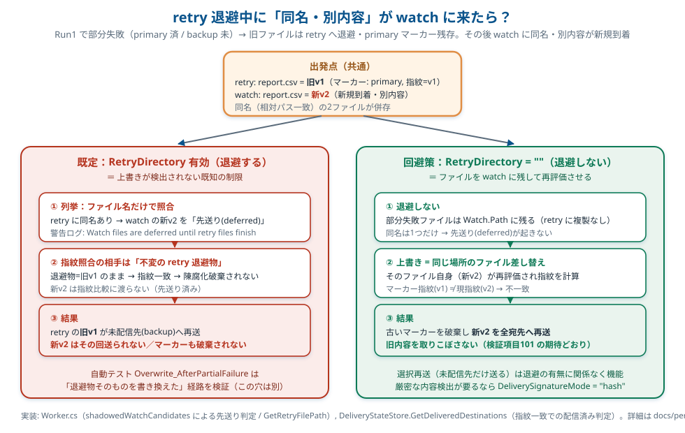

# 再試行中に同名の新ファイルが届いた場合

2026-10-01更新。旧ファイルを未配信の宛先へ送り終えてから、新ファイルを次のバッチで配信します。`Cleanup.DeleteAfterVerify=false`で旧ファイルを保持する場合も、新ファイルの配信を進められます。

復元先に同名の新ファイルがある場合は、配信済みの旧ファイルと関連ENDを`StateDirectory/completed-files/<世代ID>/files/<元の相対パス>`へ保管します。新ファイルを上書きせず、旧世代の配信記録を削除して次回の配信へ進みます。保管ファイルは自動削除しないため、運用者が保存期間と容量を管理してください。

保管の開始前に移動対象と指紋を保存し、途中で停止した場合は次回起動時に再開します。保管または配信記録の削除に失敗した場合は、終了コード1として報告します。旧ファイルとENDを分断して監視フォルダーへ戻すこともありません。

ENDの有無と原本の保持設定を変えて、旧ファイルの選択再送、新ファイルの次回配信、旧ファイルとENDの保管、中断後の再開を検証しました。[Windows検証記録](../.audit-results/2026-10-01-regression/README.md)、`PerDestinationDeliveryTrackingTests`、`PersistentRecoveryTests`を参照してください。

## 修正前の設計・運用判断の記録

以下はv3.2.1の挙動を記録した資料です。同名の新ファイルによる復元阻害は、上記の保管処理で解消しています。

### retry退避中の「同名・別内容」ファイル

> 複数宛先（ファンアウト）転送で一部宛先が失敗し、ファイルが retry へ退避された状態のときに、
> **同じ名前で中身の違うファイルが `Watch.Path` に来た**場合に何が起きるか。現状の動き・なぜそうなるか・どう運用するかをまとめた資料。
> 設計全体は [宛先別配信トラッキング 詳細解説](per-destination-delivery-tracking.md)（特に 3.4 / 3.4.3 / 6-8）を参照。

- 対象バージョン: 3.2.1
- 関連設定: `Transfer.RetryDirectory` / `Transfer.DeliverySignatureMode` / `Cleanup.DeleteAfterVerify`
- 関連検証項目: 手動検証リスト「再評価対象ファイルの上書き」「退避中の同名新規」「sizetime限界」



---

## 1. 前提（マーカーと退避のしくみ）

- 複数宛先のうち**一部だけ失敗**すると、成功した宛先の「配信済みマーカー」がディスクに残り、失敗の残ったデータファイルは既定で **`RetryDirectory`（`Watch.Path` の外）へ移動**される。
- 次回バッチでは、マーカーに記録した**指紋**（`sizetime`＝サイズ＋最終更新時刻、または `hash`）と現在のファイルの指紋を突き合わせ、
  - 一致 → その宛先は「配信済み」とみなして**送らない**（未配信宛先だけ再送＝選択再送）。
  - 不一致 → 内容が差し替わったとみなし、**古いマーカーを破棄して全宛先へ再送**する（静かなデータ欠落の防止）。

ここまでが意図された動き。問題は「指紋を突き合わせる相手が誰か」にある。

---

## 2. 現状の挙動（既定：退避が有効なとき）

### シナリオ

1. **Run1**: backup がダウン。primary だけ配信成功 → primary のマーカー作成、データは retry へ退避。
2. その後、上流が**同名・別内容**のファイルを `Watch.Path` に新規投入。
3. **Run2**: バッチ実行。

### 何が起きるか

列挙時、retry 側（旧内容）と watch 側（新内容）に**同じ相対パス**のファイルが両方ある。現状はここで **ファイル名（相対パス）の一致だけ**を見て、

> retry 退避物を優先し、watch の新ファイルは退避物の処理が終わるまで **先送り（deferred）** する

と判断する（警告ログ: `Retry directory contains ... Watch files are deferred until retry files finish`）。

その結果、

- 指紋比較に渡るのは**内容が変わらない retry 退避物**だけ。指紋は一致したままなので **陳腐化破棄は起きない**。
- retry の**旧内容**が未配信宛先（backup）へ再送される。
- watch の**新内容**はその回には**送られない**。

つまり、検証リストの「古いマーカーを破棄して全宛先へ再送」は、この自然なケース（watch に新規到着）では**発火しない**。

### なぜ自動テストは通っているのに、ここは抜けるのか

自動テスト `Overwrite_AfterPartialFailure_ResendsToAllDestinations` は、上書きを **retry 退避物そのものに対して** 行っている（`File.WriteAllText(retryPath, "v2...")`）。退避物の指紋が変わるので陳腐化破棄が働き、全宛先再送になる。
一方、運用で自然に起きるのは「**watch に新しい同名ファイルが来る**」ほうで、退避物は触られない。退避物は `Watch.Path` の外（既定で `LocalApplicationData` 配下）にあり、手動で触らない限り変化しない。だから既定運用では指紋ガードが効く相手が常に「変化しないファイル」になってしまう。

---

## 3. 検出が効く条件

指紋ガード（上書き検出）が効くのは、上書きが **「次回再評価されるファイル自体」** に当たったとき。

| ケース | 上書き対象 | 検出されるか |
|---|---|---|
| retry 退避物を直接書き換え | retry 上の旧ファイル | ○（自動テストの経路） |
| `RetryDirectory: ""`（退避無効）で watch 保持 | `Watch.Path` 上のそのファイル | ○（運用回避策・下記） |
| 既定（退避有効）で watch へ同名新規 | retry 退避物は不変／新ファイルは別物として先送り | ✗（本資料の制限） |

---

## 4. 運用回避策: `RetryDirectory: ""`（watch 保持）

部分失敗ファイルを退避させず `Watch.Path` に残す設定にすると、同名上書きは**同じ場所のファイルの差し替え**になり、次回はそのファイル自身が再評価される。指紋が変われば全宛先へ再送される。

```jsonc
{
  "Transfer": {
    "RetryDirectory": ""   // 退避を無効化。部分失敗ファイルは Watch.Path に残す
  }
}
```

- 選択再送（未配信宛先だけ送る）は退避の有無に関係なく機能する。退避を切っても「配信済み宛先へ重複配信しない」性質は維持される。
- トレードオフ: 未配信宛先がダウンし続ける間、部分失敗ファイルが `Watch.Path` に滞留する（隠しフォルダにまとめられない）。
- `DeliverySignatureMode` は別途要検討:
  - `sizetime`（既定・軽量）: サイズも最終更新時刻も据え置きで中身だけ差し替えると検出できない（既知の限界）。
  - `hash`（厳密）: 内容変更を確実に検出。ファイル数・サイズが多いと計算コスト増。

### 判断の目安

| 運用 | 推奨設定 |
|---|---|
| 同名で中身が差し替わり得る／新内容を取りこぼしたくない | `RetryDirectory: ""`（watch 保持） |
| 同名なら必ず同じ内容。進行中配信を隠しフォルダで管理したい | 既定（退避）。本資料の制限を承知の上で |
| 厳密に内容変更を検出したい | 上記に加え `DeliverySignatureMode: "hash"` |

---

## 5. 根本対処（参考・現状は未対応）

既定の退避運用のまま名前一致の先送りを直すには、列挙時の「同名なら retry 優先」の判定を **「ファイル名＋指紋の一致」** に変え、

- 指紋一致（同じ内容）→ 従来どおり retry を優先（進行中の選択再送を完了）。
- 指紋不一致（別内容）→ retry 退避物を陳腐化扱いにし、watch の新ファイルを優先して全宛先へ再送。

とする必要がある。退避物を破棄するかどうか（ツールが利用者ファイルを消さない方針との兼ね合い）も併せて設計判断が要るため、**コード変更を伴う**。本資料時点では入れていない。
